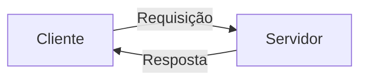
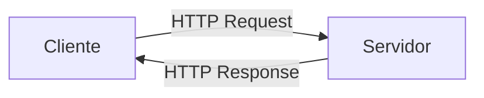

A Web é um dos serviços mais importantes da Internet. Nela estão boa parte dos serviços que utilizamos em nosso dia-a-dia, como portais de notícias, serviços de streaming, jogos, sistemas bancários, educação, entre outros.

A história da Web inicia em 1989, com `Sir. Tim Berners-Lee`, um cientista da computação nascido em Londres. Após concluir a graduação na universidade de Oxford, Tim foi trabalhar no [CERN](https://home.cern/) como engenheiro de software [@webhistory2021]. 

O CERN é um dos mais importantes centros de pesquisa do mundo, motivo pelo qual cientistas de diversos países frequentavam (e ainda frequentam) suas instalações. Naquela época, Tim observou a dificuldade dos pesquisadores em compartilhar informações. Na maioria dos casos, os dados de pesquisa estavam armazenados em computadores específicos e não eram compartilhados. Desde modo, para utilizar os dados era preciso utilizar o equipamento específico que os armazenava. A ideia de Tim foi então permitir o compartilhamento de informações com uma tecnologia emergente da época, o *hipertexto*[@webhistory2021].

A ideia não foi implementada de imediado pelo CERN, mas garantiu a Tim a possibilidade de dedicar tempo ao projeto [@webhistory2021]. Com isso, no final de 1990, ele havia escrito três implementações que são pilares para a Web até os dias atuais:

- **Linguagem HTML (*HyperText Markup Language*)**: linguagem de marcação utilizada para atribuir estrutura e semântica aos documentos da Web.
- **URI (*Uniform Resource Identifier*)**: endereço único que cada recurso recebe na Web. O tipo mais comum de **URI** chama-se **URL** (*Uniform Resource Locator*).
- **Protocolo HTTP (*Hypertext Transfer Protocol*)**: protocolo que permite a recuperação de recursos vinculados na Web. 


Com estes recursos e uma primeira implementação de *web browser* e *web server* escritas por Tim, a primeira página tornou-se disponível na Internet no final de 1990. Em 1993, Tim e outros envolvidos lutaram para assegurar que o código-fonte fosse disponibilizado de forma aberta, sem qualquer cobrança de *royalties* por parte do CERN. Esse, certamente, representa o marco que tornou a Web o ambiente que conhecemos nos dias atuais [@webhistory2021].

!!! info "Dica"
    **Web Browser** é a designação utilizada para softwares utilizados no lado cliente (usuário) para navegar pela Web. Já **Web Servers** são os softwares instalados em servidores que fornecem aos clientes o conteúdo solicitado por meio das requisições.


Em 1994, Tim foi para o MIT (*Massachusetts Institute of Technology*) com a finalidade de criar o *World Wide Web Consortium* (W3C), uma comunidade internacional voltada a definição de padrões (abertos) para a Web [@webhistory2021].

O uso de padrões abertos permitiu que muitas empresas desenvolvessem produtos para este ecossistema. Os diferentes *web browsers*, popularmente conhecidos com navegadores, são resultado deste processo, por exemplo. Atualmente temos uma grande gama de opções, como *Google Chrome*, *Microsoft Edge*, *Mozilla Firefox*, *Opera*, *Safari*, entre outros. Lembre-se que são os navegadores que nós, clientes, utilizamos para navegar pela *Web*.


!!! info Dica
    Caso queira conhecer o primeiro site desenvolvido por Tim, ele ainda pode ser encontrado no endereço [https://info.cern.ch](https://info.cern.ch).


## Protocolo HTTP

O procolo [HTTP (Hypertext Transfer Protocol)](https://developer.mozilla.org/pt-BR/docs/Web/HTTP/Overview) é um dos protocolos da pilha TCP/IP, presente na camada de **aplicação**. Seu modelo de comunicação considera a troca de mensagens entre cliente e servidor na forma de requisições e respostas.

Neste modelo, uma máquina (cliente) inicia a comunicação com outra (servidora) solicitando um recurso (requisição). A cada requisição enviada, o servidor processa e responde adequadamente, conforme a programação executada em decorrência da mensagem (resposta). Ao navegar por um site, seu navegador realizar inúmeras requisições ao servidor, sendo muitas imperceptíveis ao usuário final.


<p><small>Fonte: <a href="https://developer.mozilla.org/pt-BR/docs/Web/HTTP/Overview">Uma visão geral do HTTP - MDN </a></small></p>


## URI - Uniform Resource Identifiers

Conforme mencionamos anteriormente, uma **URI** identifica um recurso na Web de forma única. Assemelha-se ao endereço de sua residência, com alguns detalhes adicionais que permitiram, por exemplo, encontrar sua escova de dentes.

Uma URL (tipo mais comum de URI) é constituído de vários elementos. Geralmente segue o padrão `http://subdomínio.domínio.extensão-domínio/caminho-para-o-recurso?parâmetros` e está presente na barra de endereços do seu web browser enquanto você "surfa" pela Web. 

Veja alguns exemplos:

- http://www.example.com/search?category=books&sort=price
- http://www.example.com/login?redirect=http%3A%2F%2Fwww.example.com%2Fdashboard
- https://www.example.com/product?id=12345
- http://www.example.com/locations?latitude=40.7128&longitude=-74.0060
  


## Linguagem HTML

{ align=left width=25%}

`Hypertext Markup Language`, ou simplesmente HTML, é uma linguagem de marcação utilizada para representar informação na Web. Nasceu junto com o conceito da Web e hoje, juntamente às linguagens `JavaScript` e `CSS`, compõe as bases para o desenvolvimento de soluções *frontend* neste ecossistema.

Desde seu desenvolvimento, em 1989, a linguagem HTML foi passando por diversas revisões, que culminaram com o lançamento de novas versões da linguagem. Atualmente está em uso a versão 5, motivo pelo qual é comum encontrar citações à linguagem como HTML5. Caso tenha interesse de conhecer a linha do tempo das versões da linguagem na íntegra, este [documento da Wikipédia](https://en.wikipedia.org/wiki/HTML#HTML_versions_timeline) será um bom guia. A partir de 1997, graças ao trabalho da W3C, a linguagem HTML tornou-se um padrão de referência. Isso garantiu interoperabilidade em diferentes plataformas e meios de acesso. Caso tenha interesse, a especificação corrente da linguagem está disponível no [portal da W3C](https://html.spec.whatwg.org/multipage/) de forma pública.


Antes de propriamente iniciarmos nosso estudo na linguagem HTML5, precisamos entender os atores principais da Web e como eles se comunicam. Obviamente faremos uma simplificação da arquitetura, enfatizando o papel do *web browser* e do *web server*, que são os mais relevantes para nosso estudo. 

Observe o diagrama a seguir. Nele representamos um *cliente* estabelecendo comunicação com um *servidor*. O cliente envia uma requisição - solicitação de recurso - que é processada pelo *servidor* e devolvida ao *cliente* na forma de uma resposta. Esse modelo de arquitetura distribuída de comunicação é chamado `client/server` e define em alto nível como ocorre a comunicação entre *web browsers* (clientes) e *web servers* (servidores) na Web.



Importante destacar que, na troca de mensagens entre clientes e servidores, utiliza-se o protocolo de nível de aplicação HTTP (*Hypertext Transfer Protocol*), cuja função principal é oferecer uma base de comunicação genérica para transporte de dados em diferentes formatos de representação. 

Em sua concepção inicial, o formato de dados transportado pelo HTTP eram documentos HTML. Contudo, no decorrer da evolução da Web, outros formatos tornaram-se populares e também se utilizam do HTTP para transporte. São exemplos dados em formato XML, JSON, áudio, vídeo, imagens, entre outros.




Embora outros formatos de representação de dados sejam muito importantes, vamos nos ater ao HTML, pois ele é um dos pilares da Web, junto ao protocolo HTTP e o conceito de URI. Entender a Web necessariamente passa pelo estudo da linguagem HTML.

Sabemos que HTML é uma linguagem de marcação, mas o que isso significa na prática? 


Uma **linguagem de marcação** é um sistema para anotar um documento de forma que seja sintaticamente distinguível do texto. As linguagens de marcação são usadas para formatar o layout e o estilo de um documento, especificando como o texto deve ser exibido. Elas utilizam "marcas" ou "tags" para definir elementos dentro do documento [@2008weaving].

```html
<!DOCTYPE html>
<html lang="en">
<head>
    <meta charset="UTF-8">
    <title>Exemplo de Hipertexto</title>
</head>
<body>
    <h1>Bem-vindo ao meu site</h1>
    <p>Este é um exemplo de <a href="https://www.example.com">hipertexto</a> que leva você a outro documento.</p>
    <p>Você também pode navegar para <a href="#secao2">outra seção</a> deste documento.</p>

    <h2 id="secao2">Seção 2</h2>
    <p>Esta é a segunda seção do documento.</p>
</body>
</html>
```

O código que você acabou de ver corresponde a um documento HTML5. Ele contém algumas das muitas tags disponíveis, mas uma delas é especialmente importante para nós. Trata-se da tag `<a>`, cuja importância está na implementação do conceito de hipertexto, ou seja, de um conjunto de nós (imagens, palavras, videos, etc) que se conectam entre si, criando caminhos para navegar entre os diferentes recursos.


### Compreendendo o conceito de *tags*


A linguagem HTML5 é composta por um conjunto de `tags` (ou elementos). Cada `tag` serve a um propósito, atribuindo um significado - semântica - ao conteúdo envolvido. É parte da preocupação do profissional que usa a linguagem aplicar a tag que seja mais coerente com o significado do conteúdo.

Em sua grande maior, tags tem **abertura** e **fechamento**, de modo que o conteúdo que carregam fica entre estes dois símbolos.


- A **abertura da tag** compreende o nome da tag entre os símbolos de \(<\) e  \(>\), como  `<p>`, por exemplo.

- O **fechamento da tag**, por sua vez, requer o símbolo \(/\) antes do nome da tag. Neste caso, o fechamento da `<p>`é `</p>`.

!!! info Tag P
    A tag `p` é utilizada para demarcar parágrafos em documentos HTML. Qualquer conteúdo entre a abertura e o fechamento da tag deve ser interpretado como novo parágrafo. Observe:
    ```html
    <p>Aqui está um novo parágrafo!</p>
    ```
#### Atributos

As tags podem conter `atributos`, que são propriedades que customizam/modificam comportamentos ou associam valores específicos aos elementos. Assim como os nomes de tags, os atributos são pré-definidos, ou seja, são determinados em especificação. Temos atributos que são comuns a entre todas as tags e por isso recebem o nome de  `atributos globais` [@w3cglobalatributes]. Outros, por sua vez, estarão presentes em apenas algums tags.

Para definir atributos a uma tag, devemos informá-los na abertura da tag. Todo atributo tem um nome e, opcionalmente, um valor. Quando o atributo recebe um valor, o símbolo \(=\) é utilizado e o respectivo valor fica entre aspas duplas. Acompanhe no exemplo como os atributos *id*, *class* e *style* foram expressos na abertura da tag `p`.

```html
<p id="par01" class="vermelho"  style="font-size:1.3rem">Aqui está um novo parágrafo!</p>
```


### Estrutura básica de documentos HTML

Um documento HTML começa com a declaração do tipo de documento (`<!DOCTYPE html>`), que informa ao navegador que o arquivo está utilizando a versão HTML5, a mais amplamente adotada atualmente. A partir disso, o conteúdo é organizado em elementos principais:


+ [`<html>`](https://developer.mozilla.org/docs/Web/HTML/Element/html): Chamada de *root tag*, corresponde ao elemento que envolve todo documento. Todas as demais tags devem ser descendentes diretas ou indiretas de `<html>`. Espera-se que sejam filhos diretos de HTML apenas os elementos `<head>` e `<body>`. Um dos atributos mais importante é `lang`, que especifica o idioma do conteúdo [@whatwg-html5-21].
+ [`<head>`](https://developer.mozilla.org/docs/Web/HTML/Element/head): Utilizada para indicar informações gerais do documento, como metadados e vinculações com scripts e folhas de estilo [@whatwg-html5-21]. Como descendentes diretas de `<head>` temos:
    - [`<meta>`](https://developer.mozilla.org/docs/Web/HTML/Element/meta): Permite definir metadados que não podem ser especificados em outras tags. 
    - [`<title>`](https://developer.mozilla.org/docs/Web/HTML/Element/title): Define o título do documento. Apenas uma ocorrência é permitida.
    - [`<link>`](https://developer.mozilla.org/docs/Web/HTML/Element/link): Permite especificar as relações entre o documento e outro recurso externo. Utilizado especialmente para vincular folhas de estilo. O endereço do recurso vinculado fica no atributo `href`. Já o atributo `rel` indica o tipo de relacionamento estabelecido, que deve considerar um [conjunto de opções](https://html.spec.whatwg.org/multipage/links.html#linkTypes) definidas pela linguagem.
    - [`<style>`](https://developer.mozilla.org/docs/Web/HTML/Element/style): Permite incluir regras de estilo escritas em CSS ao documento.
    - [`<script>`](https://developer.mozilla.org/docs/Web/HTML/Element/script): Permite definir ou referenciar um script executável (JavaScript).
+ [`<body>`](https://developer.mozilla.org/docs/Web/HTML/Element/body): Todo documento contém apenas uma tag `<body>` e nela colocamos o conteúdo que será exibido pelo navegador. O que está no body representa o conteúdo visível da página.


Agora vamos colocar todos estes elementos juntos, de sorte a criar um documento básico e válido. Observe que devemos acrescentar na primeira linha `<!DOCTYPE html>` para indicar que o documento está na versão HTML5. Também é preciso que fique claro que algumas tags não são obrigatórias, como `<meta>`, `<title>`, `<script>` e `<style>`.

```html

<!DOCTYPE html>
<html>
  <head>
    <title>Minha primeira página</title>
    <meta charset="utf-8">
    <script>
      alert("Olá, mundo");
    </script>
    <style>
      p {
        color:red;
      }
    </style>
  </head>
  <body>
    <!--O conteúdo do documento-->
  </body>
</html>

```

Percebeu que as tags são abertas e fechadas respeitando uma hierarquia? Bem, isso é essencial para construirmos um documento bem formado, que será corretamente interpretado pelo navegador. A ideia é simples: *a tag deve ser fechada sempre no mesmo nível em que foi aberta*.


Outro ponto que você deve ter notado em nosso documento foi o trecho `<!--O conteúdo do documento-->`. Trata-se de um comentário, ou seja, um trecho sem qualquer significado para o navegador e que é ignorado por ele. Utilizamos comentários para anotar informações importantes no código a fim de melhor compreendê-lo. É uma estratégia de documentação muito importante para nós, humanos, mas irrelevante para o navegador. Em termos de sintaxe, todo comentário deve iniciar com `<!--` e encerrar com `-->` para ser válido e o trecho comentado pode ter uma ou mais linhas.


!!! info "Dica"
    Estamos considerando esta forma estrita de sintaxe para facilitar o aprendizado. O padrão HTML especifica regras mais brandas para a questão de abertura e fechamento de tags.

### Semântica de Texto

Vamos agora abordar as principais tags utilizadas para atribuir semântica a texto. Para parágrafos já sabemos que a tag a ser utilizada é `p`, mas diversas outras existem. Vamos analisar algumas delas na sequência. 


!!! important "Semântica x apresentação"
    A apresentação visual dos elementos não é do escopo da linguagem HTML. Os navegadores aplicam um estilo padrão para o conteúdo do elementos. Quando chegarmos em linguagem CSS3, iremos aprender como modificar os aspectos de apresentação.

+ [`<p>`](https://developer.mozilla.org/docs/Web/HTML/Element/p): Utilizado para criar um parágrafo.
+ [`<small>`](https://developer.mozilla.org/docs/Web/HTML/Element/small): Representa comentários colaterais, textos de menor relevância [@whatwg-html5-21].
+ [`<s>`](https://developer.mozilla.org/docs/Web/HTML/Element/s): Representa conteúdo desatualizado ou que não é mais relevante [@whatwg-html5-21].
+ [`<strong>`](https://developer.mozilla.org/docs/Web/HTML/Element/strong): Representa um conteúdo de maior seriedade, importância ou urgente.  Quanto mais ancestrais `strong` houver, maior será a relevância do conteúdo [@whatwg-html5-21].
+ [`<br>`](https://developer.mozilla.org/docs/Web/HTML/Element/br): Utilizado para representar uma quebra de linha.
+ [`<pre>`](https://developer.mozilla.org/docs/Web/HTML/Element/pre): Representa um texto pré-formatado, apresentado pelo navegador respeitando a forma em que ele foi inserido no documento.
+ [`<i>`](https://developer.mozilla.org/docs/Web/HTML/Element/i): Corresponde a uma sequencia de texto que distingue-se do restante por estar em outro idioma, ser neologismo, termo técnico ou algo semelhante.
+ [`<sup>`](https://developer.mozilla.org/docs/Web/HTML/Element/sup): Usado para adicionar conteúdo <sup>sobrescrito</sup>
+ [`<sub>`](https://developer.mozilla.org/docs/Web/HTML/Element/sub): Usado para adicionar conteúdo <sub>subscrito</sub>
+ [`<mark>`](https://developer.mozilla.org/docs/Web/HTML/Element/mark): Usado para evidenciar um trecho de conteúdo, com vistas a notificar o leitor de sua relevância.
+ [`<em>`](https://developer.mozilla.org/docs/Web/HTML/Element/em): Utilizado para enfatizar fortemente um determinado trecho de conteúdo. Quanto mais ancestrais `em` houver, maior será a ênfase ao trecho [@whatwg-html5-21].
+ [`<code>`](https://developer.mozilla.org/docs/Web/HTML/Element/code): Aplicado para conteúdo que representa trechos de código de programas de computador.
+ [`<span>`](https://developer.mozilla.org/docs/Web/HTML/Element/span): Utilizado para demarcar um trecho de conteúdo para alguma finalidade específica. A tag, em si, não adiciona qualquer semântica ao conteúdo.
+ [`<q>`](https://developer.mozilla.org/docs/Web/HTML/Element/q): Demarca citações curtas, apresentadas em meio a outro conteúdo.
+ [`<quote>`](https://developer.mozilla.org/docs/Web/HTML/Element/quote): Utilizado para especificar o título de um trabalho (livro, programa de computador, artigo, etc.). Não devemos utilizar para envolver nomes de autores, somente o título da obra.
+ [`<blockquote>`](https://developer.mozilla.org/docs/Web/HTML/Element/blockquote): Demarca citações longas.
+ [`<cite>`](https://developer.mozilla.org/docs/Web/HTML/Element/cite): Utilizado para especificar o título de um trabalho (livro, programa de computador, artigo, etc.). Não devemos utilizar para envolver nomes de autores, somente o título da obra[@whatwg-html5-21].
+ [`<span>`](https://developer.mozilla.org/docs/Web/HTML/Element/span): O elemento não provê nenhuma semântica. É utilizado normalmente em conjunto com atributos globais para agrupar trechos de conteúdo textual a fim de facilitar a plicação de estilos, por exemplo.


#### Títulos

No HTML temos a possibilidade de utilizar seis níveis de títulos. Para isso, temos disponíveis as tags `<h1>`, `<h2>`, `<h3>`, `<h4>`, `<h5>` e `<h6>`. Títulos `<h1>` são os de maior importância, e na medida que o número aumenta, a relevância do título diminui [@mdnheadings]. Veja um exemplo de documento contendo quatro níveis de títulos. Assim como ocorre em documentos de texto, os títulos relacionam-se entre si, de modo que entendemos que `<h2>`é um subtítulo de `<h1>`, `<h3>`é subtítulo de `<h2>` e assim por diante.

```html

<!DOCTYPE html>
<html>
  <head>
    <title>Títulos</title>
    <meta charset="utf-8">    
  </head>
  <body>
    <h1> Título de primeiro nível</h1>
    <p>Este é um parágrafo</p>
    <h2> Título de segundo nível</h2>
    <p>Este é um parágrafo</p>
    <h3> Título de terceiro nível</h3>
    <p>Este é um parágrafo</p>
    <h4> Título de quarto nível</h4>
    <p>Este é um parágrafo</p>
  </body>
</html>
```


#### Listas

As listas são utilizadas para elencar itens de forma ordenada ou não. Para cada caso, temos a disposição uma tag diferente: se o objetivo é utilizar uma lista **ordenada**, então utilizaremos `<ol>` e, caso haja interesse em uma lista **não ordenada**, então devemos usar `<ul>`. Quando os elementos da lista, para ambos os casos, utilizamos a tag `<li>`.

Vamos imaginar que seja necessário criar a lista da feira utilizando HTML5. Como não há necessidade de ordem para os itens, iremos utilizar uma lista não-ordenada.
```html

<!DOCTYPE html>
<html>
  <head>
    <title>Lista da Feira</title>
    <meta charset="utf-8">    
  </head>
  <body>
    <h1>Compras:</h1>
    <ul>
        <li>Alface</li>
        <li>Couve</li>
        <li>Brócolis</li>
        <li>Cenoura</li>
        <li>Pimentão</li>
    </ul>
  </body>
</html>
```


Por outro lado, se quiséssemos listar em um documento a classificação de estudantes em uma avaliação qualquer, utilizaríamos uma lista ordenada, porque, obviamente, temos a necessidade de associar ordem aos elementos.


```html

<!DOCTYPE html>
<html>
  <head>
    <title>Classificação na Prova de Culinária</title>
    <meta charset="utf-8">    
  </head>
  <body>
    <h1>Participantes:</h1>
    <ul>
        <li>João</li>
        <li>Amanda</li>
        <li>Angela</li>
        <li>Pedro</li>
        <li>Miguel</li>
    </ul>
  </body>
</html>
```


### Tags semânticas de estrutura


Um documento escrito em HTML pode ter seu conteúdo dividido em diferentes segmentos, como cabeçalho, rodapé, seções, artigos, barra de navegação e informações associadas. Antes do HTML5, a divisão destes conteúdos era feita basicamente por meio de divisões genéricas (tag `<div>`), o que conferia a estrutura desejada para o desenvolvedor, mas não apresentava a semântica necessária para interpretação automática da informação por softwares leitores de tela e *engines* de busca, como Google e Bing [@vladopvliksemantichtml2022], por exemplo.

!!! info "O que são tags semânticas?"
    As tags semânticas de estrutura em HTML têm como objetivo dar significado ao conteúdo da página, descrevendo o propósito de cada seção. Elas foram introduzidas no HTML5 para melhorar a acessibilidade, facilitar a indexação por mecanismos de busca e tornar o código mais legível para desenvolvedores. As tags semânticas proporcionam uma estrutura clara e funcional para páginas web modernas, melhorando tanto a experiência do usuário quanto a performance em motores de busca.


Para ilustrar a situação, vamos imaginar a página inicial de um *web site* fictício. Inicialmente iremos utilizar apenas divisões para segmentar o conteúdo e, na sequência, faremos uso das tags específicas do HTML5. No primeiro caso aplicamos várias vezes a tag `<div>` para organizar o conteúdo e utilizamos o atributo global `id` para indicar o significado de cada segmento.

Embora a estratégia de utilizar `<div>` atenda ao objetivo do desenvolvedor, qualquer processamento automático de conteúdo do documento fica muito difícil de ser realizado. Vamos imaginar, por exemplo, que quiséssemos obter somente os artigos do conteúdo da página. Talvez você possa pensar: ok, basta consultar o conteúdo das *divs* que contém em seu atributo `id` os valores *art1* ou *art2*. Mas a solução funciona somente para esta página e de forma parcial, pois depende do conhecimento prévio do significado dos Ids e da permanência deles ao longo do tempo. 

Mas o tempo passa, a página é modificada e novos artigos são adicionados. É preciso vasculhar novamente o HTML, entender quais marcas foram atribuídas pelo desenvolvedor aos novos artigos e então ajustar o algoritmo para coletá-los. Aí começam os problemas de uma solução que só funciona para um caso específico...


```html
<!DOCTYPE html>
<html>

<head>
    <title>University News</title>
    <meta charset="utf-8">
</head>

<body>
    <div id="cabecalho">
        <ul>
            <li><a href="home.html">Home</a></li>
            <li><a href="ensino.html">Ensino</a></li>
            <li><a href="pesquisa.html">Pesquisa</a></li>
            <li><a href="extensao.html">Extensão</a></li>
        </ul>

    </div>
    <div id="conteudo">
        <div id="secao_academico">
            <h1>Informações Acadêmicas</h1>
            <div id="art1">
                <h2>Ensino Remoto</h2>
                <p>O ensino remoto ...</p>

            </div>

        </div>
        <div id="secao_processo_seletivo">
            <h1>Processo Seletivo</h1>
            <div id="art2">
                <h2>Ingresso 2022/1</h2>
                <p>O processo seletivo 2022/1 ...</p>
            </div>
        </div>

    </div>
    <div id="rodape">
        <address>
            <small>Av. Brasil Leste, 124</small>
            <small>CEP:99999-000</small>
        </address>
    </div>


</body>

</html>
```


Quando utilizamos `tags` genéricas para representar porções de conteúdo, precisamos adicionar alguma informação em seus atributos para que possamos (nós, humanos) diferenciar cada porção das demais. Ocorre que o sentido que atribuímos a partir destas informações adicionais não é explícito, pois dependente da interpretação do contexto. Ainda, esta semântica não é precisa nem universal. Nada impede que o desenvolvedor atribua ao `id` de uma `<div>` o valor *xyz01*, com vistas a identificar um artigo. Qual software poderia facilmente deduzir o significado contextual desta informação?

Em razão da inexistência de uma representação universal para as diferentes porções de conteúdo é que o HTML5 trouxe um conjunto de novas `tags`, ditas tags de semântica estrutural. As principais constam na lista  a seguir.

 - [`<article>`](https://developer.mozilla.org/docs/Web/HTML/Element/article): Representa um trecho de conteúdo independente, autocontido, que pode ser distribuído sem o restante da página.
 - [`<section>`](https://developer.mozilla.org/docs/Web/HTML/Element/section): Indica uma segmentação do conteúdo.
 - [`<aside>`](https://developer.mozilla.org/docs/Web/HTML/Element/aside): Segmento opcional de conteúdo tangencialmente relacionado ao seu entorno, o qual poderia ser removido sem representar uma perda significativa para a compreensão.
 - [`<footer>`](https://developer.mozilla.org/docs/Web/HTML/Element/footer): Utilizado para rodapé de seções ou do próprio documento. Utilizado para registro de informações de direitos autorais, dados de contato e/ou links.
 - [`<header>`](https://developer.mozilla.org/docs/Web/HTML/Element/header): Segmento introdutório, cabeçalho, recursos iniciais de navegação.
 - [`<nav>`](https://developer.mozilla.org/docs/Web/HTML/Element/nav): Segmento do documento reservado para navegação.
 - [`<main>`](https://developer.mozilla.org/docs/Web/HTML/Element/main): Especifica o trecho do documento que contém o conteúdo principal. Deve ser único no documento inteiro.


Com estas novas tags é possível interpretar o significado dos trechos de conteúdo de forma inequívoca, tanto por humanos quanto por softwares. Para exemplificar, vamos refazer nossa página, agora aplicando as `tags` de semântica estrutural ao invés de apenas `<div>`s para demonstrar a diferença.

```html
<!DOCTYPE html>
<html>

<head>
    <title>University News</title>
    <meta charset="utf-8">
</head>

<body>
    <header>
        <nav>
            <ul>
                <li><a href="home.html">Home</a></li>
                <li><a href="ensino.html">Ensino</a></li>
                <li><a href="pesquisa.html">Pesquisa</a></li>
                <li><a href="extensao.html">Extensão</a></li>
            </ul>
        </nav>
    </header>
    <main>
        <section>
            <header>
                <h1>Informações Acadêmicas</h1>
            </header>
            <article>
                <h2>Ensino Remoto</h2>
                <p>O ensino remoto ...</p>

            </article>

        </section>
        <section>
            <header>
                <h1>Processo Seletivo</h1>
            </header>
            <article>
                <h2>Ingresso 2022/1</h2>
                <p>O processo seletivo 2022/1 ...</p>
            </article>
        </section>

    </main>
    <footer>
        <address>
            <small>Av. Brasil Leste, 124</small>
            <small>CEP:99999-000</small>
        </address>
    </footer>


</body>

</html>
```

Agora é natural perceber o que significam os segmentos de conteúdo, tanto para nós, humanos, quando para softwares que interpretam o documento, como os navegadores. E tudo isso por conta da tag utilizada, que possui semântica (significado) específico.


Outro ponto importante refere-se à relação entre semântica e apresentação. O resultado visual de uma página não tem relação com as tags utilizadas, mas com as folhas de estilo aplicadas. Isso apenas reforça a importância de utilizar o HTML5 somente para estruturar o conteúdo, conferindo o significado correto a cada trecho por meio da aplicação da *tag* adequada. Logo, a imagem abaixo, embora exemplificando o posicionamento típico dos elementos de semântica de conteúdo, não implica em qualquer posicionamento efetivo aplicado pelo navegador.


 Fonte: Vlado Pavlik [@vladopvliksemantichtml2022]


### Hiperligação de conteúdo


A capacidade da linguagem HTML de expressar relacionamentos entre recursos certamente é um dos fatores-chave para o sucesso da *web*. 

Os `hiperlinks`, como chamamos estas ligações, constituem vias que ligam um documento a outro, contido no mesmo site ou em sites diferentes, através de palavras, imagens, vídeos, áudios, entre outros tipos de recursos. Esse emaranhado de vias levou ao termo *web*, ou seja, uma grande teia de informação, cujo caminho a ser seguido depende unicamente das escolhas do usuário ao longo do caminho.

Em nossos documentos HTML5 podemos criar hiperlinks através da tag [`<a>`](https://developer.mozilla.org/docs/Web/HTML/Element/a). Para fins didáticos, iremos apresentar como criamos âncoras posicionais para elementos do documento, links locais e links externos.

Para que a tag `<a>` seja considerada um hiperlink, o atributo `href` deve estar presente com o endereço do recurso. Quando o usuário clicar sobre o objeto que representa o hiperlink (texto, imagem, etc), o navegador irá transportar o usuário até o recurso informado.

Outro atributo importante do elemento `<a>` é `target`. É usado para especificar ao navegador onde o novo recurso deverá ser apresentado (contexto do navegador). As opções que temos são:

+ **_blank**: Abre o recurso em nova janela ou aba.
+ **_self**:  Abre o recurso no mesmo contexto de navegação do documento origem do hiperlink.
+ **_parent**:  Abre o recurso no contexto de navegação pai.
+ **_top**:  Abre o recurso no contexto de navegação mais elevado da página.

Não apenas recursos obtidos via protocolo HTTP podem ser informados no atributo `href`. Podemos utilizá-lo para várias finalidades, informando valores dos seguintes tipos [@w3chref21]:

+ **URL** ([Uniform Resource Locator](https://developer.mozilla.org/en-US/docs/Learn/Common_questions/What_is_a_URL)) absoluto, como `href="http://localhost:8000/web/html5/hiperlinks/"`. Quando informado de forma absoluta, frequentemente estamos apontando para um recurso externo ao nosso site.
+ **URL relativa**, como `href="audio/musica.mp3"`. Esse formato é utilizado para navegar entre recursos locais do site.
+ **Link** para algum elemento da página através de seu valor de atributo `id`, como `href="#rodape"`. Neste caso, utilizamos para marcar posições no documento, a fim de facilitar a navegação pelo conteúdo. O botão *Voltar ao topo*, comum em diversos sites, é um exemplo de uso de um link posicional.
+ **Código JavaScript**, como `href="javascript:alert("oi");"`. Este recurso nos permite executar código (algum comportamento) a partir de um link. Muito utilizado na programação Web.


```html
<!DOCTYPE html>
<html>
  <head>
    <title>Hiperlinks</title>
    <meta charset="utf-8">
  </head>
  <body>
      <p>Para explorar o mundo da aventura, confira o <a href="https://www.adventureworld.com/">Adventure World</a>. Se você é apaixonado por culinária, não perca o <a href="https://www.cookingdelights.com/">Cooking Delights</a>, onde você pode encontrar receitas deliciosas e dicas de cozinha. Além disso, se estiver interessado em arte e cultura, visite a <a href="https://www.artgalleryhub.com/">Art Gallery Hub</a> para descobrir obras incríveis de artistas de todo o mundo.</p>


  </body>
</html>
```

Você deve ter percebido no exemplo que o hiperlink é construído a partir do conteúdo do elemento `<a>`. Nós utilizamos texto, mas poderíamos ter utilizado imagens, vídeos ou áudios e o resultado seria o mesmo.


### Imagens


Adicionar imagens à documentos HTML é algo trivial. O que mais se observa são documentos que utilizam texto, imagens, áudio e vídeo de forma combinada para passar a informação desejada ao usuário. Isso porque recursos audiovisuais conferem uma experiência mais rica, tornando o documento atrativo e, eventualmente, mais informativo.

Em termos de código, utilizamos o elemento `` para incorporar imagens ao HTML. Os atributos obrigatórios são `src` e `alt`. O primeiro deles indica o caminho para o  arquivo, que pode ser absoluto ou relativo. Já o atributo `alt` contém uma descrição textual que será exibida pela navegador em substituição à imagem, caso ela não possa ser apresentada.

Outros dois atributos importantes são `width` (largura) e `heigth` (altura). Utilizamos eles para especificar as dimensões da imagem em pixels. É conveniente utilizar valores nestas propriedades para melhorar a experiência de carregamento da página no navegador. Também merece menção o atributo `title`, o qual fornece um texto de título que é exibido quando o usuário passa o mouse sobre a imagem.

```html
<!DOCTYPE html>
<html>
  <head>
    <title>Figuras/Imagens</title>
    <meta charset="utf-8">
  </head>
  <body>
    
  </body>
</html>
```

#### Tag `<figure>`


A tag `figure` é uma tag semântica introduzida no HTML5 usada para encapsular elementos como imagens, ilustrações, gráficos, códigos, entre outros, referenciados no contexto de um documento. É frequentemente combinada com a tag `figcaption` para fornecer uma legenda ou  descrição associada ao conteúdo. Além de servir ao propósito de atribuir semântica aos elementos de conteúdo, a tag `figure` também  contribuiu para os fundamentos de acessibilidade, pois melhora a experiência de consumo de quem utilize tecnologias assistivas.


```html
<!DOCTYPE html>
<html>
  <head>
    <title>Figuras/Imagens</title>
    <meta charset="utf-8">
  </head>
  <body>
      

      <p> Na sequência apresentamos a imagem da Galáxia de Andrômeda para que você aprecie:</p>
      <figure>
          
          <<figcaption>Galáxia de Andrômeda: Wikipédia</figcaption>>
      </figure>

  </body>
</html>
```


#### Formatos gráficos suportados

Os navegadores modernos suportam vários tipos de formátos gráficos. Os mais comuns são JPEG, PNG, GIF e SVG.

- **JPEG (Joint Photographic Experts Group)** é amplamente utilizado para fotografias e imagens com tons contínuos de cor. Ele oferece uma boa compressão com perdas, o que resulta em arquivos menores, mas pode sacrificar um pouco da qualidade da imagem.
-** PNG (Portable Network Graphics)** é frequentemente usado para imagens com áreas de cor sólida, como logotipos e gráficos. Ele suporta transparência, o que o torna ideal para imagens com fundos transparentes.
- **GIF (Graphics Interchange Format)** é conhecido por suportar animações, mas também é usado para imagens estáticas, especialmente aquelas com poucas cores. O formato GIF suporta transparência e é amplamente utilizado para ícones e gráficos simples.
- **SVG (Scalable Vector Graphics)** é um formato baseado em XML que descreve imagens vetoriais. Ele é ideal para gráficos escaláveis, como ícones e logotipos, pois pode ser redimensionado sem perda de qualidade.


### Áudio e Vídeo

Com o HTML5, foi introduzido suporte nativo para a incorporação de áudio e vídeo em páginas web, eliminando a necessidade de plugins externos, como o antigo Adobe Flash. As tags `<audio>` e `<video>` oferecem uma maneira eficiente e semântica de incluir mídia em documentos HTML. Além disso, ambas as tags possuem atributos e métodos que permitem personalizar a experiência do usuário.

#### Tag `<audio>`

A tag [`<audio>`](https://developer.mozilla.org/pt-BR/docs/Web/HTML/Element/audio) é usada para incorporar arquivos de áudio em páginas web. Ela suporta formatos populares como MP3, OGG e WAV, dependendo do navegador e aplicá-la no documento é simples.

```html
<audio controls>
  <source src="audio.mp3" type="audio/mpeg">
  <source src="audio.ogg" type="audio/ogg">
  Seu navegador não suporta o elemento de áudio.
</audio>

```
No trecho acima, o atributo *controls* ativa os controles padrão do player (play, pause, volume). Já a tag `<source>` permite especificar diferentes formatos do arquivo de áudio para garantir compatibilidade entre navegadores. Caso o navegador não tenha suporte para reprodução de áudio, o texto alternativo "*Seu navegador não suporta o elemento de áudio.*" será exibido. 


#### Tag `<video>`

A tag [`<video>`](https://developer.mozilla.org/pt-BR/docs/Web/HTML/Element/audio) é usada para exibir vídeos em páginas web. Assim como a tag `<audio>`, ela suporta múltiplos formatos, como MP4 (H.264), WebM e OGG (Theora). A forma de utilizar é praticamente a mesma da tag `<audio>`, excetuando-se alguns atributos específicos para vídeo.

Importante ressaltar que podemos adicionar legendas ao vídeo para cumprir com as boas práticas de acessibilidade. A tag para tal finalidade chama-se `<track>`. 


```html
<video controls>
  <source src="video.mp4" type="video/mp4">
  <track src="legendas.vtt" kind="subtitles" srclang="pt" label="Português">
  Seu navegador não suporta vídeos.
</video>
```


### Tabelas


A criação de tabelas requer o uso de diferentes elementos HTML de forma adequada. Temos tags específicas para cabeçalho, rodapé, conteúdo, linhas e colunas de tabelas. Na sequência abordaremos cada uma delas com maiores detalhes.

A tag `<table>` é utilizada para delimitar a tabela. Como descendentes, podemos indicar o cabeçalho, conteúdo e rodapé através das elementos `<thead>`, `<tbody>` e `<tfoot>`, respectivamente. Estas elementos não são obrigatorias e são aplicadas para adicionar semântica ao conteúdo da tabela.

Efetivamente, os dados da tabela estão contidos nas células de dados, criadas a partir do elemento `<td>`, organizadas em linhas especificadas a partir do elemento `<tr>`. Para células que representam cabeçalhos, podemos utilizar o elemento `<th>` para diferenciar das células de dados.

No exemplo que segue apresentamos um documento contendo uma tabela \(3 \times 4\). A primeira linha representa o cabeçalho, as duas intermediárias, os dados e a última, o rodapé. Fique atendo ao uso dos elementos para alcançar o resultado.

```html
<!DOCTYPE html>
<html>
  <head>
    <title>Tabela</title>
    <meta charset="utf-8">
  </head>
  <body>
    <table>
        <thead>
            <tr>
                <th>Estudante</th>
                <th>Avaliação I</th>
                <th>Avaliação II</th>
            </tr>
        </thead>
        <tbody>
            <tr>
                <td>Aluno 1</td>
                <td>9.5</td>
                <td>5.7</td>
            </tr>
            <tr>
                <td>Aluno 2</td>
                <td>8.6</td>
                <td>6.2</td>
            </tr>
    </tbody>
    <tfoot>
        <tr>
            <td></td>
            <td>8.7</td>
            <td>6.0</td>
        </tr>
    </tfoot>
    </table>
</body>
</html>

```

As linhas da tabela são criadas a partir da abertura de elementos `<tr>`. Em cada linha, devemos adicionar células, sejam de dados ou de cabeçalho, por meio de `<td>` e `<th>`. Cada nova célula requer a abertura e o fechamento do respectivo elemento dentro da linha. Contudo, em alguns casos, precisamos realizar mesclagem de células, o que demanda utilizar os atributos **rowspan** e **colspan**. Ao aplicar **rowspan**, indicamos que uma célula se projeta pela quantidade de linhas informada, enquanto que **colspan** indica a quantidade de colunas que a célula irá preencher.


```html
<!DOCTYPE html>
<html>
  <head>
    <title>Tabela</title>
    <meta charset="utf-8">
  </head>
  <body>
    <table>
        <thead>
            <tr>
                <th colspan="4">Faturamento</th>
            </tr>
        </thead>
            <tbody>
                <tr>
                    <td colspan="2"></td>
                    <td>Filial A</td>
                    <td>Filial B</td>
                </tr>
                <tr>
                    <td rowspan="3">1º Trimestre</td>
                    <td>Janeiro</td>
                    <td>5</td>
                    <td>6</td>
                </tr>
                <tr>
                    <td>Fevereiro<br></td>
                    <td>4</td>
                    <td>5</td>
                </tr>
                <tr>
                    <td>Março</td>
                    <td>7</td>
                    <td>8</td>
                </tr>
            </tbody>
        </table>
    </body>
</html>

```

É importante ressaltar que as tabelas devem ser utilizadas para organizar dados e não para diagramar conteúdo. De fato, os primeiros *web sites* utilizavam tabelas como forma de posicionar conteúdo, mas na época não havia disponibilidade dos atuais recursos providos pelo HTML5 e CSS3. Portanto, hoje, evite essa má prática.


Os formulários em HTML5 são utilizados para coletar informações e interagir com os usuários em páginas da web. Com uma variedade de elementos e atributos, os formulários oferecem flexibilidade e controle sobre como os dados são coletados e processados. Para construir formulários, precisamos utilizar várias tags e conhecer seus atributos básicos. É o que veremos na sequência:

### Formulários

Um formulário é definido pelo elemento `<form>`, que envolve os campos de entrada e os elementos de controle. Com os atributos `action` e `method`, podemos especificar para onde os dados serão enviados e como eles serão transmitidos.


O atributo `action` especifica para onde os dados do formulário serão enviados após o envio. Seu valor é geralmente é uma URL, que pode ser absoluta ou relativa. Quando o formulário é enviado, os dados são submetidos para o URL especificado no atributo `action`. Se o atributo `action` estiver vazio, os dados serão submetidos para a mesma página em que o formulário está localizado.

```html
<form action="/destino" method="post">
```
Já o atributo `method` especifica como os dados do formulário serão enviados ao servidor. Os dois valores possíveis são `GET` e `POST`. Quando o valor é `GET`, os dados do formulário são anexados à URL especificada no atributo `action`, tornando-os visíveis na barra de endereços do navegador. Esse método é mais comum para formulários que não enviam dados sensíveis e quando queremos que a URL seja `bookmarkable`. Por sua vez, se valor for `POST`, os dados do formulário serão enviados no corpo da requisição HTTP, tornando-os não visíveis na URL. Esse método é mais seguro e adequado para o envio de dados sensíveis ou grandes quantidades de dados.

!!! info "URL *bookmarkable*"
    Uma URL *bookmarkable* (ou URL “favoritável”) é uma URL que permite que uma página web seja marcada (bookmark) ou compartilhada de forma que, ao ser acessada novamente, ela leve o usuário diretamente ao estado ou conteúdo específico associado à URL. Isso é essencial em aplicações modernas, como SPAs (Single Page Applications), onde o conteúdo da página pode mudar sem que a URL seja recarregada.
    São características de uma URL *bookmarkable*:
        - **Representa o Estado da Página**: A URL reflete o estado atual da página ou o conteúdo que o usuário está visualizando. Por exemplo, se você está em uma seção “Contato”, a URL pode ser https://site.com/contato.
        - **Pode Ser Marcada**: Ao salvar a URL nos favoritos ou compartilhá-la, o estado ou conteúdo específico pode ser revisitado.
        - **É Permanente**: As URLs bookmarkable geralmente seguem princípios de persistência, significando que permanecem válidas mesmo com o tempo.
    Quanto à importância, podemos considerar que: 
        - **Melhor Usabilidade**: Os usuários podem salvar ou compartilhar URLs para retornar ao mesmo estado ou conteúdo posteriormente.
        - **SEO**: URLs bem definidas ajudam os motores de busca a indexar o conteúdo corretamente.
        - **Acessibilidade**: As URLs bookmarkable permitem que aplicações sejam mais acessíveis e amigáveis para todos os usuários.


Os campos de entrada são elementos `<input>`, que podem assumir diversos tipos, como texto, email, senha, entre outros. Podemos controlar a validação dos dados usando atributos como `required`, `maxlength`, `pattern`, entre outros [@mdnnativeformcontrols].

Para oferecer opções aos usuários, utilizamos os elementos `<select>`, `<option>`, `<optgroup>`, permitindo criar menus de seleção e listas suspensas. Além disso, temos os elementos `checkbox` e `radio` para seleções múltiplas e únicas, respectivamente [@mdnnativeformcontrols].

Com o tipo de entrada `file`, os usuários podem enviar arquivos para o servidor. Isso é útil para formulários que requerem o upload de imagens, documentos, ou outros tipos de arquivos.

Para definir rótulos aos campos, utilizamos a tag `<label>`, a fim de garantir a acessibilidade e usabilidade do formulário. Também é possível agrupar campos relacionados usando `<fieldset>` e `<legend>` [@mdnnativeformcontrols]. Veja um exemplo:


```html

<!DOCTYPE html>
<html lang="en">
    <head>
        <meta charset="UTF-8">
        <meta name="viewport" content="width=device-width, initial-scale=1.0">
        <title>Exemplo de Formulário HTML5</title>
    </head>
    <body>

    <h2>Exemplo de Formulário HTML5</h2>

    <form action="/submit_form.php" method="post" enctype="multipart/form-data">
    
        <fieldset>
            <legend>Dados Pessoais:</legend>
            <label for="fname">Primeiro Nome:</label><br>
            <input type="text" id="fname" name="firstname" required><br>
        
            <label for="lname">Sobrenome:</label><br>
            <input type="text" id="lname" name="lastname" required><br>
        
            <label for="email">Email:</label><br>
            <input type="email" id="email" name="email" required><br>
        
            <label for="password">Senha:</label><br>
            <input type="password" id="password" name="password" required><br>
        
            <label for="birthdate">Data de Nascimento:</label><br>
            <input type="date" id="birthdate" name="birthdate"><br>
        
            <label for="gender">Gênero:</label><br>
            <input type="radio" id="male" name="gender" value="male">
            <label for="male">Masculino</label>
            <input type="radio" id="female" name="gender" value="female">
            <label for="female">Feminino</label><br>
        
            <label for="photo">Foto de Perfil:</label><br>
            <input type="file" id="photo" name="photo"><br>
        </fieldset>
        
        <fieldset>
            <legend>Preferências:</legend>
            <label for="color">Cor Favorita:</label><br>
            <input type="color" id="color" name="color"><br>
        
            <label for="language">Idioma Preferido:</label><br>
            <select id="language" name="language">
            <option value="en">Inglês</option>
            <option value="es">Espanhol</option>
            <option value="pt">Português</option>
            </select><br>
        
            <label for="newsletter">Receber Newsletter:</label><br>
            <input type="checkbox" id="newsletter" name="newsletter" value="yes">
            <label for="newsletter">Sim</label><br>
        </fieldset>
        
        <input type="submit" value="Enviar">
    
    </form>

    </body> 
</html>

```
