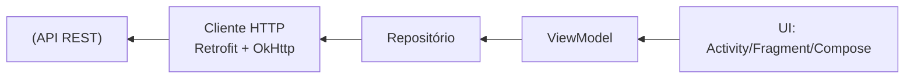

## Visão geral

A maior parte dos aplicativos móveis modernos consome dados de **APIs REST** para autenticação, catálogo de itens, sincronização de dados e envio de eventos. No Android, a integração com APIs normalmente envolve:

- modelar o contrato de dados (JSON <-> modelos);
- configurar um cliente HTTP;
- implementar chamadas (GET/POST/PUT/DELETE);
- tratar erros e estados de rede;
- integrar a camada de rede com estado de UI (por exemplo, ViewModel).

Basicamente, este processo é o que conecta a interface do usuário (UI) com o backend, permitindo que o app seja dinâmico e interativo. A seguir, vamos explorar os conceitos, ferramentas e boas práticas para consumir APIs REST em um aplicativo Android.



## O que é uma API REST (na prática)

Em uma API REST, os endpoints representam recursos e operações HTTP. Um exemplo típico é um recurso de tarefas:

- `GET /tasks` → lista tarefas
- `GET /tasks/{id}` → lê uma tarefa
- `POST /tasks` → cria uma tarefa
- `PUT /tasks/{id}` ou `PATCH /tasks/{id}` → atualiza
- `DELETE /tasks/{id}` → remove

A “forma REST” de pensar é:

- **Método HTTP** expressa a ação.
- **URL** identifica o recurso.
- **Código de status** indica o resultado.
- **Corpo JSON** carrega dados.

!!! info "Contrato é mais importante do que código"

    Em projetos reais, integração bem-sucedida depende de um contrato claro: payloads, códigos de erro e regras de autenticação. Sem isso, a implementação vira tentativa e erro.


A maioria das APIs fornece uma `baseUrl` (por exemplo, `https://api.exemplo.com/`) e rotas versionadas (por exemplo, `/v1/`). O versionamento evita que mudanças quebrem aplicativos já publicados.

O aplicativo geralmente recebe JSON e precisa convertê-lo em objetos Kotlin. Duas práticas importantes:

- manter **nomes consistentes** entre JSON e modelo (ou mapear com anotações);
- separar **DTOs** (objetos de transporte) de modelos internos quando o domínio for mais complexo.

No caso de autenticação, o app deve enviar credenciais (token, chave, sessão) em cada requisição. Três padrões comuns:

- **Bearer token (JWT)**: o app envia `Authorization: Bearer <token>`.
- **API key**: mais comum em integração servidor-servidor; em apps, costuma ser inadequado se a chave der acesso amplo.
- **Sessão/cookies**: menos comum em mobile moderno, mas existe.

!!! warning "Segurança no cliente"

    O aplicativo deve assumir que qualquer segredo embutido pode ser extraído. Em geral, chaves sensíveis devem ficar no backend. No cliente, a proteção real é autenticação do usuário + autorização no servidor.

## Ferramentas comuns no Android

No ecossistema Android, um stack muito usado é:

- **Retrofit**: define a API por interface e gera a implementação.
- **OkHttp**: cliente HTTP com interceptors, timeouts e cache.
- **Kotlin Coroutines**: chamadas assíncronas com `suspend`.
- **kotlinx.serialization** (ou Moshi/Gson): serialização de JSON.

A documentação do Retrofit e do OkHttp descreve as peças principais (interfaces, conversores, interceptors e configuração de cliente) [@retrofit; @okhttp]. 

Para usar Retrofit no Android, adicione as dependências no **módulo do app** (normalmente `app/build.gradle` ou `app/build.gradle.kts`). O Retrofit por si só gera as chamadas a partir de interfaces; para JSON, você também precisa de um **conversor** (por exemplo, kotlinx.serialization, Moshi ou Gson).

Exemplo (Groovy — `build.gradle`):

```gradle
dependencies {
    // Retrofit (cliente declarativo por interface)
    implementation "com.squareup.retrofit2:retrofit:2.11.0"

    // OkHttp (engine HTTP usada pelo Retrofit)
    implementation "com.squareup.okhttp3:okhttp:4.12.0"

    // Conversor para kotlinx.serialization (usado nos exemplos deste material)
    implementation "com.squareup.retrofit2:converter-kotlinx-serialization:2.11.0"
    implementation "org.jetbrains.kotlinx:kotlinx-serialization-json:1.6.3"
}
```

Exemplo (Kotlin DSL — `build.gradle.kts`):

```kotlin
dependencies {
    implementation("com.squareup.retrofit2:retrofit:2.11.0")
    implementation("com.squareup.okhttp3:okhttp:4.12.0")
    implementation("com.squareup.retrofit2:converter-kotlinx-serialization:2.11.0")
    implementation("org.jetbrains.kotlinx:kotlinx-serialization-json:1.6.3")
}
```

!!! note "Versões"
    Em projetos reais, mantenha versões consistentes entre os artefatos do Retrofit e valide a compatibilidade com a versão do Kotlin/AGP do projeto.

Agora vamos entender como usar essas ferramentas para consumir uma API REST de forma simplificada.


### Passo 1 — Modelar DTOs

Supondo uma API de tarefas, um DTO de leitura pode semelhante ao abaixo. Observe o uso de `data class` e anotações de serialização para mapear campos JSON.

```kotlin
import kotlinx.serialization.SerialName
import kotlinx.serialization.Serializable

@Serializable
data class TaskDto(
    val id: Long,
    val title: String,
    val done: Boolean,
    @SerialName("created_at") val createdAt: String,
)
```

### Passo 2 — Definir a interface da API

Aqui utilizamos a sintaxe de Retrofit para declarar os endpoints. Cada função é anotada com o método HTTP e a rota, e os parâmetros indicam o corpo ou query params.

```kotlin
import retrofit2.http.Body
import retrofit2.http.GET
import retrofit2.http.POST

interface TaskApi {
    @GET("v1/tasks")
    suspend fun listTasks(): List<TaskDto>

    @POST("v1/tasks")
    suspend fun createTask(@Body body: CreateTaskRequest): TaskDto
}
```

### Passo 3 — Construir Retrofit + OkHttp

O exemplo abaixo ilustra:

- `OkHttpClient` com timeouts;
- interceptor para autenticação;
- Retrofit com conversor de JSON.

```kotlin
import kotlinx.serialization.json.Json
import okhttp3.Interceptor
import okhttp3.OkHttpClient
import okhttp3.Response
import retrofit2.Retrofit
import retrofit2.converter.kotlinx.serialization.asConverterFactory
import okhttp3.MediaType.Companion.toMediaType
import java.util.concurrent.TimeUnit

class AuthInterceptor(
    private val tokenProvider: () -> String?,
) : Interceptor {
    override fun intercept(chain: Interceptor.Chain): Response {
        val original = chain.request()
        val token = tokenProvider()

        val request = if (token.isNullOrBlank()) {
            original
        } else {
            original.newBuilder()
                .addHeader("Authorization", "Bearer $token")
                .build()
        }

        return chain.proceed(request)
    }
}

fun buildTaskApi(baseUrl: String, tokenProvider: () -> String?): TaskApi {
    val json = Json {
        ignoreUnknownKeys = true
        isLenient = true
    }

    val contentType = "application/json".toMediaType()

    val okHttp = OkHttpClient.Builder()
        .connectTimeout(15, TimeUnit.SECONDS)
        .readTimeout(30, TimeUnit.SECONDS)
        .writeTimeout(30, TimeUnit.SECONDS)
        .addInterceptor(AuthInterceptor(tokenProvider))
        .build()

    val retrofit = Retrofit.Builder()
        .baseUrl(baseUrl)
        .client(okHttp)
        .addConverterFactory(json.asConverterFactory(contentType))
        .build()

    return retrofit.create(TaskApi::class.java)
}
```

!!! info "Por que ignoreUnknownKeys?"

    Em integração com APIs, o servidor pode adicionar campos ao JSON. Configurar o parser para ignorar campos desconhecidos torna o app mais resiliente a mudanças não destrutivas.

## Tratamento de erros: o que o app precisa fazer

Uma integração “funciona” quando o app consegue tratar pelo menos estes casos:

- sem internet / DNS / timeout;
- resposta HTTP 4xx/5xx;
- JSON inválido ou inesperado;
- autenticação expirada (401) e fluxo de re-login.

Um padrão útil é modelar um resultado com `sealed class`.

!!! info "O que é `sealed class` (na prática)"

    Uma `sealed class` define uma **hierarquia fechada**: todos os tipos que estendem aquela classe são conhecidos (e declarados no mesmo arquivo, em geral). Isso é útil para representar um conjunto **finito** de estados possíveis — por exemplo: sucesso, erro HTTP, erro de rede, erro desconhecido.

    Ela lembra um `enum` no sentido de modelar um conjunto finito de opções, mas não é a mesma coisa: `enum` é uma lista de **valores** fixos; `sealed class` é uma família de **tipos**, e cada caso pode carregar dados diferentes (por exemplo, `HttpError(code, body)` vs `NetworkError(error)`).

    Na UI, isso ajuda porque um `when (result)` pode ser **exaustivo** (o compilador te força a tratar todos os casos), evitando que algum cenário de erro fique “esquecido” e vire bug em produção.

```kotlin
sealed class ApiResult<out T> {
    data class Success<T>(val value: T) : ApiResult<T>()
    data class HttpError(val code: Int, val body: String?) : ApiResult<Nothing>()
    data class NetworkError(val error: Throwable) : ApiResult<Nothing>()
    data class UnknownError(val error: Throwable) : ApiResult<Nothing>()
}
```

E encapsular chamadas em uma **corrotina** (função `suspend`) que retorna `ApiResult`. Corrotinas são o modelo de concorrência leve do Kotlin: você escreve código com aparência “sequencial”, mas ele pode **suspender** durante operações de I/O (rede, disco) sem **bloquear** a thread.

Neste caso (chamadas HTTP), isso é útil porque:

- a UI não trava: a requisição pode suspender e retomar quando a resposta chegar;
- o código fica linear e legível (em vez de callbacks encadeados);
- existe **cancelamento**: se a tela sai de cena (por exemplo, ViewModel é limpo), a operação pode ser cancelada;
- o repositório centraliza o tratamento de erro (mapeando exceções para `ApiResult`), e a UI renderiza estados de forma previsível.

```kotlin
import retrofit2.HttpException
import java.io.IOException

suspend fun <T> safeApiCall(block: suspend () -> T): ApiResult<T> {
    return try {
        ApiResult.Success(block())
    } catch (e: HttpException) {
        ApiResult.HttpError(e.code(), e.response()?.errorBody()?.string())
    } catch (e: IOException) {
        ApiResult.NetworkError(e)
    } catch (e: Throwable) {
        ApiResult.UnknownError(e)
    }
}
```

!!! warning "Thread principal"

    Mesmo com `suspend`, a equipe deve evitar trabalho pesado na thread principal. Bibliotecas como Retrofit/OkHttp já executam I/O fora da UI thread, mas conversões e pós-processamentos grandes ainda podem causar travamentos.

## Integração com ViewModel (padrão didático)

Um recorte simples de arquitetura em sala:

- UI dispara eventos (clique, refresh).
- ViewModel chama repositório.
- Repositório executa `safeApiCall` e retorna `ApiResult`.
- UI renderiza `Loading/Success/Error`.

```kotlin
class TaskRepository(private val api: TaskApi) {
    suspend fun listTasks(): ApiResult<List<TaskDto>> = safeApiCall {
        api.listTasks()
    }
}
```

## Boas práticas que evitam problemas em produção

### Timeouts e retry

- timeouts devem ser explícitos para evitar “carregando infinito”; 
- retries automáticos devem ser usados com cuidado (para não duplicar POST/PUT).

### Paginação

APIs de lista quase sempre precisam de paginação (offset/limit, cursor, page/token). O app deve:

- exibir loading incremental;
- evitar carregar tudo em memória;
- tratar “fim da lista”.

### Cache local

Se a UX exigir navegação offline, a equipe pode combinar:

- cache local (por exemplo, Room) com dados “últimos conhecidos”;
- atualização em background quando a rede voltar.

## Checklist de integração

Ao final, uma integração com API REST deve responder “sim” para:

- Existe uma `baseUrl` configurada e versionada?
- Os DTOs cobrem os payloads reais da API?
- O app trata `timeout`, `401`, `403`, `404` e `500` de modo previsível?
- Existe um ponto único de autenticação (interceptor) e um fluxo de expiração?
- As telas conseguem exibir estados de carregamento e erro?

## Referências

- Square: Retrofit [@retrofit]
- Square: OkHttp [@okhttp]
- Kotlinx Serialization [@kotlinx_serialization]
