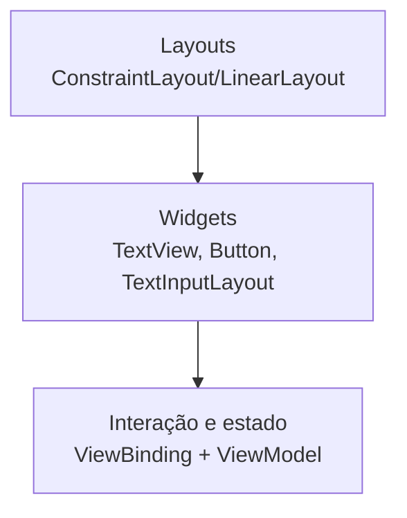

## Visão geral

Os componentes visuais do Android são, em geral, **Views** (elementos de interface) organizadas por **ViewGroups** (contêineres/layouts). A tela final normalmente é composta por três camadas:

1. **Layout** (como os componentes são posicionados)
2. **Widgets** (textos, botões, listas, campos)
3. **Interação/estado** (cliques, validação, carregamento, erro)

A documentação de Views e layouts descreve o modelo de composição de telas com XML e componentes padrão [@android_docs_layouts]. Para consistência visual, é comum usar componentes do Material Design [@material_design].

Na implementação Android, muitos widgets “Material” usados em sala (como `TextInputLayout`, `MaterialButton` e `Snackbar`) são fornecidos pela biblioteca **Material Components for Android** (MDC-Android) [@material_components_android].



## Layouts (contêineres)

Layouts são componentes cujo papel é **organizar** outras Views.

### ConstraintLayout

O `ConstraintLayout` é um dos layouts mais usados por permitir layouts complexos com menos níveis de aninhamento.

Exemplo (XML simplificado):

```xml
<androidx.constraintlayout.widget.ConstraintLayout
    xmlns:android="http://schemas.android.com/apk/res/android"
    xmlns:app="http://schemas.android.com/apk/res-auto"
    android:layout_width="match_parent"
    android:layout_height="match_parent">

    <TextView
        android:id="@+id/titulo"
        android:layout_width="0dp"
        android:layout_height="wrap_content"
        android:text="Tela"
        app:layout_constraintStart_toStartOf="parent"
        app:layout_constraintEnd_toEndOf="parent"
        app:layout_constraintTop_toTopOf="parent" />

</androidx.constraintlayout.widget.ConstraintLayout>
```

### LinearLayout

O `LinearLayout` organiza itens em linha ou coluna e é útil em layouts simples. Em telas complexas, o excesso de aninhamento pode piorar performance.

## Componentes básicos (widgets)

### TextView

Usado para exibir texto.

```xml
<TextView
    android:id="@+id/tvNome"
    android:layout_width="wrap_content"
    android:layout_height="wrap_content"
    android:text="Nome" />
```

### EditText e TextInputLayout (Material)

Para entrada de texto, recomenda-se (em muitos projetos) usar `TextInputLayout` + `TextInputEditText` para obter rótulo, helper text e mensagens de erro padronizadas.

```xml
<com.google.android.material.textfield.TextInputLayout
    android:layout_width="match_parent"
    android:layout_height="wrap_content"
    android:hint="E-mail">

    <com.google.android.material.textfield.TextInputEditText
        android:id="@+id/etEmail"
        android:layout_width="match_parent"
        android:layout_height="wrap_content"
        android:inputType="textEmailAddress" />

</com.google.android.material.textfield.TextInputLayout>
```

Exemplo de validação (Kotlin):

```kotlin
fun validarEmail(email: String): Boolean {
    return email.contains("@") && email.contains(".")
}
```

### Button e MaterialButton

Botões disparam ações. Em muitos projetos, `MaterialButton` é usado para manter estilo consistente.

```kotlin
binding.btnSalvar.setOnClickListener {
    // executar ação
}
```

### ImageView

Exibe imagens (ícones, fotos, etc.). Em geral, o carregamento de imagens remotas deve ser feito com uma biblioteca (para cache e redimensionamento).

```xml
<ImageView
    android:id="@+id/imgAvatar"
    android:layout_width="72dp"
    android:layout_height="72dp"
    android:contentDescription="Avatar"
    android:scaleType="centerCrop" />
```

## Listas e coleções

### RecyclerView

O `RecyclerView` é o componente padrão para listas eficientes (itens reciclados). Ele exige:

- um `LayoutManager` (vertical/horizontal/grid)
- um `Adapter` (como criar e ligar cada item)
- um layout para a linha (item)

Exemplo (Adapter simplificado, Kotlin):

```kotlin
data class Item(val id: Long, val titulo: String)

class ItemAdapter(
    private val items: List<Item>,
    private val onClick: (Item) -> Unit,
) : androidx.recyclerview.widget.RecyclerView.Adapter<ItemViewHolder>() {

    override fun onCreateViewHolder(parent: android.view.ViewGroup, viewType: Int): ItemViewHolder {
        val view = android.view.LayoutInflater.from(parent.context)
            .inflate(android.R.layout.simple_list_item_1, parent, false)
        return ItemViewHolder(view, onClick)
    }

    override fun onBindViewHolder(holder: ItemViewHolder, position: Int) {
        holder.bind(items[position])
    }

    override fun getItemCount(): Int = items.size
}

class ItemViewHolder(
    itemView: android.view.View,
    private val onClick: (Item) -> Unit,
) : androidx.recyclerview.widget.RecyclerView.ViewHolder(itemView) {

    fun bind(item: Item) {
        (itemView as android.widget.TextView).text = item.titulo
        itemView.setOnClickListener { onClick(item) }
    }
}
```

!!! info "Ponto didático"

    Em listas reais, o adapter costuma usar `ListAdapter` + `DiffUtil` para atualizar itens com eficiência.

## Navegação e estrutura da tela

### Toolbar / AppBar

A barra superior geralmente mostra título e ações, e se integra ao “Up” (voltar) em navegação.

### BottomNavigationView

Usado para alternar entre destinos principais do app.

## Feedback ao usuário

### Snackbar

A `Snackbar` exibe mensagens temporárias (por exemplo, “salvo com sucesso”) e pode ter ação (undo).

### ProgressIndicator

Indicadores de progresso (linear/circular) tornam carregamentos explícitos.

### Dialog

Diálogos são usados para confirmação (ex.: apagar item) ou seleção de opções.

## Boas práticas (erros comuns)

1. Evitar lógica de negócio dentro de Activities/Fragments: a UI deve apenas orquestrar eventos.
2. Padronizar validação e mensagens de erro (especialmente em formulários).
3. Preferir componentes Material quando o objetivo for consistência visual.
4. Cuidar de acessibilidade: `contentDescription`, tamanhos mínimos de toque e contraste.

## Referências

- Android Developers: Layouts (Views) [@android_docs_layouts]
- Android Developers: App resources overview [@android_docs_resources]
- Material Design 3 [@material_design]
- Material Components for Android [@material_components_android]
