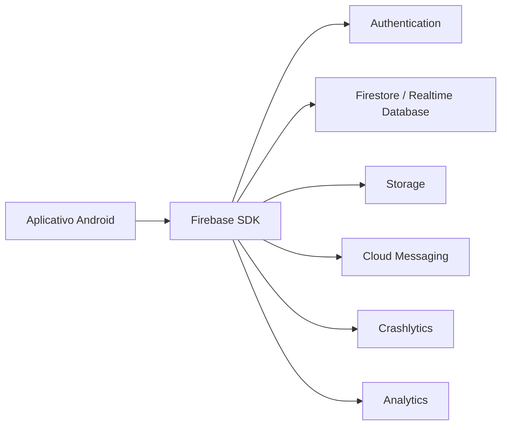

## Visão geral

O Firebase é uma plataforma de serviços gerenciados que apoia o desenvolvimento de aplicativos com recursos como **autenticação**, **banco de dados**, **armazenamento de arquivos**, **notificações**, **analytics** e **monitoramento de falhas**. Em Android, a integração ocorre por meio do **Firebase SDK**, que conecta o aplicativo a um projeto configurado no console.

A integração típica segue a sequência: criar o projeto no console → registrar o aplicativo Android → incluir o arquivo de configuração → adicionar dependências → validar a comunicação com um serviço inicial (por exemplo, Analytics ou Crashlytics) [@firebase_android_add].



## Modelo mental: cliente, servidor e regras

Para entender “como integrar Firebase” de forma segura, é útil separar o que roda no **cliente** (o aplicativo Android) do que roda em um **servidor** (quando existe). O SDK do Firebase no Android é um SDK de cliente: ele executa requisições diretamente aos serviços do Firebase usando as credenciais e o contexto do app.

Isso não significa que o app “pode tudo”. O acesso a dados (Firestore e Storage) é controlado por **Security Rules**. Essas regras definem o que um usuário autenticado (ou anônimo) pode ler e escrever. Essa é a base da segurança no lado do Firebase para apps móveis.

Quando o projeto precisa de operações privilegiadas (por exemplo, tarefas administrativas, envio de notificações em massa, validações que não devem ficar no app), é comum existir uma camada de servidor usando o **Firebase Admin SDK**. O Admin SDK usa credenciais de serviço e não deve ser embutido no aplicativo.

```mermaid
flowchart TB
    subgraph Cliente
        A[App Android\nFirebase Client SDK]
    end

    subgraph Firebase
        F[(Firestore)]
        S[(Storage)]
        M[(FCM)]
        R[Security Rules]
    end

    subgraph Servidor\n(opcional)
        B[Backend\nFirebase Admin SDK]
    end

    A -->|leitura/escrita\nregulada por Rules| R
    R --> F
    R --> S

    B -->|operações privilegiadas| F
    B -->|operações privilegiadas| S
    B -->|envio de mensagens| M
```

## Pré-requisitos

Para uma integração previsível, o projeto precisa atender a alguns requisitos práticos:

- possuir um pacote Android definido (applicationId), pois ele identifica o app no Firebase;
- usar uma versão do Gradle/Android Gradle Plugin compatível com as bibliotecas atuais;
- ter acesso a uma conta Google para criar e administrar o projeto no console.

A documentação oficial é a referência primária para requisitos e passos atualizados, pois eles podem mudar ao longo do tempo [@firebase_android_add].

## Passo 1 — Criar um projeto no Firebase Console

No Firebase Console, a equipe cria um novo projeto. Em seguida, registra-se o aplicativo Android informando o **package name** (applicationId). Em muitos casos também se informa o **SHA-1** (e, às vezes, SHA-256) para habilitar recursos como logins com provedores e APIs específicas.

O resultado desse passo é o registro do app dentro do projeto Firebase.

## Passo 2 — Baixar e adicionar o arquivo de configuração

Após registrar o app, o console fornece o arquivo `google-services.json`. Esse arquivo deve ser colocado no módulo do aplicativo (normalmente `app/` no projeto Android).

Esse arquivo contém identificadores e chaves públicas do projeto e permite que o plugin de build gere recursos e metadados necessários para o SDK localizar o projeto correto.

## Passo 3 — Adicionar dependências do Firebase (BoM)

Em projetos modernos, recomenda-se usar o **Firebase BoM (Bill of Materials)** para manter versões coerentes entre bibliotecas [@firebase_bom]. Com o BoM, a equipe define uma versão única e adiciona as dependências de serviços específicos sem declarar versões individuais.

Nesta etapa, o projeto normalmente também habilita o plugin do Google Services, que processa o `google-services.json` [@firebase_android_add].

## Passo 3.1 — Organização por ambientes (dev/homolog/prod)

Em projetos de ensino e projetos reais, o time normalmente precisa separar ao menos dois ambientes: um para desenvolvimento e outro para produção. Uma prática comum é usar projetos Firebase distintos (por exemplo, “app-dev” e “app-prod”), cada um com seu próprio `google-services.json`.

O objetivo é reduzir risco: testes e dados de sala/laboratório não devem afetar o ambiente de produção. Essa separação também facilita mudar configurações (como regras e provedores de login) sem impactar usuários reais.

## Passo 4 — Inicialização do Firebase no app

Em geral, a inicialização do Firebase é automática quando o projeto inclui o arquivo de configuração e as dependências. Ao iniciar o app, o SDK lê as configurações e prepara os serviços.

Para verificar a integração, é comum começar por um serviço simples:

- **Analytics**: verificar eventos no console;
- **Crashlytics**: forçar um crash controlado (em ambiente de teste) e confirmar o relatório no console.

## Passo 4.1 — Diagnóstico de problemas comuns (integração inicial)

Quando o Firebase “não funciona” logo após o setup, os problemas mais comuns tendem a ser de configuração e identificação do app.

O time costuma validar, em ordem:

- o `applicationId` do módulo Android é exatamente o mesmo registrado no Firebase Console;
- o arquivo `google-services.json` foi adicionado no módulo correto (o módulo do app);
- o build está resolvendo as dependências do BoM e sincronizando sem conflitos de versão [@firebase_bom];
- o dispositivo/emulador tem conectividade e data/hora corretas (certificados e TLS podem falhar quando o relógio está muito errado).

## Passo 5 — Integrar serviços comuns (visão prática)

A integração “completa” com Firebase costuma ser incremental: a equipe habilita apenas o que o app precisa, um serviço por vez, testando o comportamento no emulador e em dispositivos reais.

### Autenticação (Firebase Authentication)

O Firebase Authentication oferece autenticação por e-mail/senha e por provedores (Google, Apple, etc.). O fluxo geral é:

1. habilitar o provedor no console;
2. implementar o fluxo de login no app;
3. ler o usuário autenticado e proteger rotas/telas.

A documentação oficial apresenta os passos e decisões de integração por provedor [@firebase_auth_android].

Uma distinção importante para a arquitetura do app é: o cliente autentica o usuário e obtém um **ID token**. Em cenários com backend próprio, esse token é enviado ao servidor, que valida a identidade do usuário (normalmente com Admin SDK) antes de executar ações privilegiadas.

### Banco de dados (Cloud Firestore)

O Firestore é um banco NoSQL orientado a documentos, muito usado para dados sincronizados e consultas simples a moderadas. A integração típica envolve:

- definir coleções e documentos;
- criar regras de segurança (Security Rules);
- ler/gravar dados a partir do app;
- testar regras e consultas.

A documentação do Firestore descreve modelagem e regras de segurança para Android [@firebase_firestore_android].

Ao modelar dados, uma regra prática é preferir documentos “pequenos e coesos”, evitando coleções com documentos gigantes. O custo de leitura no Firestore é por documento lido; portanto, uma modelagem que reduz leituras desnecessárias tende a ser mais eficiente.

### Armazenamento de arquivos (Cloud Storage)

O Cloud Storage é usado para arquivos (imagens, PDFs, áudios). Um roteiro comum é:

- definir “pastas” lógicas (caminhos) para organização;
- enviar arquivos com metadados quando necessário;
- recuperar URLs para exibição;
- configurar regras de acesso (por exemplo, apenas usuário autenticado).

A referência oficial de início rápido do Storage (Android) detalha o fluxo de upload/download e as decisões típicas de configuração [@firebase_storage_android].

### Notificações (Firebase Cloud Messaging)

O FCM permite enviar push notifications. Em alto nível, a integração exige:

- registrar o dispositivo e obter um token;
- enviar mensagens a partir de um servidor (ou do console, para testes);
- tratar mensagens em primeiro e segundo plano.

Como mensagens impactam UX e permissões, a equipe costuma validar cuidadosamente o comportamento por versão do Android.

No FCM, existem duas “pontas”: o **cliente** (app) recebe um token e processa mensagens, e um **servidor** (ou ferramenta de envio) envia mensagens para tokens ou tópicos. A documentação de FCM em Android descreve os requisitos e o comportamento do cliente [@firebase_fcm_android].

### Crashlytics (observabilidade)

Crashlytics coleta e organiza falhas (crashes) e alguns tipos de erros não fatais (non-fatal) quando configurado. Ele ajuda a priorizar correções com base em frequência e impacto. A documentação do Crashlytics descreve integração, testes e publicação [@firebase_crashlytics_android].

## Passo 5.1 — Analytics (instrumentação mínima)

Em muitos cursos e projetos, Analytics é adotado primeiro por ser uma validação rápida do setup: eventos aparecem no console sem exigir modelagem de dados. A documentação de Analytics em Android descreve a instrumentação inicial e as formas de enviar eventos [@firebase_analytics_android].

## Passo 6 — Segurança: regras, chaves e ambientes

Integração com Firebase sempre envolve decisões de segurança. Três recomendações de base são:

1. **Regras de segurança**: Firestore/Storage devem ter regras que reflitam a política do app; nunca confiar apenas na validação do cliente.
2. **Separação de ambientes**: é comum manter projetos distintos para desenvolvimento e produção, reduzindo risco de testes afetarem dados reais.
3. **Princípio do menor privilégio**: permissões e acessos devem ser mínimos para a necessidade do app.

As referências de Security Rules ajudam a compreender como escrever regras e testá-las para Firestore e Storage [@firebase_rules; @firebase_firestore_rules; @firebase_storage_rules].

!!! warning "Sobre chaves e credenciais"

    O aplicativo Android não deve conter credenciais do Admin SDK (service account). Chaves privadas devem ficar apenas em ambientes controlados (servidores, CI/CD ou máquinas de desenvolvimento com proteção adequada). No app, a segurança depende principalmente de autenticação e Security Rules.

## Passo 6.1 — Emuladores para desenvolvimento (quando disponível)

Quando a turma ou o time deseja desenvolver sem depender de ambiente remoto o tempo todo, é possível usar o **Firebase Emulator Suite**, que simula serviços localmente. Isso tende a reduzir atrito em sala (rede instável, limites de cota, criação de dados de teste). A documentação oficial descreve como habilitar e usar os emuladores [@firebase_emulator_suite].

## Exemplos de código (Kotlin)

Os exemplos a seguir usam **Kotlin** e estão divididos em dois contextos:

- **Android (Client SDK)**: o app integra autenticação, Firestore/Storage e recebe mensagens via FCM.
- **Servidor (Kotlin/JVM com Admin SDK)**: um backend valida tokens, acessa dados com privilégios e envia notificações.

Em um projeto real, o Admin SDK deve rodar no **servidor**, não no aplicativo Android [@firebase_admin_sdk].

=== "Android (Client SDK)"

    ### Dependências (exemplo em Gradle Kotlin DSL)

    O uso do BoM reduz conflitos de versão entre bibliotecas [@firebase_bom].

    ```kotlin
    // build.gradle.kts (módulo :app)
    dependencies {
        implementation(platform("com.google.firebase:firebase-bom:<versao>"))

        implementation("com.google.firebase:firebase-auth-ktx")
        implementation("com.google.firebase:firebase-firestore-ktx")
        implementation("com.google.firebase:firebase-storage-ktx")
        implementation("com.google.firebase:firebase-messaging-ktx")
        implementation("com.google.firebase:firebase-crashlytics-ktx")
        implementation("com.google.firebase:firebase-analytics-ktx")
    }
    ```

    ### Authentication: obter o ID token do usuário

    Esse token pode ser enviado ao backend para validação (via Admin SDK) quando o projeto usa um servidor próprio.

    ```kotlin
    import com.google.firebase.auth.FirebaseAuth
    import kotlinx.coroutines.tasks.await

    suspend fun obterIdToken(): String? {
        val user = FirebaseAuth.getInstance().currentUser ?: return null
        val result = user.getIdToken(false).await()
        return result.token
    }
    ```

    ### Firestore: gravar e ler documentos

    ```kotlin
    import com.google.firebase.firestore.FirebaseFirestore
    import kotlinx.coroutines.tasks.await

    data class Usuario(
        val nome: String = "",
        val ativo: Boolean = true,
    )

    suspend fun criarUsuario(uid: String, nome: String) {
        val db = FirebaseFirestore.getInstance()
        db.collection("usuarios").document(uid)
            .set(Usuario(nome = nome, ativo = true))
            .await()
    }

    suspend fun listarUsuariosAtivos(limit: Long = 20): List<Pair<String, Usuario>> {
        val db = FirebaseFirestore.getInstance()
        val snapshot = db.collection("usuarios")
            .whereEqualTo("ativo", true)
            .limit(limit)
            .get()
            .await()

        return snapshot.documents.mapNotNull { doc ->
            val usuario = doc.toObject(Usuario::class.java)
            if (usuario != null) doc.id to usuario else null
        }
    }
    ```

    ### Storage: upload de arquivo (por URI)

    ```kotlin
    import android.net.Uri
    import com.google.firebase.storage.FirebaseStorage
    import kotlinx.coroutines.tasks.await

    suspend fun uploadAvatar(uid: String, uri: Uri): String {
        val storage = FirebaseStorage.getInstance()
        val ref = storage.reference.child("avatars/$uid.jpg")

        ref.putFile(uri).await()
        return ref.path
    }
    ```

    ### FCM: obter token do dispositivo e receber mensagens

    Obter o token (para associar ao usuário no Firestore e permitir envios direcionados):

    ```kotlin
    import com.google.firebase.messaging.FirebaseMessaging
    import kotlinx.coroutines.tasks.await

    suspend fun obterTokenFcm(): String {
        return FirebaseMessaging.getInstance().token.await()
    }
    ```

    Receber mensagens (exemplo minimalista):

    ```kotlin
    import com.google.firebase.messaging.FirebaseMessagingService
    import com.google.firebase.messaging.RemoteMessage

    class AppMessagingService : FirebaseMessagingService() {
        override fun onMessageReceived(message: RemoteMessage) {
            // Processar payload e gerar notificação local (se necessário)
        }

        override fun onNewToken(token: String) {
            // Enviar token atualizado para o backend ou salvar no Firestore
        }
    }
    ```

    ### Crashlytics e Analytics: instrumentação mínima

    ```kotlin
    import android.os.Bundle
    import com.google.firebase.analytics.FirebaseAnalytics
    import com.google.firebase.crashlytics.FirebaseCrashlytics

    fun registrarEventoAnalytcs(analytics: FirebaseAnalytics) {
        analytics.logEvent("abrir_tela", Bundle().apply {
            putString("nome", "home")
        })
    }

    fun registrarErro(crashlytics: FirebaseCrashlytics, err: Throwable) {
        crashlytics.recordException(err)
    }
    ```

=== "Servidor (Kotlin/JVM com Admin SDK)"

    !!! warning "Admin SDK é para servidor"

        Esses exemplos são para um backend em Kotlin/JVM. Eles não devem ser executados no Android.

    ### Inicialização do Admin SDK

    O backend lê credenciais de service account em ambiente controlado (por exemplo, variável de ambiente apontando para um JSON protegido) [@firebase_admin_sdk].

    ```kotlin
    import com.google.auth.oauth2.GoogleCredentials
    import com.google.firebase.FirebaseApp
    import com.google.firebase.FirebaseOptions
    import java.io.FileInputStream

    fun initAdmin() {
        if (FirebaseApp.getApps().isNotEmpty()) return

        val credPath = System.getenv("GOOGLE_APPLICATION_CREDENTIALS")
            ?: error("Definir GOOGLE_APPLICATION_CREDENTIALS")

        FileInputStream(credPath).use { stream ->
            val options = FirebaseOptions.builder()
                .setCredentials(GoogleCredentials.fromStream(stream))
                .build()

            FirebaseApp.initializeApp(options)
        }
    }
    ```

    ### Validação de identidade: verificar um ID token

    ```kotlin
    import com.google.firebase.auth.FirebaseAuth

    data class UsuarioAutenticado(
        val uid: String,
        val email: String?,
        val provider: String?,
    )

    fun verificarToken(idToken: String): UsuarioAutenticado {
        val decoded = FirebaseAuth.getInstance().verifyIdToken(idToken)
        return UsuarioAutenticado(
            uid = decoded.uid,
            email = decoded.email,
            provider = decoded.claims["firebase"]
                ?.let { it as? Map<*, *> }
                ?.get("sign_in_provider")
                ?.toString(),
        )
    }
    ```

    ### Firestore: gravar e ler documentos (admin)

    ```kotlin
    import com.google.cloud.firestore.Firestore
    import com.google.firebase.cloud.FirestoreClient

    data class Usuario(val nome: String, val ativo: Boolean)

    fun criarUsuario(uid: String, nome: String) {
        val db: Firestore = FirestoreClient.getFirestore()
        db.collection("usuarios").document(uid).set(Usuario(nome, true))
    }
    ```

    ### FCM: envio de notificação para um token

    ```kotlin
    import com.google.firebase.messaging.FirebaseMessaging
    import com.google.firebase.messaging.Message
    import com.google.firebase.messaging.Notification

    fun enviarPush(token: String, titulo: String, corpo: String): String {
        val message = Message.builder()
            .setToken(token)
            .setNotification(Notification.builder().setTitle(titulo).setBody(corpo).build())
            .build()

        return FirebaseMessaging.getInstance().send(message)
    }
    ```

## Passo 7 — Validação e checklist

Ao finalizar a primeira integração, espera-se que o projeto consiga confirmar:

- o app está registrado corretamente no console e o `google-services.json` corresponde ao applicationId;
- o build inclui o BoM e as dependências necessárias [@firebase_bom];
- ao menos um serviço foi validado ponta a ponta (por exemplo, um evento no Analytics ou um crash no Crashlytics);
- regras de Firestore/Storage estão configuradas (quando esses serviços são usados);
- o app trata erros de rede e estados offline de forma previsível.

## Referências

- Firebase Documentation: Add Firebase to your Android project [@firebase_android_add]
- Firebase Documentation: Firebase BoM (Android) [@firebase_bom]
- Firebase Documentation: Firebase Authentication on Android [@firebase_auth_android]
- Firebase Documentation: Cloud Firestore on Android [@firebase_firestore_android]
- Firebase Documentation: Cloud Storage for Android [@firebase_storage_android]
- Firebase Documentation: Firebase Cloud Messaging on Android [@firebase_fcm_android]
- Firebase Documentation: Google Analytics for Firebase (Android) [@firebase_analytics_android]
- Firebase Documentation: Crashlytics on Android [@firebase_crashlytics_android]
- Firebase Documentation: Security Rules [@firebase_rules]
- Firebase Documentation: Firebase Emulator Suite [@firebase_emulator_suite]
- Firebase Documentation: Admin SDK [@firebase_admin_sdk]
