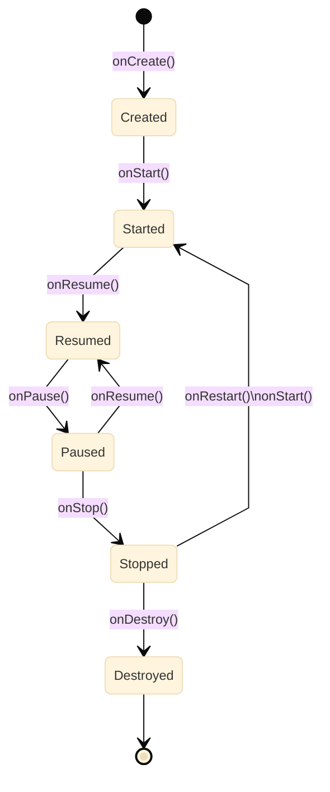

## Visão geral

O desenvolvimento Android é baseado em componentes gerenciados pelo sistema operacional. Em especial, a maior parte dos aplicativos inicia em uma **Activity** (uma tela) e navega para outras telas por meio de **Intents** ou bibliotecas de navegação (como o **Navigation Compose**). Além disso, é comum separar o projeto em camadas para manter o código compreensível à medida que o aplicativo cresce.

Ao longo deste documento, os principais tópicos são: ciclo de vida de Activities, Intents (explícitas e implícitas) e criação de UI com **Jetpack Compose**, incluindo estado e navegação.


## Activities


Uma **Activity** é um componente fundamental do desenvolvimento de aplicativos Android, representando uma única tela com interface de usuário. O sistema operacional controla quando a Activity é criada, exibida, colocada em segundo plano e destruída. Por isso, compreender o **ciclo de vida** é essencial para inicializar recursos no momento correto e liberar recursos quando a tela deixa de ser visível.

### Ciclo de Vida

O ciclo de vida de uma Activity é gerenciado pelo sistema operacional Android e é composto por uma série de estados (e métodos de callback). Na prática, as transições mais importantes estão relacionadas a três perguntas:

1. A tela foi criada e precisa carregar UI/dados iniciais?
2. A tela está visível e pode interagir com o usuário?
3. A tela saiu de foco e precisa salvar/liberar recursos?

Os estados mais comuns são:

- **Created (Criada):** a Activity é instanciada e configura a UI.
- **Started (Iniciada):** a Activity torna-se visível.
- **Resumed (Retomada):** a Activity está em primeiro plano, recebendo interação.
- **Paused (Pausada):** outra tela entrou parcialmente em foco; é comum pausar animações ou tarefas que exigem foco.
- **Stopped (Parada):** a Activity não está mais visível.
- **Destroyed (Destruída):** a Activity é finalizada e removida da memória.

O diagrama a seguir resume as transições principais:



Cada estado do ciclo de vida é associado a métodos específicos chamados automaticamente pelo sistema. Assim, é possível executar instruções apropriadas para cada fase. Em geral, `onCreate()` é usado para inicialização (UI, listeners, configuração), enquanto `onStart()`/`onResume()` indicam que a tela tornou-se visível/ativa.

- `onCreate()`: Chamado quando a Activity está sendo criada.
- `onStart()`: Chamado quando a Activity está prestes a se tornar visível.
- `onResume()`: Chamado quando a Activity está em primeiro plano e interagindo com o usuário.
- `onPause()`: Chamado quando a Activity está prestes a perder o foco, geralmente quando outra Activity é iniciada.
- `onStop()`: Chamado quando a Activity não é mais visível ao usuário.
- `onRestart()`: Chamado quando a Activity está voltando do estado parado (`onStop`) para o estado iniciado.
- `onDestroy()`: Chamado antes da Activity ser destruída.

Além desses callbacks, existe `onSaveInstanceState()`, que permite salvar um pequeno conjunto de dados para reconstruir a UI (por exemplo, textos digitados) caso o sistema destrua e recrie a Activity (mudanças de configuração ou recuperação de memória).


```kotlin

import android.os.Bundle
import androidx.appcompat.app.AppCompatActivity

class MinhaActivity : AppCompatActivity() {

    override fun onCreate(savedInstanceState: Bundle?) {
        super.onCreate(savedInstanceState)
        setContentView(R.layout.activity_minha)

        // Seu código de inicialização aqui
    }

    override fun onStart() {
        super.onStart()
        // A Activity está prestes a se tornar visível
    }

    override fun onResume() {
        super.onResume()
        // Está em primeiro plano e pode interagir com o usuário
    }

    override fun onPause() {
        super.onPause()
        // Está prestes a perder o foco
    }

    override fun onStop() {
        super.onStop()
        // Não é mais visível ao usuário
    }

    override fun onSaveInstanceState(outState: Bundle) {
        super.onSaveInstanceState(outState)
        // Salvar dados pequenos necessários para restaurar a UI
    }

    override fun onRestart() {
        super.onRestart()
        // Está voltando do estado parado para o estado iniciado
    }

    override fun onDestroy() {
        super.onDestroy()
        // Está prestes a ser destruída
    }
}
```


## Fragments

Um **Fragment** é um componente de UI que representa uma **parte reutilizável de uma tela**. Na prática, ele funciona como um “subcomponente” de uma Activity: o Fragment define (e gerencia) a própria interface e lógica de interação, mas é exibido dentro de um contêiner pertencente a uma Activity.

A documentação oficial descreve Fragments como uma forma de modularizar a UI, reaproveitar partes de telas e suportar diferentes tamanhos/formatos de dispositivo (por exemplo, layouts com múltiplos painéis em tablets) [@android_docs_fragments].

### Diferenças entre Fragment e Activity

Uma Activity costuma ser usada como **ponto de entrada** de uma tela (e, muitas vezes, de um fluxo). Já um Fragment é usado para **compor a tela** a partir de partes menores.

As diferenças mais importantes são:

- **Escopo e responsabilidade**: uma Activity representa uma tela de mais alto nível; um Fragment representa uma parte dessa tela.
- **Gerenciamento pelo sistema**: Activities são criadas e destruídas diretamente pelo Android com base no ciclo de vida do app; Fragments são gerenciados por uma Activity por meio do `FragmentManager`.
- **Ciclo de vida da View**: além do ciclo de vida do próprio Fragment, existe o ciclo de vida da **View do Fragment** (criada em `onCreateView` e destruída em `onDestroyView`). Essa diferença é crucial para evitar vazamentos de memória em referências a Views.
- **Composição e reuso**: Fragments facilitam reuso de UI e composição (por exemplo, a mesma “tela de detalhe” em celulares e tablets), além de integrarem-se bem a bibliotecas de navegação.

### Exemplo: Activity hospeda um Fragment

No XML da Activity, declara-se um contêiner para o conteúdo do Fragment. Um componente comum é `FragmentContainerView`.

```xml
<androidx.fragment.app.FragmentContainerView
    xmlns:android="http://schemas.android.com/apk/res/android"
    android:id="@+id/fragment_container"
    android:layout_width="match_parent"
    android:layout_height="match_parent" />
```

No Kotlin, o Fragment cria a sua interface no `onCreateView` (ou usa ViewBinding para inflar o layout).

```kotlin
class PerfilFragment : Fragment(R.layout.fragment_perfil) {
    override fun onViewCreated(view: View, savedInstanceState: Bundle?) {
        super.onViewCreated(view, savedInstanceState)
        // Inicialização de UI e listeners usando a view inflada
    }
}
```

Por fim, a Activity pode adicionar o Fragment no contêiner usando o `FragmentManager`:

```kotlin
supportFragmentManager.beginTransaction()
    .replace(R.id.fragment_container, PerfilFragment())
    .commit()
```

Em aplicações modernas, esse gerenciamento frequentemente é feito por bibliotecas como o Navigation Component, mas os conceitos de “Activity hospeda Fragment” e “Fragment possui view lifecycle” permanecem os mesmos.


## Intents

Intents são uma parte essencial do desenvolvimento de aplicativos Android, assim como as Activities. Elas permitem criar interações entre diferentes componentes do sistema, como Activities, Services, Broadcast Receivers e Content Providers. Na prática, Intents são usadas para navegar entre telas, compartilhar dados, abrir recursos do dispositivo (navegador, discador, mapa) e delegar ações para outros aplicativos.

Dentre as funcionalidades mais comuns, destacam-se:


- **Iniciar Componentes:** Uma das principais funcionalidades das *intents* é iniciar componentes do Android, como Activities, Services, Broadcast Receivers e Content Providers. 
   
- **Comunicar Dados:** As *intents* podem ser usadas para transmitir dados entre componentes do Android. Os desenvolvedores podem enviar dados, como strings, números, objetos Parcelable ou Serializable, e até mesmo arquivos, entre diferentes partes do aplicativo ou mesmo entre aplicativos diferentes.

- **Realizar ações explícitas e implícitas:** uma *intent* explícita especifica um componente de destino dentro do próprio aplicativo (por exemplo, uma Activity). Já uma *intent* implícita especifica uma ação geral (por exemplo, “abrir uma URL”) e permite que o Android escolha o aplicativo apropriado.

- **Responder a Intenções Externas:** Os aplicativos Android podem se registrar para responder a intenções externas, como abrir um tipo específico de arquivo ou lidar com solicitações de compartilhamento de conteúdo de outros aplicativos. Isso permite uma integração eficaz entre diferentes aplicativos no dispositivo.


### Componentes de uma Intent

Uma Intent no Android é composta por várias partes:

- **Ação (Action):** Define a ação a ser executada, como "ACTION_VIEW" para visualizar dados, "ACTION_SEND" para enviar dados ou "ACTION_DIAL" para fazer uma chamada telefônica.
- **Categoria (Category):** Define a categoria da Intent, como "CATEGORY_LAUNCHER" para uma Activity de lançamento ou "CATEGORY_DEFAULT" para uma ação padrão.
- **Componente (Component):** Especifica o componente de destino para a Intent, como uma Activity, Service ou Broadcast Receiver.
- **Dados (Data):** Representa os dados associados à Intent, como um URI para visualizar uma página da web ou um arquivo para enviar.

Em intents implícitas, o sistema normalmente considera também o **tipo MIME** (`type`), especialmente em ações de compartilhamento.

### Exemplos de Uso

As Intents são amplamente utilizadas em aplicativos Android para uma variedade de propósitos. Aqui estão alguns exemplos comuns de como as Intents podem ser usadas:

- **Navegação entre telas:** Abrir uma nova Activity para apresentar uma nova tela ao usuário.
- **Compartilhamento de conteúdo:** Enviar texto, imagens ou arquivos para outros aplicativos.
- **Iniciar serviços em segundo plano:** Iniciar um Service para executar operações em segundo plano, como baixar arquivos ou processar dados.
- **Receber transmissões:** Registrar Broadcast Receivers para responder a eventos do sistema ou de outros aplicativos.

Os exemplos a seguir mostram duas abordagens corretas: (1) usar intents em uma Activity tradicional; (2) usar intents dentro de Compose obtendo um `Context` com `LocalContext.current`.

#### Intents em uma Activity (Kotlin/Views ou Compose)

```kotlin
import android.content.Intent
import android.net.Uri
import android.os.Bundle
import androidx.appcompat.app.AppCompatActivity

class IntentsActivity : AppCompatActivity() {
    override fun onCreate(savedInstanceState: Bundle?) {
        super.onCreate(savedInstanceState)
    }

    fun abrirSite() {
        val intent = Intent(Intent.ACTION_VIEW, Uri.parse("https://developer.android.com"))
        startActivity(intent)
    }

    fun abrirDiscador() {
        val intent = Intent(Intent.ACTION_DIAL, Uri.parse("tel:123456789"))
        startActivity(intent)
    }

    fun compartilharTexto() {
        val intent = Intent(Intent.ACTION_SEND).apply {
            type = "text/plain"
            putExtra(Intent.EXTRA_TEXT, "Confira este link: https://developer.android.com")
        }
        startActivity(Intent.createChooser(intent, "Compartilhar via"))
    }
}
```

#### Intents em Jetpack Compose

```kotlin
import android.content.Intent
import android.net.Uri
import androidx.compose.material3.Button
import androidx.compose.material3.Text
import androidx.compose.runtime.Composable
import androidx.compose.ui.platform.LocalContext

@Composable
fun AbrirSiteButton() {
    val context = LocalContext.current

    Button(onClick = {
        val intent = Intent(Intent.ACTION_VIEW, Uri.parse("https://developer.android.com"))
        context.startActivity(intent)
    }) {
        Text("Abrir site")
    }
}
```


### Enviar dados de uma Activity para outra via Intent

Para enviar dados a outra Activity, cria-se uma intent explícita e adicionam-se dados com `putExtra()`. É possível enviar tipos primitivos e alguns objetos (por exemplo, `Parcelable`). Depois, inicia-se a tela com `startActivity()`.


```kotlin
val intent = Intent(this, OutraActivity::class.java)
intent.putExtra("nome", "John")
intent.putExtra("idade", 30)
startActivity(intent)
```

Na Activity de destino, obtém-se o `Intent` que iniciou a tela (por exemplo, em `onCreate()`) por meio do atributo `intent`.

A partir do objeto *intent*, utilizamos os métodos `getStringExtra()`, `getIntExtra()`, etc., para extrair os dados, com base nas chaves que fornecemos no momento do envio.


```kotlin
val nome = intent.getStringExtra("nome")
val idade = intent.getIntExtra("idade", 0)
```

### Receber resultados (Activity Result API)

Em versões modernas do Android, é recomendado usar a Activity Result API ao invés de `startActivityForResult()`. O exemplo a seguir abre o seletor de conteúdo e recebe uma `Uri`.

```kotlin
import androidx.activity.result.contract.ActivityResultContracts

private val selecionarImagem = registerForActivityResult(
    ActivityResultContracts.GetContent()
) { uri ->
    // uri pode ser nula se o usuário cancelar
}

fun abrirGaleria() {
    selecionarImagem.launch("image/*")
}
```


## Referências

- Documentação oficial do Android: [Activities](https://developer.android.com/guide/components/activities)
- Documentação oficial do Android: [Ciclo de Vida de uma Activity](https://developer.android.com/guide/components/activities/activity-lifecycle)
- Documentação oficial do Android: [Intents and Intent Filters](https://developer.android.com/guide/components/intents-filters)
- Documentação oficial do Android: [Activity Result API](https://developer.android.com/training/basics/intents/result)
- Documentação oficial do Android: [Jetpack Compose](https://developer.android.com/jetpack/compose)
- Documentação oficial do Android: [Navigation Compose](https://developer.android.com/jetpack/compose/navigation)
- Android Developers Blog: [Understanding Android Intents](https://android-developers.googleblog.com/2009/11/intents-are-not-just-for-starting.html)

