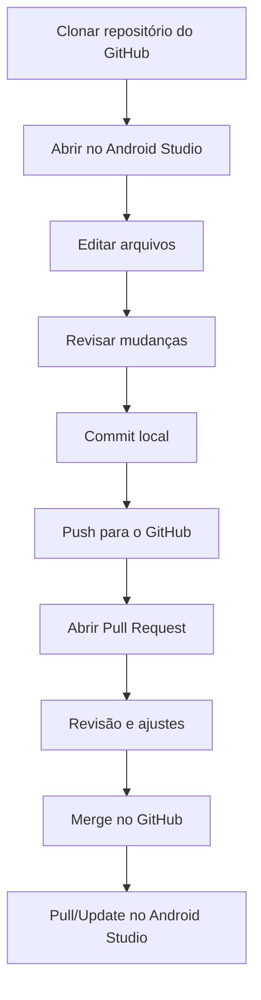

## Objetivo

Este material apresenta um tutorial de uso básico do Git no Android Studio, considerando um fluxo comum de trabalho com repositórios hospedados no GitHub. O foco é fazer com que os estudantes consigam: clonar um repositório, criar commits, enviar (push) e baixar (pull) alterações, trabalhar com branches e resolver conflitos simples, além de interagir com Pull Requests.

## Pré-requisitos

Para acompanhar o tutorial, considera-se que:

1. O Git está instalado no sistema operacional e acessível pelo Android Studio.
2. Existe uma conta no GitHub e acesso a um repositório (próprio ou da turma).
3. O Android Studio está instalado e atualizado.

Como referência de estudo e consulta, recomenda-se a leitura do livro oficial do Git [@chacon2014progit] e a documentação do GitHub sobre autenticação e trabalho com repositórios [@githubdocs-auth]. Para a interface do Android Studio (baseada na plataforma IntelliJ), a documentação de controle de versão também é útil [@jetbrains-vcs].

## Conceitos mínimos (o vocabulário do dia a dia)

Antes do passo a passo, convém fixar algumas palavras que aparecem na interface do Android Studio e no GitHub:

- **Repositório (repo)**: pasta do projeto com histórico de versões.
- **Commit**: “foto” das mudanças, registrada localmente, com mensagem e autor.
- **Branch**: linha de desenvolvimento paralela (por exemplo, `main` e `feature/login`).
- **Remote**: servidor remoto (no GitHub, geralmente chamado `origin`).
- **Push**: envia commits locais para o GitHub.
- **Pull / Update**: traz commits do GitHub para a máquina.
- **Pull Request (PR)**: proposta de mudança no GitHub, usada para revisão e merge.

## Visão geral do fluxo

O fluxo mais comum no GitHub para trabalhos em equipe pode ser resumido assim:



## 1) Configurar Git no Android Studio

O Android Studio costuma detectar o Git automaticamente. Quando isso não acontece, configura-se manualmente:

1. Abrir as configurações do Android Studio.
2. Localizar as opções de **Version Control / Git**.
3. Apontar o caminho do executável do Git (por exemplo, `git` no macOS/Linux).
4. Usar o botão de teste (quando disponível) para validar a detecção.

Além disso, recomenda-se configurar a identidade (nome e e-mail) que aparecerá nos commits. Em geral, isso pode ser feito no terminal embutido do Android Studio:

```bash
git config --global user.name "Nome Sobrenome"
git config --global user.email "email@exemplo.com"
```

## 2) Conectar o Android Studio ao GitHub (autenticação)

A integração com o GitHub permite operações como clone, push e navegação por PRs a partir do IDE. O método exato pode variar por versão do Android Studio, mas em geral envolve:

1. Abrir as configurações do Android Studio.
2. Ir até a seção de **Accounts / GitHub**.
3. Fazer login via navegador (OAuth) ou fornecer um token (PAT) quando solicitado.

Em termos práticos, o importante é entender que o GitHub não aceita mais autenticação por senha em operações Git via HTTPS; normalmente usa-se OAuth no IDE ou um token [@githubdocs-auth].

## 3) Clonar um repositório do GitHub

Para iniciar um projeto a partir de um repositório existente:

1. No Android Studio, escolher a opção de **Get from VCS** (ou equivalente).
2. Selecionar **Git**.
3. Colar a URL do repositório no GitHub.
4. Escolher a pasta local onde o projeto será salvo.
5. Confirmar o clone e aguardar a importação/abertura do projeto.

Depois do clone, o Android Studio passa a mostrar janelas e menus de versionamento, como o painel de mudanças (Changes) e ações de commit/push.

## 4) Criar um repositório a partir de um projeto já existente

Quando o projeto já existe localmente, mas ainda não está versionado:

1. Inicializar o Git no projeto (geralmente via menu **VCS** → **Enable Version Control Integration**).
2. Selecionar **Git**.
3. Verificar o arquivo `.gitignore` (um projeto Android normalmente ignora `build/`, `.idea/` parcialmente, e artefatos de compilação).

Se a atividade exigir que o projeto seja publicado no GitHub, o Android Studio também costuma oferecer uma ação para compartilhar o projeto (por exemplo, “Share Project on GitHub”), criando o repositório remoto e fazendo o primeiro push.

## 5) Fazer o primeiro commit (e entender “commit” vs “push”)

Um erro comum no início é acreditar que “commit” já envia mudanças para o GitHub. Na prática:

- **Commit** grava o histórico localmente.
- **Push** envia os commits locais para o GitHub.

No Android Studio, um fluxo típico para commitar é:

1. Abrir a janela de **Commit** (ou **Git** → **Commit**).
2. Revisar os arquivos alterados.
3. Selecionar quais arquivos entram no commit (equivalente ao “stage”).
4. Escrever uma mensagem objetiva.
5. Confirmar o commit.

Após isso, executa-se **Push** (às vezes existe o atalho “Commit and Push”).

## 6) Atualizar o projeto: Pull / Update

Em projetos em equipe, é importante atualizar o repositório com frequência para reduzir conflitos:

1. Usar **Pull** (ou **Update Project**) para baixar mudanças do GitHub.
2. Verificar se há conflitos.
3. Rodar o projeto ou os testes necessários após a atualização.

## 7) Trabalhar com branches (básico)

Branches evitam que todos editem diretamente a `main` ao mesmo tempo. Um fluxo simples para uma tarefa é:

1. Criar uma branch para a tarefa (por exemplo, `feature/tela-login`).
2. Fazer commits pequenos ao longo do desenvolvimento.
3. Fazer push da branch para o GitHub.
4. Abrir um Pull Request para revisão/merge.

No Android Studio, a troca/criação de branches geralmente está acessível pelo menu Git ou pelo indicador de branch na barra inferior.

## 8) Pull Request (PR) no GitHub

O Pull Request é o mecanismo mais comum para integrar uma branch ao código principal no GitHub.

Um passo a passo mínimo (do ponto de vista do processo) é:

1. Fazer push da branch para o GitHub.
2. Abrir um PR no GitHub (branch → `main`).
3. Ler as verificações (checks) e comentários.
4. Ajustar o código no Android Studio e fazer novos commits na mesma branch.
5. Fazer push novamente; o PR é atualizado automaticamente.
6. Após aprovação, fazer o merge.
7. De volta ao Android Studio, fazer pull/update para sincronizar.

## 9) Resolução de conflitos (quando o Git “não consegue adivinhar”)

Conflitos aparecem quando duas pessoas (ou duas branches) modificam as mesmas linhas de um arquivo e o Git não consegue decidir qual versão deve prevalecer.

Quando isso ocorrer:

1. O Android Studio apresentará os arquivos em conflito.
2. Abrir o resolvedor de merge da IDE.
3. Comparar **Local** vs **Remote** (ou **Current** vs **Incoming**), escolhendo trechos.
4. Salvar o resultado final.
5. Finalizar o merge e fazer commit.
6. Rodar o projeto para confirmar que está consistente.

A regra prática é: primeiro entender *o que mudou* em cada lado; só depois escolher a versão final.

## Boas práticas mínimas (para evitar problemas típicos)

- Fazer commits pequenos e frequentes, com mensagens que descrevem a intenção.
- Atualizar (pull) antes de começar uma tarefa e antes de abrir PR.
- Evitar versionar segredos (tokens, chaves, senhas) e arquivos gerados de build.
- Preferir branch por tarefa e PR para integração.

## Recursos adicionais

- Livro “Pro Git” (base conceitual e prática) [@chacon2014progit]
- Documentação do GitHub sobre autenticação e tokens [@githubdocs-auth]
- Documentação da plataforma IntelliJ/JetBrains sobre VCS (interface do IDE) [@jetbrains-vcs]
