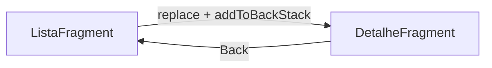

## Visão geral

Navegação, no contexto Android, é o conjunto de decisões e mecanismos que controlam **como o aplicativo troca de telas**, **como o usuário volta**, e **como dados são passados entre destinos**.

Em projetos Android, os destinos de navegação mais comuns são:

- **Activities** (telas de alto nível);
- **Fragments** (partes de UI hospedadas em uma Activity);
- (em projetos com Jetpack Compose) **composables** que atuam como destinos.

Este material foca em navegação entre telas e fragments no ecossistema tradicional (Views/XML + Fragments), com conexão aos conceitos que também aparecem em Compose.

## Conceitos essenciais: task, back stack e o botão voltar

Antes de implementar navegação, é importante compreender como o Android organiza as telas em execução.

- **Task**: um conjunto de Activities que o usuário percebe como “um fluxo” do aplicativo.
- **Back stack**: uma pilha de telas; a tela atual fica no topo.
- **Up vs Back**:
  - **Back** (botão do sistema) volta na pilha de acordo com a navegação real do usuário.
  - **Up** (seta na App Bar) normalmente volta dentro da hierarquia lógica do app.

Um modelo mental simplificado é:

```mermaid
flowchart TB
    A[Activity A] --> B[Activity B]
    B --> C[Activity C]

    subgraph Back stack (topo em cima)
      C
      B
      A
    end
```

Em navegação com Fragments, também existe um “back stack” de fragments dentro da Activity, quando o aplicativo adiciona transações ao back stack.

## Navegação entre Activities com Intents

A forma mais direta de navegar entre telas é iniciar uma Activity com uma **Intent**.

### Intent explícita (tela dentro do próprio app)

A Intent explícita define diretamente a classe da Activity de destino.

```kotlin
import android.content.Intent
import androidx.appcompat.app.AppCompatActivity

class ListaActivity : AppCompatActivity() {

    fun abrirDetalhe(id: Long) {
        val intent = Intent(this, DetalheActivity::class.java).apply {
            putExtra("id", id)
        }
        startActivity(intent)
    }
}
```

Na Activity de destino, os dados podem ser lidos a partir do `intent`:

```kotlin
import androidx.appcompat.app.AppCompatActivity

class DetalheActivity : AppCompatActivity() {

    fun carregar() {
        val id = intent.getLongExtra("id", -1L)
        // carregar dados para o id
    }
}
```

### Intent implícita (delegar ação a outro app)

A Intent implícita descreve uma ação (por exemplo, abrir uma URL). O Android decide qual app pode atender à ação.

```kotlin
import android.content.Intent
import android.net.Uri
import androidx.appcompat.app.AppCompatActivity

class AjudaActivity : AppCompatActivity() {

    fun abrirSite() {
        val intent = Intent(Intent.ACTION_VIEW, Uri.parse("https://developer.android.com"))
        startActivity(intent)
    }
}
```

A documentação oficial descreve intents e filtros de intent em detalhes [@android_docs_intents].

### Retornar resultado: Activity Result API

Para fluxos que precisam de um resultado (selecionar uma imagem, pedir permissão, escolher um contato), usa-se a **Activity Result API** [@android_docs_activity_result_api].

Exemplo (conceitual):

```kotlin
import androidx.activity.result.contract.ActivityResultContracts

private val selecionarArquivo = registerForActivityResult(
    ActivityResultContracts.GetContent()
) { uri ->
    // tratar a uri retornada
}

fun abrirSeletor() {
    selecionarArquivo.launch("image/*")
}
```

## Fragments e navegação dentro de uma Activity

Um Fragment é um componente que encapsula UI e lógica de interação, mas é **hospedado** em uma Activity. Isso permite compor uma tela por partes e também alternar conteúdo sem trocar de Activity.

Na prática, navegação com fragments pode ser feita de duas maneiras:

1. **Transações manuais** com `FragmentManager` (bom para entender fundamentos);
2. **Navigation Component** (recomendado em projetos modernos com Fragments).

A documentação oficial de Fragments descreve o papel do componente e seus ciclos de vida [@android_docs_fragments].

### Ciclo de vida da View do Fragment (ponto crítico)

Fragments possuem um detalhe importante: o ciclo de vida da **View do Fragment** é separado do ciclo de vida do Fragment. A View é criada em `onCreateView` e destruída em `onDestroyView`. Esse aspecto afeta diretamente o uso de ViewBinding e referências a Views.

## Navegação com FragmentManager (fundamentos)

### Definindo o container

A Activity precisa de um contêiner para mostrar Fragments.

```xml
<androidx.fragment.app.FragmentContainerView
    xmlns:android="http://schemas.android.com/apk/res/android"
    android:id="@+id/fragment_container"
    android:layout_width="match_parent"
    android:layout_height="match_parent" />
```

### Substituir um Fragment (sem back stack)

Uma troca simples substitui o conteúdo atual.

```kotlin
supportFragmentManager.beginTransaction()
    .replace(R.id.fragment_container, ListaFragment())
    .commit()
```

Nesse caso, o botão voltar não “desfaz” a troca, porque não há entrada no back stack de fragments.

### Substituir e adicionar ao back stack

Para permitir voltar ao fragment anterior, adiciona-se a transação ao back stack.

```kotlin
supportFragmentManager.beginTransaction()
    .replace(R.id.fragment_container, DetalheFragment())
    .addToBackStack(null)
    .commit()
```

Modelo mental:



### Passagem de dados para um Fragment

Em projetos legados, é comum passar dados por `Bundle` com `arguments`.

```kotlin
class DetalheFragment : Fragment(R.layout.fragment_detalhe) {

    override fun onViewCreated(view: View, savedInstanceState: Bundle?) {
        super.onViewCreated(view, savedInstanceState)
        val id = requireArguments().getLong("id")
        // carregar dados
    }
}

fun abrirDetalhe(id: Long) {
    val fragment = DetalheFragment().apply {
        arguments = Bundle().apply {
            putLong("id", id)
        }
    }

    supportFragmentManager.beginTransaction()
        .replace(R.id.fragment_container, fragment)
        .addToBackStack(null)
        .commit()
}
```

Em projetos modernos, é preferível o **Navigation Component com Safe Args**, pois reduz erros de chave/tipo.

## Navegação com Navigation Component (recomendado com Fragments)

O Jetpack Navigation organiza a navegação a partir de um **grafo** (navigation graph), garantindo consistência de back stack, animações e integração com a App Bar.

A documentação oficial apresenta o Navigation Component e suas integrações [@android_docs_navigation].

### Peças principais

- `NavHostFragment`: contêiner que hospeda destinos de navegação.
- `NavController`: objeto que executa navegação.
- `nav_graph.xml`: define destinos e ações.

Exemplo (estrutura típica do grafo):

```xml
<navigation xmlns:android="http://schemas.android.com/apk/res/android"
    xmlns:app="http://schemas.android.com/apk/res-auto"
    android:id="@+id/nav_graph"
    app:startDestination="@id/listaFragment">

    <fragment
        android:id="@+id/listaFragment"
        android:name="com.exemplo.ListaFragment"
        android:label="Lista">
        <action
            android:id="@+id/action_lista_to_detalhe"
            app:destination="@id/detalheFragment" />
    </fragment>

    <fragment
        android:id="@+id/detalheFragment"
        android:name="com.exemplo.DetalheFragment"
        android:label="Detalhe" />

</navigation>
```

E, no Fragment de origem, navega-se via `findNavController()`:

```kotlin
import androidx.navigation.fragment.findNavController

class ListaFragment : Fragment(R.layout.fragment_lista) {

    fun irParaDetalhe() {
        findNavController().navigate(R.id.action_lista_to_detalhe)
    }
}
```

### Argumentos e tipagem

O Navigation Component suporta declarar argumentos no grafo. Com **Safe Args**, os argumentos ganham tipagem e reduzem bugs de runtime.

## Boas práticas (erros comuns em sala e em projetos)

1. **Evitar múltiplas “fontes de navegação”**: escolher um padrão (Navigation Component para Fragments, por exemplo) e aplicá-lo de forma consistente.
2. **Separar navegação de UI**: eventos de clique disparam navegação, mas regras (quando pode navegar) costumam ficar em camadas de lógica/estado.
3. **Cuidado com binding em Fragments**: limpar referências em `onDestroyView` para evitar vazamentos.
4. **Não exagerar em Activities**: em apps modernos, muitas telas são organizadas como fragments dentro de uma Activity principal.
5. **Planejar o botão voltar**: cada destino deve ter um comportamento de retorno coerente com o fluxo do usuário.

## Referências

- Android Developers: Intents and Intent Filters [@android_docs_intents]
- Android Developers: Activity Result API [@android_docs_activity_result_api]
- Android Developers: Fragments [@android_docs_fragments]
- Android Developers: Navigation Component [@android_docs_navigation]
