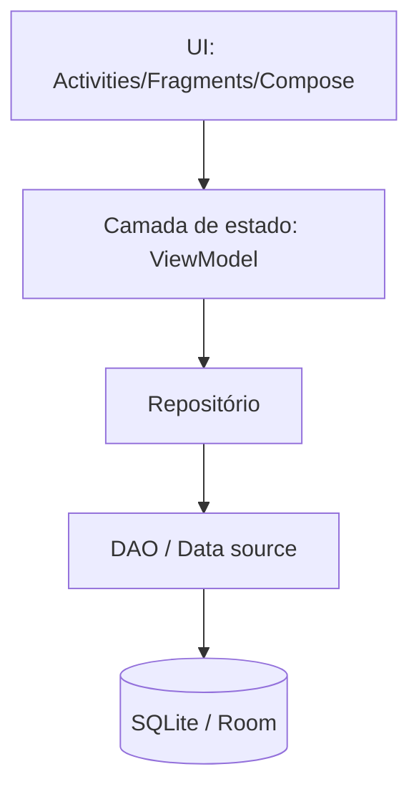

## Visão geral

A persistência local permite que um aplicativo mantenha dados **mesmo sem conexão** e reduza latência de leitura, guardando informações no dispositivo. No Android, uma opção clássica é o **SQLite**, um banco de dados relacional embarcado.

Existem duas formas principais de integração com SQLite no Android:

1. **Acesso direto ao SQLite** (API de baixo nível, com SQL manual).
2. **Room** (biblioteca da Jetpack que abstrai SQLite, recomendada para a maioria dos casos modernos).

A documentação oficial descreve opções de armazenamento local e recomendações atuais [@android_docs_data_storage]. Para SQLite e a API tradicional, há referências específicas [@android_docs_sqlite]. Para Room, a documentação concentra as práticas modernas (Entities, DAOs e migrações) [@android_docs_room].

## O que significa “integrar com SQLite” (passo a passo)

Ao integrar um app Android com SQLite, o projeto costuma seguir estes passos, do planejamento à manutenção:

1. Definir **o que precisa persistir** (modelo de dados e casos de uso).
2. Escolher a abordagem (Room ou API direta).
3. Projetar o **schema** (tabelas, colunas, chaves, índices e relacionamentos).
4. Implementar a camada de acesso a dados (CRUD, consultas, transações).
5. Definir regras de **migração** (mudanças de versão do schema).
6. Integrar com a camada de UI/estado (carregar, salvar, observar mudanças).
7. Garantir boas práticas: performance, concorrência, testes e backup.

O diagrama a seguir ilustra uma organização típica:



## Passo 1 — Definir requisitos e modelo de dados

Antes de escrever qualquer SQL, define-se:

- quais entidades existem (por exemplo, **Usuário**, **Pedido**, **Produto**);
- quais consultas são necessárias (listar, buscar por id, filtrar por status);
- quais regras de integridade são importantes (unicidade de e-mail, chaves estrangeiras);
- qual volume esperado de dados (impacta índices, paginação e tamanho do banco).

Essa etapa reduz retrabalho, especialmente quando as migrações começam a ocorrer.

## Passo 2 — Escolher a abordagem: Room vs SQLite direto

### Room (recomendado)

O Room é uma camada sobre SQLite que fornece:

- mapeamento entre classes e tabelas (Entities);
- métodos de consulta organizados (DAOs);
- validações em tempo de compilação (quando aplicável);
- suporte estruturado a migrações.

Em projetos de ensino e projetos reais, Room tende a reduzir erros comuns (SQL com typo, conversões de tipo e cursores mal fechados) [@android_docs_room].

### SQLite direto (quando faz sentido)

A API direta pode ser útil quando:

- o projeto precisa de controle fino de SQL e performance;
- existe código legado que já usa `SQLiteOpenHelper`;
- a equipe deseja manter a camada de persistência mínima e manual.

Mesmo assim, é importante manter disciplina com transações, fechamento de recursos e execução fora da thread principal [@android_docs_sqlite].

!!! info "Regra prática"

    Para a maioria dos aplicativos modernos com Fragments/Jetpack, Room é a escolha padrão. A API direta fica como alternativa para manutenção de legado ou casos muito específicos.

## Passo 2.1 — Integração com Room no Android (roteiro prático)

Quando a equipe escolhe Room, o “caminho das pedras” no Android costuma ser:

1. **Adicionar dependências do Room** no build do módulo (incluindo o processador de anotações adequado ao projeto).
2. Definir as **Entities** (classes que representam tabelas), incluindo:
    - chave primária;
    - índices;
    - conversões de tipo quando necessário (por exemplo, datas).
3. Definir os **DAOs** (interfaces/classe de acesso a dados), separando:
    - operações de escrita (insert/update/delete);
    - consultas (selects) por caso de uso.
4. Criar a classe do banco (`RoomDatabase`) apontando:
    - lista de Entities;
    - versão do banco;
    - DAOs expostos.
5. Declarar e testar **migrações** entre versões do banco.
6. Criar um **Repositório** que encapsula o DAO para o resto do app (UI não deve conhecer detalhes do banco).
7. Integrar com a camada de estado (por exemplo, ViewModel), garantindo execução de I/O fora da thread principal.

Esse roteiro se conecta diretamente ao que a documentação descreve como arquitetura típica de persistência com Room [@android_docs_room].

## Passo 2.2 — Integração com SQLite direto no Android (roteiro prático)

Ao optar pelo SQLite direto, um roteiro clássico é:

1. Definir o schema (SQL) e a **versão do banco**.
2. Implementar um helper de criação/atualização (por exemplo, com `SQLiteOpenHelper`), centralizando:
    - `onCreate`: criação das tabelas e índices;
    - `onUpgrade`: migrações entre versões.
3. Criar uma camada de acesso a dados que:
    - abre o banco apenas quando necessário;
    - usa parâmetros nas queries;
    - fecha/gerencia recursos corretamente.
4. Garantir que leituras/escritas ocorram fora da thread principal.

Esse fluxo é alinhado ao material oficial de “salvar dados usando SQLite” [@android_docs_sqlite].

## Passo 3 — Projetar o schema (SQL)

Independentemente da abordagem, o banco relacional exige um **schema**.

### Exemplo de schema mínimo

A seguir, um exemplo de tabela de tarefas com índice por status:

```sql
CREATE TABLE tarefa (
  id INTEGER PRIMARY KEY AUTOINCREMENT,
  titulo TEXT NOT NULL,
  concluida INTEGER NOT NULL DEFAULT 0,
  criada_em INTEGER NOT NULL
);

CREATE INDEX idx_tarefa_concluida ON tarefa(concluida);
```

Pontos importantes:

- escolher tipos coerentes (inteiros para timestamps, `TEXT` para textos);
- criar índices para consultas frequentes;
- decidir como representar booleanos (frequentemente `0/1`).

## Passo 4 — Implementar CRUD e consultas

Nesta etapa, o projeto implementa operações básicas:

- Create (inserir)
- Read (ler por id, listar, filtrar)
- Update (atualizar campos)
- Delete (remover)

A lógica abaixo usa **Python** apenas como exemplo didático para demonstrar SQL, transações e consultas, porque o foco é entender o comportamento do SQLite. Em Android, a mesma ideia é implementada via Room (DAOs) ou API direta.

### Exemplo didático em Python (SQLite)

```python
import sqlite3
from dataclasses import dataclass
from typing import Iterable

@dataclass(frozen=True)
class Tarefa:
    id: int
    titulo: str
    concluida: bool
    criada_em: int


def criar_schema(conn: sqlite3.Connection) -> None:
    conn.execute(
        """
        CREATE TABLE IF NOT EXISTS tarefa (
          id INTEGER PRIMARY KEY AUTOINCREMENT,
          titulo TEXT NOT NULL,
          concluida INTEGER NOT NULL DEFAULT 0,
          criada_em INTEGER NOT NULL
        )
        """
    )
    conn.execute("CREATE INDEX IF NOT EXISTS idx_tarefa_concluida ON tarefa(concluida)")


def inserir_tarefa(conn: sqlite3.Connection, titulo: str, criada_em: int) -> int:
    cur = conn.execute(
        "INSERT INTO tarefa (titulo, concluida, criada_em) VALUES (?, ?, ?)",
        (titulo, 0, criada_em),
    )
    return int(cur.lastrowid)


def listar_pendentes(conn: sqlite3.Connection) -> list[Tarefa]:
    cur = conn.execute(
        "SELECT id, titulo, concluida, criada_em FROM tarefa WHERE concluida = 0 ORDER BY criada_em DESC"
    )
    return [
        Tarefa(id=row[0], titulo=row[1], concluida=bool(row[2]), criada_em=row[3])
        for row in cur.fetchall()
    ]


def concluir(conn: sqlite3.Connection, tarefa_id: int) -> None:
    conn.execute("UPDATE tarefa SET concluida = 1 WHERE id = ?", (tarefa_id,))


def remover(conn: sqlite3.Connection, tarefa_id: int) -> None:
    conn.execute("DELETE FROM tarefa WHERE id = ?", (tarefa_id,))


def exemplo() -> None:
    conn = sqlite3.connect(":memory:")
    with conn:
        criar_schema(conn)
        tid = inserir_tarefa(conn, "Estudar SQLite", criada_em=1700000000)
        concluir(conn, tid)
        remover(conn, tid)


if __name__ == "__main__":
    exemplo()
```

Observações didáticas:

- `?` representa parâmetros posicionais (evita SQL injection e problemas de quoting).
- O bloco `with conn:` agrupa comandos em uma transação.

## Passo 5 — Transações e consistência

Em SQLite, transações são essenciais quando existem múltiplas escritas dependentes. Por exemplo: inserir um pedido e seus itens.

Conceitos chave:

- uma transação deve ser **curta**;
- falhas devem resultar em **rollback**;
- leituras e escritas devem ser planejadas para reduzir contenção.

No Android, Room possui suporte a transações e também é possível usar transações na API direta de SQLite [@android_docs_room].

## Passo 6 — Migrações (evolução do banco)

A evolução do app quase sempre exige alterar tabelas (novas colunas, índices, normalização). Isso exige um processo de **migração**.

### Estratégia recomendada

- versionar o schema;
- escrever migrações incrementais (1→2, 2→3, ...);
- testar migrações com bancos reais/fixtures.

Exemplo de migração SQL simples (adicionar coluna):

```sql
ALTER TABLE tarefa ADD COLUMN prioridade INTEGER NOT NULL DEFAULT 0;
```

Em Room, migrações são declaradas explicitamente e executadas conforme a versão do banco [@android_docs_room].

!!! warning "Prática a evitar"

    Recriar o banco apagando tudo pode parecer mais simples, mas costuma destruir dados do usuário. Essa estratégia só é aceitável em protótipos e ambientes de desenvolvimento.

## Passo 7 — Concorrência e performance

No Android, não se deve executar operações de banco na **thread principal**. Leituras pesadas e escritas devem ser feitas em background.

Boas práticas comuns:

- consolidar múltiplas escritas em uma transação;
- criar índices para filtros frequentes;
- evitar carregar listas gigantes sem paginação;
- medir tempo de consulta quando a base cresce.

## Passo 7.1 — Integração com Activities e Fragments (o que costuma dar errado)

Ao integrar persistência com telas (Activities/Fragments), alguns pontos geram erros recorrentes:

- **Bloquear a UI**: consultas e escritas feitas na thread principal causam travamentos.
- **Acoplamento**: quando a tela executa SQL diretamente, o código tende a ficar difícil de testar e manter.
- **Vazamentos de referência**: em Fragments, referências à View não devem sobreviver ao `onDestroyView`.

Uma abordagem comum é manter o acesso a dados encapsulado (DAO/Repositório) e expor apenas operações de alto nível para a camada de estado (por exemplo, ViewModel), que por sua vez abastece a UI.

## Passo 8 — Testes

A integração com SQLite deve ser testada para:

- validar schema e constraints;
- validar consultas (joins, filtros, ordenação);
- validar migrações.

Em um contexto didático, um caminho consistente é criar testes com banco efêmero (in-memory) para validar comportamento das consultas.

## Checklist final de integração

Ao final, um projeto integrado com SQLite deve conseguir responder afirmativamente:

- O schema está definido e documentado?
- O app consegue fazer CRUD sem travar a UI?
- As consultas importantes têm índices?
- Migrações estão implementadas e testadas?
- Existe uma camada de acesso a dados clara (DAO/Repositório)?
- Há estratégia para erros (banco corrompido, falta de espaço, etc.)?

## Referências

- Android Developers: Data and file storage overview [@android_docs_data_storage]
- Android Developers: Save data using SQLite [@android_docs_sqlite]
- Android Developers: Room persistence library [@android_docs_room]
