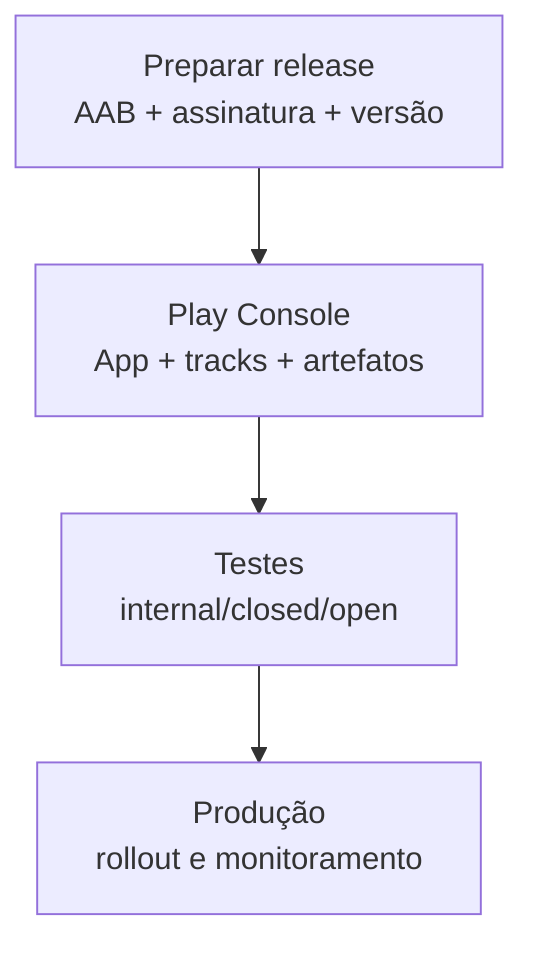

## Visão geral

Publicar um aplicativo na Google Play Store é um processo que combina **preparação técnica do build**, **requisitos de conformidade (políticas)** e **cadastro de metadados** no Play Console. Em termos práticos, a publicação costuma ocorrer em três fases:

1. preparar o aplicativo para release (versão, assinatura, bundle e validações);
2. configurar a entrega no Play Console (tracks, testes e rollout);
3. finalizar a ficha do app (conteúdo, privacidade e requisitos legais) e enviar para revisão.

A documentação oficial do Play Console descreve fluxos, requisitos e telas que podem mudar ao longo do tempo [@play_console_help].

## Pré-requisitos

Antes de começar a publicação, a equipe precisa garantir:

- uma conta Google com acesso ao **Google Play Console**;
- um aplicativo Android que gere build de release (preferencialmente como **Android App Bundle**);
- um plano mínimo de testes (ao menos em dispositivos reais e em emuladores);
- clareza sobre dados coletados, permissões e fluxos sensíveis (login, pagamentos, localização).

## Etapa 1 — Preparar o aplicativo para release

### 1.1 Versionamento: versionCode e versionName

A Play Store exige que cada upload tenha um `versionCode` **maior** do que o anterior. O `versionName` é exibido ao usuário.

Regras didáticas úteis:

- `versionCode`: inteiro crescente (por exemplo, 1, 2, 3…)
- `versionName`: versão legível (por exemplo, 1.0.0, 1.0.1…)

Se o `versionCode` não aumentar, o upload será recusado.

### 1.2 Build recomendado: Android App Bundle (AAB)

O formato recomendado para publicação é o **Android App Bundle (AAB)**, pois ele permite que a Play Store entregue ao dispositivo apenas os recursos necessários (por ABI, densidade, idioma), reduzindo tamanho de download. A documentação do Android descreve o conceito e as implicações do App Bundle [@android_app_bundle].

### 1.3 Assinatura do app e Play App Signing

Aplicativos na Play Store precisam ser assinados. O modelo atual mais comum é habilitar **Play App Signing**, em que a Play gerencia a chave de assinatura de produção e a equipe usa uma chave de upload (mais segura para o dia a dia). O Play Console descreve esse fluxo e os cuidados de gerenciamento de chaves [@play_app_signing].

!!! warning "Perda de chaves"

    Se a equipe perder a chave de assinatura (ou o controle dela, quando não usa Play App Signing), pode ser impossível atualizar o app para os usuários existentes. Por isso, a gestão de chaves é um requisito crítico.

### 1.4 R8/ProGuard e otimização

Para builds de release, é comum habilitar minificação/otimização. Isso reduz tamanho do app, mas pode quebrar reflexão/serialização se regras não estiverem corretas. A equipe deve:

- testar o release build;
- manter regras de keep para bibliotecas que usam reflexão;
- validar logs/stack traces em ambiente de teste.

### 1.5 Testes mínimos antes do upload

Uma lista mínima de validações práticas:

- o app abre e navega nas telas principais;
- fluxos críticos funcionam (login, cadastro, sincronização, pagamento);
- permissões são pedidas no momento correto e com justificativa;
- o app lida com offline/timeout sem travar;
- crash básico não acontece nas primeiras interações.

## Etapa 2 — Criar e configurar o app no Play Console

### 2.1 Criar o aplicativo

No Play Console, a equipe cria o app, define idioma padrão, nome e categoria. Essa criação inicial habilita as demais abas de configuração.

### 2.2 Escolher trilhas (tracks) e estratégia de teste

O Play Console organiza releases em trilhas. Uma estratégia didática simples:

- **Internal testing**: validar rapidamente com poucos testadores.
- **Closed testing**: validar com um grupo maior (turma/time) com controle.
- **Open testing**: beta público, quando aplicável.
- **Production**: publicação final.

O objetivo é reduzir risco: problemas aparecem em testes antes de chegar em produção.

### 2.3 Enviar o artefato (AAB) e criar um release

A equipe faz upload do AAB na trilha escolhida e descreve a versão (release notes). Em seguida, configura rollout.

## Etapa 3 — Metadados do app (Store Listing)

A publicação exige preencher dados que aparecem na Play Store:

- nome do app;
- descrição curta e completa;
- ícone e imagens;
- categoria e tags;
- dados de contato.

Essa etapa influencia descoberta e confiança do usuário.

## Etapa 4 — Conformidade: políticas, privacidade e requisitos legais

A Play Store exige respostas e declarações sobre:

- **conteúdo** (classificação indicativa);
- **privacidade** e coleta/compartilhamento de dados;
- permissões sensíveis;
- anúncios e monetização;
- crianças e público-alvo.

O conjunto exato de formulários pode variar, mas a regra de ouro é: as respostas no Console devem refletir o comportamento real do app.

!!! info "Privacidade como parte do projeto"

    Em um curso, é útil tratar privacidade como requisito desde o início: quais dados são coletados, por que, e como o usuário é informado.

## Etapa 5 — Revisão, publicação e rollout

Após configurar release, metadados e conformidade, a equipe envia para revisão. A revisão pode ser automática e/ou manual.

Quando aprovado, o app pode:

- ser liberado imediatamente;
- ser liberado com **rollout gradual** (porcentagem de usuários).

Rollout gradual é útil quando a equipe deseja monitorar estabilidade (crashes, ANRs) e reverter rapidamente em caso de regressão.

## Etapa 6 — Pós-publicação: monitoramento e manutenção

Publicar não encerra o trabalho. Um ciclo mínimo de manutenção inclui:

- monitorar crashes e ANRs;
- acompanhar reviews e feedback;
- publicar correções com `versionCode` crescente;
- planejar mudanças de API target e dependências.

## Checklist resumido (passo a passo)

1. Definir `versionCode`/`versionName` e gerar build de release.
2. Gerar **AAB** e validar funcionamento do release build.
3. Configurar assinatura e (quando possível) habilitar **Play App Signing**.
4. Criar o app no Play Console.
5. Preencher Store Listing (ícone, descrição, imagens).
6. Preencher formulários de privacidade, conteúdo e permissões.
7. Subir o AAB em **Internal testing** e testar.
8. Promover para Closed/Open testing (se necessário) e testar.
9. Publicar em produção com rollout (opcional) e monitorar.

## Referências

- Google Play Console Help: Visão geral e fluxos de publicação [@play_console_help]
- Android Developers: Android App Bundle [@android_app_bundle]
- Google Play Console Help: Play App Signing [@play_app_signing]
