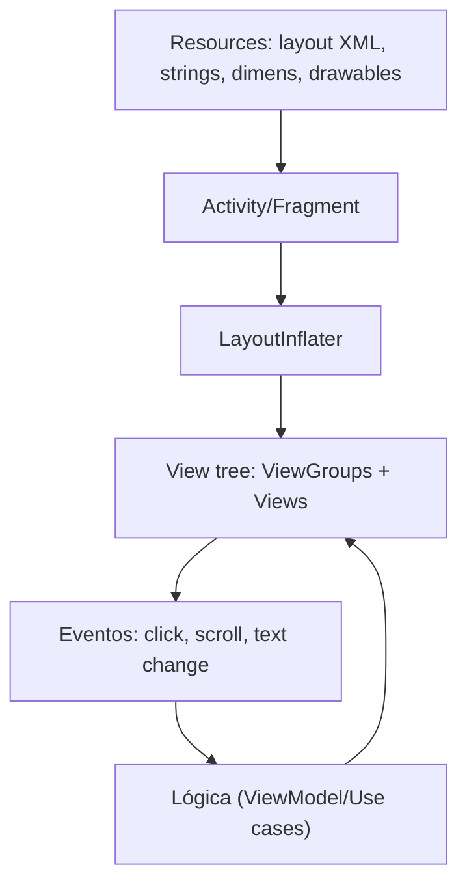

## Visão geral

O desenvolvimento de interfaces Android “clássico” (pré-Compose) é baseado no **sistema de Views**. Nesse modelo, a interface é descrita principalmente em **arquivos XML de layout** e instanciada (“inflada”) em tempo de execução por uma **Activity** ou um **Fragment**. Mesmo com a popularização do Jetpack Compose, o ecossistema Android ainda possui muitos aplicativos, bibliotecas e telas em XML, tornando esse conteúdo essencial para manutenção, evolução e integração de projetos.

Em termos de fluxo, o sistema costuma seguir a sequência: **layout XML** → **inflação** → **referência aos componentes** → **tratamento de eventos** → **atualização da UI**.



A documentação oficial descreve os fundamentos do sistema de Views e layouts [@android_docs_layouts] e a estrutura de recursos (resources) [@android_docs_resources].

## Conceitos fundamentais: Views e ViewGroups

Uma **View** é um componente visual individual (por exemplo, `TextView`, `Button`, `ImageView`). Um **ViewGroup** é um contêiner que organiza outras Views e define regras de posicionamento e medição (por exemplo, `LinearLayout`, `FrameLayout`, `ConstraintLayout`).

O Android mede e desenha a UI em duas fases relevantes:

- **Measure pass**: cada View calcula o tamanho com base em regras do pai e em suas próprias restrições.
- **Layout/Draw pass**: o pai posiciona as filhas e o sistema desenha a árvore de Views.

Compreender essas etapas ajuda a evitar problemas de performance e “saltos” visuais (re-layouts excessivos).

## Estrutura de recursos e organização de pastas

Em um projeto Android padrão, os arquivos de UI em XML aparecem principalmente em:

- `res/layout/`: layouts de Activities, Fragments e itens de listas
- `res/drawable/`: shapes, seletores, vetores (`VectorDrawable`), imagens
- `res/values/`: `strings.xml`, `colors.xml`, `dimens.xml`, `styles.xml`/`themes.xml`

Um objetivo importante é **evitar valores “hard-coded”** em layouts, centralizando textos, dimensões e cores em resources para facilitar manutenção e internacionalização.

## Layouts mais usados

### ConstraintLayout (recomendado para telas complexas)

O `ConstraintLayout` é frequentemente a melhor escolha para telas de complexidade média/alta. Ele permite posicionar elementos por **restrições** (constraints), reduzindo a necessidade de muitos níveis de ViewGroups.

Exemplo: layout de tela simples com título, campo e botão.

```xml
<?xml version="1.0" encoding="utf-8"?>
<androidx.constraintlayout.widget.ConstraintLayout
    xmlns:android="http://schemas.android.com/apk/res/android"
    xmlns:app="http://schemas.android.com/apk/res-auto"
    android:layout_width="match_parent"
    android:layout_height="match_parent"
    android:padding="16dp">

    <TextView
        android:id="@+id/titulo"
        android:layout_width="0dp"
        android:layout_height="wrap_content"
        android:text="@string/titulo_login"
        android:textAppearance="@style/TextAppearance.Material3.HeadlineSmall"
        app:layout_constraintTop_toTopOf="parent"
        app:layout_constraintStart_toStartOf="parent"
        app:layout_constraintEnd_toEndOf="parent" />

    <EditText
        android:id="@+id/email"
        android:layout_width="0dp"
        android:layout_height="wrap_content"
        android:hint="@string/hint_email"
        android:inputType="textEmailAddress"
        app:layout_constraintTop_toBottomOf="@id/titulo"
        app:layout_constraintStart_toStartOf="parent"
        app:layout_constraintEnd_toEndOf="parent"
        android:layout_marginTop="16dp" />

    <Button
        android:id="@+id/entrar"
        android:layout_width="0dp"
        android:layout_height="wrap_content"
        android:text="@string/acao_entrar"
        app:layout_constraintTop_toBottomOf="@id/email"
        app:layout_constraintStart_toStartOf="parent"
        app:layout_constraintEnd_toEndOf="parent"
        android:layout_marginTop="16dp" />

</androidx.constraintlayout.widget.ConstraintLayout>
```

== info "Boas práticas:"
  - `layout_width="0dp"` em `ConstraintLayout` significa “match constraints” (preencher o espaço respeitando constraints).
  - Preferir constraints claras e evitar cadeias (chains) desnecessárias quando a tela é simples.

### LinearLayout (bom para estruturas simples em linha/coluna)

`LinearLayout` organiza componentes em uma direção (`vertical` ou `horizontal`). É útil em layouts simples, mas pode gerar hierarquias profundas quando combinado em excesso.

```xml
<LinearLayout
    xmlns:android="http://schemas.android.com/apk/res/android"
    android:layout_width="match_parent"
    android:layout_height="wrap_content"
    android:orientation="vertical"
    android:padding="16dp">

    <TextView
        android:layout_width="wrap_content"
        android:layout_height="wrap_content"
        android:text="@string/titulo" />

    <Button
        android:layout_width="match_parent"
        android:layout_height="wrap_content"
        android:text="@string/acao" />

</LinearLayout>
```

### FrameLayout (bom para sobreposições)

`FrameLayout` costuma ser usado para sobrepor elementos (por exemplo, conteúdo + loading). Em telas modernas, é comum vê-lo como container de `Fragment`.

### RelativeLayout (legado)

Hoje é menos utilizado porque o `ConstraintLayout` cobre a maior parte dos casos com melhor ergonomia e performance. Em manutenção de projetos antigos, ainda aparece com frequência.

## Propriedades essenciais de layout

### `layout_width` e `layout_height`

- `wrap_content`: ajusta ao conteúdo
- `match_parent`: ocupa o máximo permitido pelo pai
- valor em `dp`: tamanho fixo (usar com cuidado)

### Margens, padding e gravidade

- `android:padding`: espaço interno da View
- `android:layout_margin`: espaço externo (entre a View e o entorno)
- `android:gravity`: alinha conteúdo dentro da View
- `android:layout_gravity`: alinha a View dentro de certos ViewGroups (por exemplo, `LinearLayout`)

### Unidades

- `dp`: dimensão para layout
- `sp`: tamanho de texto

O uso de `sp` para texto melhora acessibilidade, pois respeita configurações de fonte do sistema.

## IDs e acesso aos componentes: findViewById vs ViewBinding

### findViewById (mais simples, mas menos seguro)

O `findViewById` exige cast e é propenso a erros quando IDs mudam.

```kotlin
val botao = findViewById<Button>(R.id.entrar)
botao.setOnClickListener {
    // ação
}
```

### ViewBinding (recomendado)

O **ViewBinding** gera classes tipadas para cada layout, reduzindo `NullPointerException` e casts. Para habilitar:

```kotlin
android {
    buildFeatures {
        viewBinding = true
    }
}
```

Uso em Activity:

```kotlin
class LoginActivity : AppCompatActivity() {

    private lateinit var binding: ActivityLoginBinding

    override fun onCreate(savedInstanceState: Bundle?) {
        super.onCreate(savedInstanceState)
        binding = ActivityLoginBinding.inflate(layoutInflater)
        setContentView(binding.root)

        binding.entrar.setOnClickListener {
            val email = binding.email.text.toString()
            // validação e ação
        }
    }
}
```

Em projetos com Fragments, é comum usar ViewBinding com cuidado para evitar *memory leaks* (limpando a referência no `onDestroyView`).

## Fragments (UI modular dentro de uma Activity)

No sistema de Views, um **Fragment** é um componente que encapsula uma porção de UI e pode ser combinado com outros fragments dentro de uma mesma Activity. Ele é especialmente útil quando se deseja:

- separar uma tela em partes reaproveitáveis (por exemplo, “lista” e “detalhe”);
- suportar diferentes tamanhos de tela com a mesma base de código (celular vs tablet);
- manter uma Activity mais enxuta, delegando UI e eventos para componentes menores.

A diferença central em relação à Activity é o **escopo**: a Activity é uma tela de alto nível e o Fragment é um componente de UI hospedado dentro dela. Além disso, Fragments possuem um detalhe importante: o ciclo de vida da **View do Fragment** é separado do ciclo de vida do Fragment, sendo criado em `onCreateView` e destruído em `onDestroyView` [@android_docs_fragments].

### Exemplo: ViewBinding em Fragment

Em Fragments, é comum manter o binding como variável anulável e limpá-lo em `onDestroyView`, evitando manter referências para Views que já foram destruídas.

```kotlin
class PerfilFragment : Fragment(R.layout.fragment_perfil) {

    private var _binding: FragmentPerfilBinding? = null
    private val binding get() = _binding!!

    override fun onViewCreated(view: View, savedInstanceState: Bundle?) {
        super.onViewCreated(view, savedInstanceState)
        _binding = FragmentPerfilBinding.bind(view)

        binding.botaoSalvar.setOnClickListener {
            // ação
        }
    }

    override fun onDestroyView() {
        super.onDestroyView()
        _binding = null
    }
}
```

## Eventos e interações

### Clicks e listeners comuns

- `setOnClickListener`: clique
- `addTextChangedListener`: alteração de texto
- `setOnCheckedChangeListener`: toggles (CheckBox/Switch)

Exemplo (validação básica no texto):

```kotlin
binding.email.addTextChangedListener {
    val valor = it?.toString().orEmpty()
    binding.entrar.isEnabled = valor.contains("@")
}
```

### Android: no XML ou no Kotlin?

Layouts XML permitem declarar `android:onClick`, mas isso costuma reduzir rastreabilidade e testabilidade. Para ensino e manutenção, geralmente é preferível associar listeners no Kotlin, centralizando a lógica.

## RecyclerView: listas performáticas em XML

Quando uma tela precisa exibir listas longas, `RecyclerView` é a base do toolkit tradicional.

Estrutura típica:

- layout da tela: inclui um `RecyclerView`
- layout de item: define a linha/célula
- `Adapter` + `ViewHolder`: liga dados aos itens
- `LayoutManager`: define se é lista, grid, etc.

Exemplo de item (`res/layout/item_usuario.xml`):

```xml
<LinearLayout
    xmlns:android="http://schemas.android.com/apk/res/android"
    android:layout_width="match_parent"
    android:layout_height="wrap_content"
    android:orientation="vertical"
    android:padding="12dp">

    <TextView
        android:id="@+id/nome"
        android:layout_width="wrap_content"
        android:layout_height="wrap_content"
        android:textAppearance="@style/TextAppearance.Material3.TitleMedium" />

    <TextView
        android:id="@+id/email"
        android:layout_width="wrap_content"
        android:layout_height="wrap_content"
        android:textAppearance="@style/TextAppearance.Material3.BodyMedium" />

</LinearLayout>
```

Adapter (recorte):

```kotlin
class UsuarioAdapter(
    private val itens: List<Usuario>,
    private val onClick: (Usuario) -> Unit
) : RecyclerView.Adapter<UsuarioAdapter.ViewHolder>() {

    class ViewHolder(val binding: ItemUsuarioBinding) : RecyclerView.ViewHolder(binding.root)

    override fun onCreateViewHolder(parent: ViewGroup, viewType: Int): ViewHolder {
        val binding = ItemUsuarioBinding.inflate(LayoutInflater.from(parent.context), parent, false)
        return ViewHolder(binding)
    }

    override fun onBindViewHolder(holder: ViewHolder, position: Int) {
        val item = itens[position]
        holder.binding.nome.text = item.nome
        holder.binding.email.text = item.email
        holder.binding.root.setOnClickListener { onClick(item) }
    }

    override fun getItemCount() = itens.size
}
```

Em projetos reais, costuma-se preferir `ListAdapter` + `DiffUtil` para atualizar listas com eficiência.

## Recursos (resources): strings, dimens, cores e drawables

### Strings e internacionalização

Textos devem ir para `res/values/strings.xml` e, quando necessário, para variações por idioma (`values-pt`, `values-en`, etc.). Isso facilita a tradução e evita repetição.

```xml
<resources>
    <string name="titulo_login">Login</string>
    <string name="hint_email">E-mail</string>
    <string name="acao_entrar">Entrar</string>
</resources>
```

### Dimens e consistência visual

Dimensões repetidas (margens, tamanhos) devem ser centralizadas em `dimens.xml`.

```xml
<resources>
    <dimen name="espaco_padrao">16dp</dimen>
</resources>
```

### Drawables: shapes e seletores

Layouts XML costumam usar drawables para bordas e estados de interação. Exemplo de shape com cantos arredondados (`res/drawable/bg_input.xml`):

```xml
<shape xmlns:android="http://schemas.android.com/apk/res/android">
    <solid android:color="@android:color/transparent"/>
    <stroke android:width="1dp" android:color="@color/borda"/>
    <corners android:radius="8dp"/>
    <padding android:left="12dp" android:top="12dp" android:right="12dp" android:bottom="12dp"/>
</shape>
```

Seletores permitem variar o drawable conforme estado (pressionado, focado). Exemplo (`res/drawable/btn_selector.xml`):

```xml
<selector xmlns:android="http://schemas.android.com/apk/res/android">
    <item android:state_pressed="true" android:drawable="@color/botao_pressionado" />
    <item android:drawable="@color/botao_normal" />
</selector>
```

## Estilos e temas

Estilos evitam repetição de atributos e garantem consistência. O Material Design (Material 2/3) oferece uma base recomendada para componentes e tipografia [@material_design].

Exemplo de estilo aplicado a um `TextView`:

```xml
<style name="TextoTitulo">
    <item name="android:textSize">20sp</item>
    <item name="android:textStyle">bold</item>
</style>
```

Em aplicações modernas, `themes.xml` organiza cores, tipografia e comportamentos de componentes, com variações como tema claro/escuro.

## Inclusão e reutilização de layouts

Para evitar duplicação, o XML suporta:

- `<include layout="@layout/algo" />`: reutiliza layout
- `<merge>`: reduz um nível de hierarquia quando um layout é incluído
- `<ViewStub>`: carrega conteúdo sob demanda (útil para otimização)

O uso criterioso desses recursos pode reduzir hierarquia e melhorar performance.

## Acessibilidade (a11y)

Interfaces com XML devem considerar:

- `contentDescription` em imagens com significado
- tamanhos mínimos de toque (botões/ícones)
- contraste adequado entre texto e fundo
- suporte a fontes maiores (usar `sp` e evitar alturas fixas em textos)

A acessibilidade é um requisito de qualidade e também reduz retrabalho, pois problemas costumam aparecer tarde no ciclo se não forem considerados desde o início.

## Boas práticas de performance no sistema de Views

- Evitar hierarquias profundas (muitos ViewGroups aninhados)
- Preferir `ConstraintLayout` para telas complexas
- Evitar `layout_width/height` fixos em excesso
- Minimizar `overdraw` (camadas desenhadas sem necessidade)
- Reutilizar itens com `RecyclerView` e evitar `notifyDataSetChanged()` indiscriminado

## Integração com arquiteturas modernas

Mesmo usando XML, é comum aplicar padrões atuais:

- ViewModel (camada de estado)
- LiveData/StateFlow para observar mudanças
- Separação de camadas (UI, domínio, dados)

O XML descreve a UI, mas a arquitetura define a forma como estado e eventos trafegam no aplicativo.

## Referências

- Android Developers: Layouts (Views) [@android_docs_layouts]
- Android Developers: Recursos (resources) [@android_docs_resources]
- Material Design: Guidelines [@material_design]
