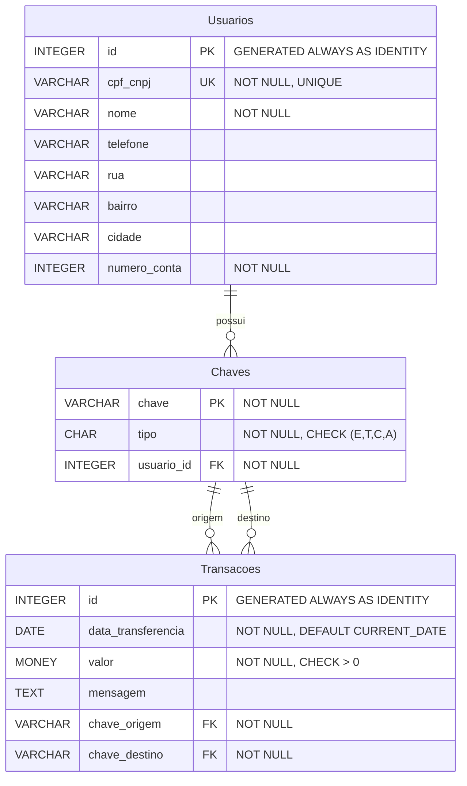

# APIs REST: Conceitos

Uma **API (Application Programming Interface)** ou Interface de Programação de Aplicação é um conjunto de regras, protocolos e ferramentas que permite a comunicação entre diferentes sistemas de software. As APIs funcionam como intermediários que permitem que aplicações distintas "conversem" entre si de forma padronizada e segura.

O **REST (Representational State Transfer)** é um estilo arquitetural para sistemas distribuídos, especialmente para serviços web. Uma API REST é uma interface que segue os princípios REST, oferecendo uma forma simples e eficiente de comunicação entre cliente e servidor através do protocolo HTTP.

As características elementares de uma REST API podem ser resumidos a:

1. **Stateless (Sem Estado)**: Cada requisição deve conter todas as informações necessárias para ser processada
2. **Client-Server**: Separação clara entre cliente e servidor
3. **Cacheable**: Respostas podem ser armazenadas em cache para melhorar performance
4. **Uniform Interface**: Interface uniforme e consistente
5. **Layered System**: Arquitetura em camadas


De acordo com a definição, as [REST APIs](https://ics.uci.edu/~fielding/pubs/dissertation/fielding_dissertation.pdf) utilizam o protocolo HTTP e seus verbos como meio de comunicação e interface semântica. Neste modelo, as ações são solicitadas por meio dos verbos. Os principais são:

- **GET**: Solicita recuperação de recursos
- **POST**: Efetiva a criação de novos recursos
- **PUT**: Realiza a atualização de recursos existentes (substituição completa)
- **PATCH**: Realiza a atualização  parcial de recursos existentes
- **DELETE**: Remove recursos

Outros verbos estão disponíveis no protocolo HTTP. Podemos encontrar detalhes adicionais na documentação do [MDN](https://developer.mozilla.org/pt-BR/docs/Web/HTTP/Reference/Methods). Contudo, nem todos eles são utilizados no desenvolvimento.

Além dos verbos, outro recurso importante do HTTP são as categoria de código de *resposta*. Por meio destes códigos, o servidor comunica ao cliente o resultado da operação solicitada. Alguns códigos de resposta são muito comuns e estão descritos a seguir. 

- **200 OK**: Requisição bem-sucedida
- **201 Created**: Recurso criado com sucesso
- **400 Bad Request**: Erro na requisição do cliente
- **401 Unauthorized**: Não autorizado
- **404 Not Found**: Recurso não encontrado
- **500 Internal Server Error**: Erro interno do servidor

Perceba que o primeiro número do código de retorno atua como um indicador de categoria. Todos os valores dentro da mesma categoria compartilham do mesmo significado geral. Na tabela abaixo, descrevemos quais são os objetivos de cada categoria.

| Categoria | Faixa de Códigos | Descrição        | Objetivo                                                                                                          |
| --------- | ---------------- | ---------------- | ----------------------------------------------------------------------------------------------------------------- |
| 1xx       | 100–199          | Informativo      | Indicar que a requisição foi recebida e está sendo processada                                                     |
| 2xx       | 200–299          | Sucesso          | Confirmar que a ação solicitada pelo cliente foi realizada com sucesso                                            |
| 3xx       | 300–399          | Redirecionamento | Informar que é necessário tomar ações adicionais para completar a requisição, geralmente redirecionando o cliente |
| 4xx       | 400–499          | Erro do Cliente  | Indicar que houve um erro causado pela requisição do cliente                                                      |
| 5xx       | 500–599          | Erro do Servidor | Informar que o servidor falhou ao processar uma requisição válida                                                 |


> Podemos encontrar informações adicionais sobre categorias e códigos de erros na documentação do [MDN](https://developer.mozilla.org/pt-BR/docs/Web/HTTP/Reference/Status)

## Por que desenvolver APIs?

Ao expor uma API de comunicação, um sistema amplia significativamente seu grau de integração com outros sistemas e processos automatizados. Com isso, a utilização do software torna-se mais flexível, escalável e reutilizável pelos seus clientes.

Logo, de forma ampla, podemos pensar que as APIs são úteis, pois oferecem:

- **Integração**: Facilita a integração entre diferentes sistemas e plataformas
- **Reutilização**: Permite reutilizar funcionalidades em múltiplas aplicações
- **Escalabilidade**: Possibilita o crescimento e expansão de sistemas
- **Flexibilidade**: Oferece flexibilidade na arquitetura de software
- **Colaboração**: Facilita o trabalho em equipe e desenvolvimento distribuído
- **Monetização**: Pode gerar receita através da disponibilização de serviços, se aplicável


Os casos mais comuns de uso de APIs são em aplicações mobile, arquitetura de microserviços, integração de sistemas, IoT e disponibilização de serviços para parceiros/terceiros.


## Construíndo APIs com NodeJS

O desenvolvimento de uma API pode ser realizado através de diversas linguagens e frameworks. A linguagem JavaScript (ou TypeScript) e seu ecossistema (NodeJS e módulos do npm) são uma das *stacks* de desenvolvimento amplamente utilizadas.

Na sequência iremos abordar os passos necessários para criar uma REST API, ou seja, uma interface de comunicação que se baseia no protocolo HTTP e seus verbos. 

> Partiremos do princípio de que o [NodeJS](https://nodejs.org/pt) está adequadamente instalado no seu sistema operacional.


### Configuração inicial do projeto

O primeiro passo compreende inicializar um projeto NodeJS através do comando `npm init`. Considerando que iremos utilizar a linguagem TypeScript e o ambiente Visual Studio Code, os passos necessários são:

[ ] Abra o terminal integrado no VS Code (atalho: `ctrl + `` ).
[ ] Execute o comando `npm init` para criar o arquivo `package.json`.
[ ] Instale o TypeScript e os tipos necessários com `npm install typescript @types/node --save-dev`.
[ ] Execute `npx tsc --init` para gerar o arquivo `tsconfig.json`.
[ ] Crie a estrutura de pastas e arquivos do seu projeto (por exemplo, uma pasta `src` e um arquivo `index.ts`).
[ ] Instale o `ts-node-dev` e configure para rodar o projeto em desenvolvimento: `npm install ts-node-dev --save-dev` e adicione `"dev": "ts-node-dev --respawn --transpile-only src/index.ts"` na chave `"scripts"`do arquivo `package.json`.


Na sequência iremos instalar os módulos necessários para a construção da nossa API. Lembre-se que o comando de instalação é `npm i <nome-pacote>`.

[ ] - `express`: microframework para desenvolvimento web
[ ] - `pg`: módulo para interação com PostgreSQL
[ ] - `reflect-metadata`: módulo que adiciona suporte para anotações
[ ] - `typeorm`: framework ORM 
[ ] - `dotenv`: módulo para utilizar arquivos de configuração

Instalados os pacotes, iremos modificar o arquivo `src/index.ts`, adicionando o código a seguir com a intenção de testar nossa configuração. Após a alteração, execute no terminal do Visual Studio Code o comando `npm run dev` a partir do diretório raiz do projeto e então acesse o navegador (ou utilize algum cliente REST) no endereço [http://localhost:4000/check](http://localhost:4000/check) e verifique se a resposta será `Requisição recebida`. 


```typescript
import {Request, Response} from 'express';
import * as express from 'express';


const app = express()

app.get("/check",
    async (req:Request, resp:Response) =>{
        resp.statusCode=200;
        resp.send("Requisição recebida");
    }
)


app.listen(4000, ()=>{
    console.log("Servidor em execução...")
})
```

### Modelo de dados

Nosso estudo de caso irá abordar uma simplificação do sistema de pagamentos instantâneo PIX, apenas para ilustrar aspectos técnicos e de arquitetura importantes na concepção deste tipo de software (APIs).

A definição dos nossos dados irá contemplar as entidades *Usuários*, *Chaves* e *Transações*. Os atributos e domínio de dados encontram-se descritos no diagrama lógico que segue, o qual considera o PostgreSQL como SGBD de destino.




Com o modelo lógico de dados definido, já temos condições de construir nossas classes de entitidade por meio do módulo [´TypeORM´](https://typeorm.io/). A fim de melhor organizar a estrutura dos artefatos de código, vamos criar um diretório específico chamado ´src/entities´. As etapas de instalação constam na [documentação oficial](https://typeorm.io/docs/getting-started#installation) do TypeORM.

A primeira entidade que iremos criar irá representar os dados da tabela **usuarios**. Para tal, criaremos o arquivo `usuario.entity.ts` e nele iremos colocar o código a seguir.

Observe com atenção as anotações presentes:
- `@Entity`: usada para indicar que a classe representa uma entidade, associada a uma tabela do banco de dados.
- `@PrimaryGeneratedColumn`: indica  que o atributo representa a coluna que é chave primária, cujo valor é gerado automaticamente.
- `@Column`: indica que o atributo representa uma coluna da tabela.

> O objeto literal passado por parâmetro para as anotações customiza as propriedades de funcionamento padrão, como definir a coluna para aceitar somente valores únicos ou não permitir nulo.

```typescript
import { Column, Entity, PrimaryGeneratedColumn } from "typeorm";

@Entity(
    {
        name: "usuarios"
    }
)
export class Usuario {
    @PrimaryGeneratedColumn()
    id:number  

    @Column({
        nullable:false,
        unique:true
    })
    cpf_cnpj:string

    @Column({
        nullable:false
    })
    nome:string
    
    @Column()
    telefone:string

    @Column()
    rua:string

    @Column()
    bairro:string

    @Column()
    cidade:string
    
    @Column({
        nullable:false
    })
    numero_conta:string 
}

```


