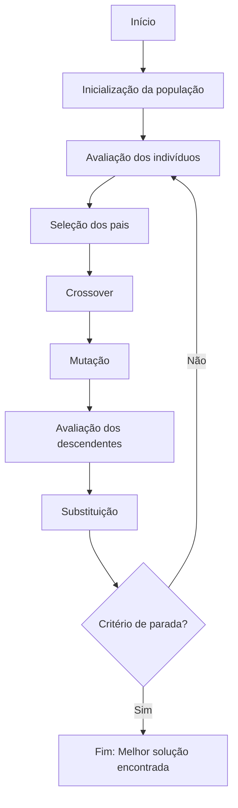

Algoritmos Genéticos (AGs) são métodos estocásticos de busca e otimização, inspirados nos processos evolutivos da biologia natural. Eles fazem parte do conjunto de técnicas conhecidas como metaheurísticas, e são particularmente úteis quando o espaço de soluções é muito grande, descontínuo ou de difícil modelagem matemática.


Os algoritmos genéticos são métodos diretamente na teoria da evolução das espécies proposta por Charles Darwin. Essa teoria, baseada na seleção natural, sugere que os organismos mais bem adaptados ao ambiente têm maior probabilidade de sobreviver e transmitir suas características às gerações seguintes. Da mesma forma, em um algoritmo genético, cada solução para um problema é tratada como um “indivíduo” dentro de uma população. Essas soluções competem entre si com base em uma medida de desempenho, chamada de função de aptidão. As soluções com melhor desempenho têm mais chances de serem selecionadas para gerar novas soluções por meio de operadores que simulam processos biológicos, como o cruzamento e a mutação.

Durante o cruzamento, partes das soluções selecionadas são combinadas para formar descendentes, assim como ocorre com o material genético em organismos vivos. Já a mutação introduz pequenas alterações aleatórias nas soluções, promovendo diversidade na população e permitindo a exploração de novas regiões do espaço de busca. Com o passar das gerações, a população evolui, e espera-se que as soluções se tornem progressivamente melhores, aproximando-se de uma resposta ótima ou satisfatória para o problema.

Portanto, os algoritmos genéticos não apenas se inspiram na teoria darwiniana, mas a aplicam de forma prática no campo da computação, utilizando os princípios de evolução, adaptação e sobrevivência dos mais aptos como base para resolver problemas complexos. 


!!! info "Método Estocástico"
     É um procedimento ou técnica que envolve aleatoriedade ou incerteza em sua execução. Em outras palavras, é um método que utiliza variáveis aleatórias ou processos probabilísticos para resolver problemas, fazer previsões ou modelar fenômenos.


!!! info "Metaheurísticas"
     São estratégias de alto nível projetadas para resolver problemas complexos de otimização de forma eficiente, mesmo que não garantam a melhor solução possível (ótimo global).
     Combinam regras determinísticas e estocásticas para explorar o espaço de soluções e encontrar boas respostas em tempo razoável, especialmente quando métodos exatos são inviáveis por serem muito lentos ou complexos.


## Etapas de um AG

Um AG realiza iterações sobre populações de possíveis soluções. A cada ciclo (geração), indivíduos melhores são selecionados, recombinados e modificados, simulando o processo evolutivo natural.



Na sequência vamos conhecer um pouco mais sobre cada um destes passos.


### Inicialização da População

A etapa de inicialização da população em um algoritmo genético é responsável por criar a primeira geração de soluções candidatas ao problema a ser resolvido. Essa população inicial é composta por diversos indivíduos, onde cada um representa uma **possível solução codificada de forma adequada ao problema** (por exemplo, como uma string binária, um vetor de números reais, ou uma permutação de itens).

Essa geração inicial é geralmente criada de forma aleatória, para garantir diversidade genética e permitir uma ampla exploração do espaço de soluções desde o início. A diversidade é crucial, pois evita que o algoritmo fique preso prematuramente em soluções locais, dando mais chance de encontrar o ótimo global ao longo da evolução.

Em alguns casos, a inicialização pode ser parcialmente dirigida ou heurística, incluindo soluções conhecidas ou estimativas boas para acelerar a convergência, mas ainda assim mantendo certa aleatoriedade para garantir variedade.

Cada indivíduo é representado por um cromossomo, composto de genes. Os genes são responsáveis por codificar a possível solução. Durante esta etapa, uma quantidade específica de indivíduos é criada, cada uma apresentando cromossomos construídos de forma estocástica.

```python
import random

def gerar_cromossomo(tamanho):
    return [random.randint(0, 1) for _ in range(tamanho)]

populacao = [gerar_cromossomo(10) for _ in range(6)]

```


### Avaliação (Função de Aptidão)

É o momento em que cada indivíduo (ou solução candidata) da população é avaliado quanto à sua qualidade ou desempenho em resolver o problema proposto. Essa qualidade é medida por uma função chamada função de aptidão (ou *fitness function*), que atribui um valor numérico a cada indivíduo com base em quão bem ele resolve o problema.

Durante essa etapa, o algoritmo percorre toda a população e calcula a aptidão de cada indivíduo. O valor da aptidão pode representar, por exemplo, o lucro total em um problema de maximização, ou o custo total em um problema de minimização (como a distância total em uma rota). Quanto maior a aptidão (em problemas de maximização), melhor a solução.

O objetivo da avaliação é fornecer uma base para a seleção, que ocorre nas etapas seguintes do algoritmo. Indivíduos com melhor desempenho têm mais chance de serem escolhidos para reprodução, ou seja, para gerar novos indivíduos que vão compor as próximas gerações. Portanto, a avaliação da população é essencial para guiar a evolução da população em direção a soluções cada vez melhores ao longo das gerações.


```python
def aptidao(cromossomo):
    return sum(cromossomo)
```


### Seleção


Nesta etapa são escolhidos os indivíduos da população atual que terão a oportunidade de reproduzir-se e gerar novos indivíduos para a próxima geração. Essa escolha é baseada nos valores de aptidão calculados na etapa anterior — quanto maior a aptidão de um indivíduo, maiores são suas chances de ser selecionado.

O objetivo da seleção é favorecer as melhores soluções, mas também manter alguma diversidade genética, permitindo que até mesmo indivíduos menos aptos tenham uma pequena chance de serem escolhidos, o que ajuda a evitar a convergência prematura em ótimos locais.

Existem diferentes estratégias de seleção, entre as mais comuns estão:
- **Roleta (roulette wheel selection)**: a chance de um indivíduo ser escolhido é proporcional à sua aptidão.
- **Torneio (tournament selection)**: grupos aleatórios de indivíduos competem entre si, e o melhor de cada grupo é selecionado.
- **Seleção por classificação (rank selection)**: os indivíduos são ordenados por aptidão, e a chance de seleção depende da posição no ranking, não do valor absoluto da aptidão.

Durante essa etapa, normalmente são selecionados pares de indivíduos para cruzamento, formando a base da próxima geração. Assim, a seleção atua como um filtro evolutivo: favorece boas soluções, mas também mantém variabilidade para que o algoritmo continue explorando novas possibilidades.


```python
def selecao_torneio(populacao, k=3):
    competidores = random.sample(populacao, k)
    return max(competidores, key=aptidao)
```


### Crossover (Recombinação)


Crossover (ou cruzamento) é uma das principais operações utilizadas para gerar novos indivíduos a partir de dois pais selecionados da população atual. Inspirado no processo de reprodução sexual presente na natureza, o crossover tem como objetivo combinar as características dos pais para formar descendentes que possuam potencialmente melhores soluções para o problema sendo resolvido. Durante o processo, partes dos cromossomos dos pais são trocadas em pontos específicos, formando assim novos cromossomos. Existem diversas estratégias de crossover, como o de ponto único, de dois pontos, uniforme, entre outros, e a escolha da técnica mais adequada depende do tipo de codificação dos indivíduos e da natureza do problema. O crossover é essencial para promover a diversidade genética na população e para explorar novas regiões do espaço de busca, contribuindo significativamente para a convergência do algoritmo a uma solução ótima ou satisfatória.


```python

def crossover(pai1, pai2):
    ponto = random.randint(1, len(pai1) - 1)
    filho1 = pai1[:ponto] + pai2[ponto:]
    filho2 = pai2[:ponto] + pai1[ponto:]
    return filho1, filho2
```


### Mutação


é uma operação que introduz pequenas alterações aleatórias nos cromossomos dos indivíduos, com o objetivo de manter a diversidade genética da população e evitar que o algoritmo convirja prematuramente para soluções locais. A mutação ocorre geralmente com baixa probabilidade e afeta apenas alguns genes de um indivíduo, modificando seus valores de forma aleatória ou dentro de um intervalo definido. Esse processo simula mutações genéticas naturais e permite que novas soluções potencialmente melhores sejam exploradas, mesmo que não estejam diretamente presentes na combinação dos pais. A mutação é, portanto, uma ferramenta fundamental para garantir a exploração do espaço de busca e complementar a ação do crossover, que tende a intensificar a busca em torno das soluções já encontradas.


```python
def mutacao(cromossomo, taxa=0.1):
    return [gene if random.random() > taxa else 1 - gene for gene in cromossomo]
```


### Substituição


É a etapa responsável por atualizar a população atual com novos indivíduos gerados durante o processo evolutivo. Após aplicar as operações de seleção, crossover e mutação, o algoritmo precisa decidir quais indivíduos farão parte da próxima geração. A substituição pode ser feita de diferentes maneiras, como substituição completa (em que toda a população é renovada pelos descendentes) ou parcial (onde apenas parte da população é trocada). Uma estratégia comum é a substituição elitista, que garante que os melhores indivíduos da geração atual sejam preservados, mesmo após a introdução dos novos. Essa etapa é crucial para o equilíbrio entre a conservação de boas soluções (exploração) e a busca por novas soluções (exploração), influenciando diretamente a convergência e a eficiência do algoritmo genético.


### Algoritmo Completo (Simplificado)


```python

def algoritmo_genetico(tamanho_pop=10, tamanho_crom=10, geracoes=20):
    populacao = [gerar_cromossomo(tamanho_crom) for _ in range(tamanho_pop)]

    for geracao in range(geracoes):
        nova_populacao = []
        while len(nova_populacao) < tamanho_pop:
            pai1 = selecao_torneio(populacao)
            pai2 = selecao_torneio(populacao)
            filho1, filho2 = crossover(pai1, pai2)
            filho1 = mutacao(filho1)
            filho2 = mutacao(filho2)
            nova_populacao.extend([filho1, filho2])

        populacao = nova_populacao[:tamanho_pop]
        melhor = max(populacao, key=aptidao)
        print(f"Geração {geracao+1}: Melhor aptidão = {aptidao(melhor)}")
```