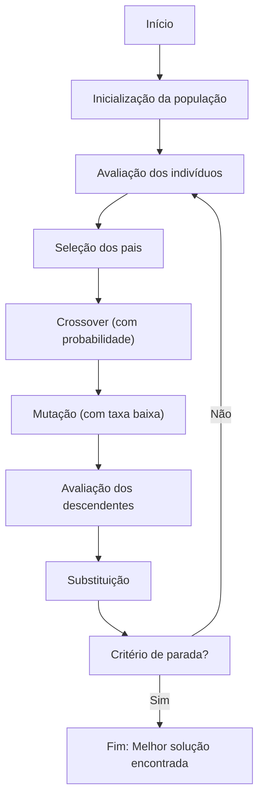
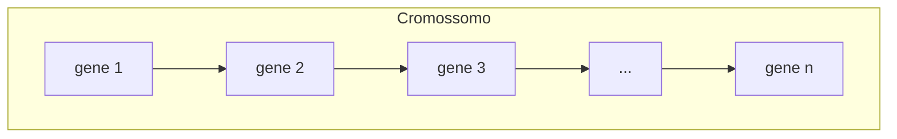

Algoritmos Genéticos (AGs) são métodos estocásticos de busca e otimização inspirados em processos evolutivos observados na natureza. Eles pertencem à família das **meta-heurísticas** e costumam ser úteis quando o espaço de soluções é grande, irregular (descontínuo), ruidoso ou de difícil modelagem matemática. O conceito foi desenvolvido por John Holland em 1975 e popularizado por David Goldberg em 1989, sendo amplamente aplicado em problemas de otimização combinatória, contínua, aprendizado de máquina, entre outros.


!!! info "Dicas"
    - Meta-heurísticas são estratégias de alto nível projetadas para resolver problemas complexos de otimização de forma eficiente, mesmo que não garantam a melhor solução possível (ótimo global). Combinam regras determinísticas e estocásticas para explorar o espaço de soluções e encontrar boas respostas em tempo razoável, especialmente quando métodos exatos são inviáveis por serem muito lentos ou complexos.
  


Em um AG, cada solução candidata é tratada como um **indivíduo** em uma **população**. A qualidade de cada indivíduo é medida por uma **função de aptidão** (*fitness*). Em cada geração, indivíduos mais aptos têm maior probabilidade de serem selecionados para produzir descendentes por meio de **crossover** (recombinação) e **mutação**. Ao longo das gerações, espera-se que a população evolua para soluções progressivamente melhores.

!!! warning "Importante"
    AGs **não garantem** encontrar o ótimo global. Eles oferecem, em geral, soluções boas em tempo razoável, especialmente quando métodos exatos são inviáveis.

 Ao longo da execução, o AG precisa equilibrar:
     
  - **Exploração**: buscar regiões novas do espaço de soluções (muita diversidade, mais aleatoriedade).
  - **Intensificação** (*exploitation*): refinar soluções já boas (seleção mais forte, menos diversidade).

## Quando faz sentido usar AG

Em termos práticos, AGs tendem a ser uma boa escolha quando:

- existe uma forma clara de **avaliar** uma solução (função de aptidão), mas não há um método matemático direto para obter a melhor solução;
- o espaço de busca é muito grande para tentativa exaustiva;
- o problema possui **múltiplos ótimos locais** e métodos determinísticos ficam presos facilmente;
- deseja-se uma solução boa em tempo limitado.

Em contrapartida, se há um método exato eficiente (por exemplo, programação linear, algoritmos de fluxo, ou busca com poda bem definida), frequentemente ele é preferível.


## Etapas de um AG

Um AG realiza iterações sobre populações de possíveis soluções. A cada ciclo (geração), indivíduos melhores são selecionados, recombinados e modificados, simulando o processo evolutivo natural.


```mermaid
graph TD
    A[Início] --> B["Inicialização da população"]
    B --> C["Avaliação dos indivíduos"]
    C --> D["Seleção dos pais"]
    D --> E["Crossover (com probabilidade)"]
    E --> F["Mutação (com taxa baixa)"]
    F --> G["Avaliação dos descendentes"]
    G --> H["Substituição"]
    H --> I["Critério de parada?"]
    I -- Não --> C
    I -- Sim --> J[Fim: Melhor solução encontrada]
```

Na sequência, cada etapa é detalhada com exemplos.

## Representação (cromossomo) e codificação

Antes de implementar operadores como crossover e mutação, define-se **como uma solução é representada**. Essa decisão influencia diretamente o comportamento do algoritmo.

Representações comuns:

- **Binária**: lista de 0/1 (boa para problemas como seleção de itens e versões discretizadas de variáveis).
- **Inteiros/Reais**: vetores numéricos (bom para otimização contínua, com operadores adequados).
- **Permutação**: sequência sem repetição (muito usada em roteamento e ordenação, como TSP).

Um cromossomo binário pode ser visualizado assim:


```mermaid
flowchart 
    subgraph C[Cromossomo]
        g1[gene 1] --> g2[gene 2] --> g3[gene 3] --> dots[...] --> gn[gene n]
    end
```


### Inicialização da População

A etapa de inicialização da população em um algoritmo genético é responsável por criar a primeira geração de soluções candidatas ao problema a ser resolvido. Essa população inicial é composta por diversos indivíduos, onde cada um representa uma **possível solução codificada de forma adequada ao problema** (por exemplo, como uma string binária, um vetor de números reais, ou uma permutação de itens).

Essa geração inicial é geralmente criada de forma aleatória, para garantir diversidade genética e permitir uma ampla exploração do espaço de soluções desde o início. A diversidade é crucial, pois evita que o algoritmo fique preso prematuramente em soluções locais, dando mais chance de encontrar o ótimo global ao longo da evolução.

Em alguns casos, a inicialização pode ser parcialmente dirigida ou heurística, incluindo soluções conhecidas ou estimativas boas para acelerar a convergência, mas ainda assim mantendo certa aleatoriedade para garantir variedade.

Cada indivíduo é representado por um cromossomo, composto de genes. Os genes são responsáveis por codificar a possível solução. Durante esta etapa, uma quantidade específica de indivíduos é criada, cada uma apresentando cromossomos construídos de forma estocástica.

```python
import random

def gerar_cromossomo(tamanho):
    return [random.randint(0, 1) for _ in range(tamanho)]

populacao = [gerar_cromossomo(10) for _ in range(6)]

```


### Avaliação (Função de Aptidão)

É o momento em que cada indivíduo (ou solução candidata) da população é avaliado quanto à sua qualidade ou desempenho em resolver o problema proposto. Essa qualidade é medida por uma função chamada função de aptidão (ou *fitness function*), que atribui um valor numérico a cada indivíduo com base em quão bem ele resolve o problema.

Durante essa etapa, o algoritmo percorre toda a população e calcula a aptidão de cada indivíduo. O valor da aptidão pode representar, por exemplo, o lucro total em um problema de **maximização**, ou o custo total em um problema de **minimização** (como a distância total em uma rota). Quanto maior a aptidão (em problemas de maximização), melhor a solução.

O objetivo da avaliação é fornecer uma base para a seleção, que ocorre nas etapas seguintes do algoritmo. Indivíduos com melhor desempenho têm mais chance de serem escolhidos para reprodução, ou seja, para gerar novos indivíduos que vão compor as próximas gerações. Portanto, a avaliação da população é essencial para guiar a evolução da população em direção a soluções cada vez melhores ao longo das gerações.


```python
def aptidao(cromossomo):
    return sum(cromossomo)
```

!!! tip "Maximização vs. minimização"
     No exemplo, a aptidão é maior quando há mais 1s (maximização). Em problemas de **minimização**, há alternativas comuns:
     
     - transformar o problema em maximização (por exemplo, $fitness = 1/(1+erro)$);
     - usar seleção baseada em **ranking** (ordenação), reduzindo dependência da escala.


### Seleção


Nesta etapa são escolhidos os indivíduos da população atual que terão a oportunidade de reproduzir-se e gerar novos indivíduos para a próxima geração. Essa escolha é baseada nos valores de aptidão calculados na etapa anterior — quanto maior a aptidão de um indivíduo, maiores são suas chances de ser selecionado.

O objetivo da seleção é favorecer as melhores soluções, mas também manter alguma diversidade genética, permitindo que até mesmo indivíduos menos aptos tenham uma pequena chance de serem escolhidos, o que ajuda a evitar a convergência prematura em ótimos locais.

Existem diferentes estratégias de seleção, entre as mais comuns estão:
- **Roleta (roulette wheel selection)**: a chance de um indivíduo ser escolhido é proporcional à sua aptidão.
- **Torneio (tournament selection)**: grupos aleatórios de indivíduos competem entre si, e o melhor de cada grupo é selecionado.
- **Seleção por classificação (rank selection)**: os indivíduos são ordenados por aptidão, e a chance de seleção depende da posição no ranking, não do valor absoluto da aptidão.

Durante essa etapa, normalmente são selecionados pares de indivíduos para cruzamento, formando a base da próxima geração. Assim, a seleção atua como um filtro evolutivo: favorece boas soluções, mas também mantém variabilidade para que o algoritmo continue explorando novas possibilidades.


```python
def selecao_torneio(populacao, k=3):
    competidores = random.sample(populacao, k)
    return max(competidores, key=aptidao)
```

!!! note "Pressão seletiva"
     O valor de `k` no torneio influencia a **pressão seletiva**. Em geral, `k` maior favorece mais os melhores indivíduos (mais intensificação), mas pode reduzir diversidade (risco de convergência prematura).


### Crossover (Recombinação)


Crossover (ou cruzamento) é uma das principais operações utilizadas para gerar novos indivíduos a partir de dois pais selecionados da população atual. Inspirado no processo de reprodução sexual presente na natureza, o crossover tem como objetivo combinar as características dos pais para formar descendentes que possuam potencialmente melhores soluções para o problema sendo resolvido. Durante o processo, partes dos cromossomos dos pais são trocadas em pontos específicos, formando assim novos cromossomos. Existem diversas estratégias de crossover, como o de ponto único, de dois pontos, uniforme, entre outros, e a escolha da técnica mais adequada depende do tipo de codificação dos indivíduos e da natureza do problema. O crossover é essencial para promover a diversidade genética na população e para explorar novas regiões do espaço de busca, contribuindo significativamente para a convergência do algoritmo a uma solução ótima ou satisfatória.


```python

def crossover(pai1, pai2):
    ponto = random.randint(1, len(pai1) - 1)
    filho1 = pai1[:ponto] + pai2[ponto:]
    filho2 = pai2[:ponto] + pai1[ponto:]
    return filho1, filho2
```


### Mutação

A mutação é uma operação que introduz pequenas alterações aleatórias nos cromossomos, com o objetivo de manter a diversidade genética e reduzir o risco de convergência prematura em ótimos locais. Em geral, a mutação ocorre com baixa probabilidade e altera apenas alguns genes.

No caso binário, uma mutação simples é “flipar” bits (0 vira 1 e 1 vira 0).


```python
def mutacao(cromossomo, taxa=0.1):
    return [gene if random.random() > taxa else 1 - gene for gene in cromossomo]
```


### Substituição


É a etapa responsável por atualizar a população atual com novos indivíduos gerados durante o processo evolutivo. Após aplicar as operações de seleção, crossover e mutação, o algoritmo precisa decidir quais indivíduos farão parte da próxima geração. A substituição pode ser feita de diferentes maneiras, como substituição completa (em que toda a população é renovada pelos descendentes) ou parcial (onde apenas parte da população é trocada). Uma estratégia comum é a substituição elitista, que garante que os melhores indivíduos da geração atual sejam preservados, mesmo após a introdução dos novos. Essa etapa é crucial para o equilíbrio entre a conservação de boas soluções (intensificação) e a busca por novas soluções (exploração), influenciando diretamente a convergência e a eficiência do algoritmo genético.


Uma forma de tornar o processo mais estável é aplicar **elitismo**: preservar automaticamente os melhores indivíduos da geração atual.

!!! info "Exploração e intensificação"
     Na prática, o AG equilibra **intensificação** (preservar/refinar bons indivíduos) e **exploração** (introduzir diversidade por recombinação e mutação).

## Critérios de parada

O algoritmo pode encerrar quando:

- atinge um número máximo de gerações;
- encontra um indivíduo com aptidão “boa o suficiente” (limiar);
- a melhora da melhor aptidão estagna por várias gerações;
- o tempo máximo de execução é atingido.

Em materiais didáticos, o critério “máximo de gerações” é o mais simples para começar.

## Restrições e penalidades

Muitos problemas têm restrições (por exemplo, limite de peso, orçamento, capacidade). Uma abordagem simples é incorporar **penalidades** à aptidão:

- soluções que violam restrições recebem aptidão reduzida;
- a penalidade pode ser proporcional ao “quanto” a restrição foi violada.

Esse mecanismo permite que o AG explore soluções quase viáveis e gradualmente se aproxime da viabilidade.


## Algoritmo Completo (Simplificado)

A seguir, apresenta-se um exemplo **autossuficiente** (um único bloco) resolvendo o problema *OneMax*: maximizar a soma de bits 1. O exemplo inclui:

- `p_crossover` para controlar se haverá crossover;
- `taxa_mutacao` para controlar o “flip” de bits;
- `elitismo` para preservar os melhores indivíduos.

```python
import random


def gerar_cromossomo(tamanho):
    return [random.randint(0, 1) for _ in range(tamanho)]


def aptidao(cromossomo):
    return sum(cromossomo)


def selecao_torneio(populacao, k=3):
    competidores = random.sample(populacao, k)
    return max(competidores, key=aptidao)


def crossover_um_ponto(pai1, pai2):
    ponto = random.randint(1, len(pai1) - 1)
    filho1 = pai1[:ponto] + pai2[ponto:]
    filho2 = pai2[:ponto] + pai1[ponto:]
    return filho1, filho2


def mutacao_bitflip(cromossomo, taxa):
    return [gene if random.random() > taxa else 1 - gene for gene in cromossomo]


def algoritmo_genetico_onemax(
    *,
    tamanho_pop=30,
    tamanho_crom=20,
    geracoes=50,
    k_torneio=3,
    p_crossover=0.9,
    taxa_mutacao=0.02,
    elitismo=1,
    seed=42,
):
    if seed is not None:
        random.seed(seed)

    populacao = [gerar_cromossomo(tamanho_crom) for _ in range(tamanho_pop)]

    for geracao in range(1, geracoes + 1):
        populacao_ordenada = sorted(populacao, key=aptidao, reverse=True)
        elites = populacao_ordenada[:elitismo]

        nova_populacao = elites.copy()
        while len(nova_populacao) < tamanho_pop:
            pai1 = selecao_torneio(populacao, k=k_torneio)
            pai2 = selecao_torneio(populacao, k=k_torneio)

            if random.random() < p_crossover:
                filho1, filho2 = crossover_um_ponto(pai1, pai2)
            else:
                filho1, filho2 = pai1[:], pai2[:]

            filho1 = mutacao_bitflip(filho1, taxa=taxa_mutacao)
            filho2 = mutacao_bitflip(filho2, taxa=taxa_mutacao)

            nova_populacao.append(filho1)
            if len(nova_populacao) < tamanho_pop:
                nova_populacao.append(filho2)

        populacao = nova_populacao
        melhor = max(populacao, key=aptidao)
        print(f"Geração {geracao:03d}: melhor aptidão = {aptidao(melhor)}")

        if aptidao(melhor) == tamanho_crom:
            break

    return max(populacao, key=aptidao)


if __name__ == "__main__":
    melhor = algoritmo_genetico_onemax()
    print("Melhor cromossomo:", melhor)
    print("Aptidão:", aptidao(melhor))
```

## Parâmetros e escolhas típicas

Em exercícios iniciais, os estudantes podem começar com valores “razoáveis” e ajustar conforme o problema:

- **Tamanho da população**: maior aumenta diversidade, mas custa mais avaliação.
- **Probabilidade de crossover**: frequentemente alta (por exemplo, 0,7 a 0,9), para recombinar boas soluções.
- **Taxa de mutação**: tipicamente baixa (por exemplo, 0,1% a 5% por gene), para manter diversidade.
- **Elitismo**: pequeno (1 a 5% da população), para preservar progresso.
- **Seleção (pressão seletiva)**: torneio com `k` pequeno (2 a 5) é um ponto de partida comum.

Esses números dependem do problema e da representação, então a calibração é parte do processo.


## Leituras recomendadas

Para aprofundamento e fundamentação teórica/prática, recomenda-se consultar [@holland1975adaptation], [@goldberg1989genetic] e [@eiben2003introduction].

