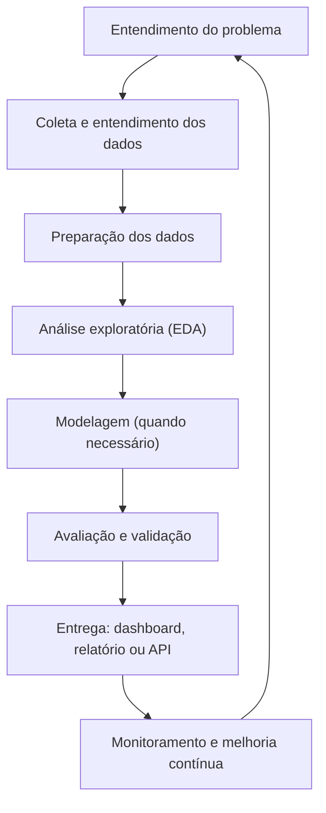
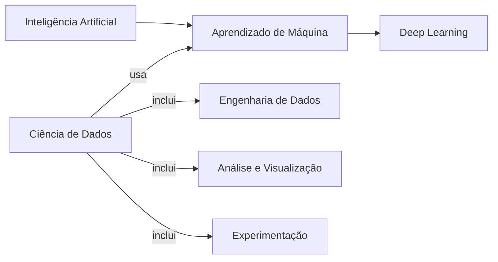

Ciência de Dados é uma área interdisciplinar dedicada a **transformar dados em conhecimento acionável**. Em termos práticos, ela combina estatística, computação e conhecimento do domínio (negócios, saúde, indústria, educação etc.) para responder perguntas, apoiar decisões e automatizar partes de processos com base em evidências. Ela se relaciona profundamente com Inteligência Artificial porque utiliza aprendizado de máquina e deep learning para automatizar previsões e decisões, mas vai além disso: envolve qualidade de dados, experimentos, comunicação e governança para que resultados sejam confiáveis e úteis [@provost2013data].

Um ponto importante para os estudantes: Ciência de Dados não é apenas “treinar modelos”. Ela envolve um conjunto amplo de atividades, que vão desde a definição do problema e a coleta de dados até a entrega e o acompanhamento de soluções em produção.

## Por que Ciência de Dados existe?

Organizações e governos geram dados continuamente: transações, sensores, logs de sistemas, formulários, imagens, áudio, texto, entre outros. Sem métodos adequados, esses dados viram apenas “armazenamento”. A Ciência de Dados surge para:

- estruturar perguntas que possam ser respondidas com dados;
- preparar dados para análise (limpeza, integração, padronização);
- descobrir padrões, relações e anomalias;
- construir modelos preditivos e prescritivos quando isso fizer sentido;
- comunicar resultados de forma clara e confiável.

## Ciclo de vida de um projeto de dados

Um projeto típico segue um fluxo iterativo (com voltas e refinamentos), semelhante a modelos amplamente adotados na prática, como o CRISP-DM [@shearer2000crispdm].

### Entendimento do problema

Nesta etapa, define-se o objetivo e o critério de sucesso. A pergunta “o que se quer melhorar?” geralmente precisa ser convertida em uma métrica observável.

Exemplos:

- reduzir a evasão escolar (métrica: taxa de evasão por período);
- melhorar a detecção de fraudes (métrica: taxa de detecção com baixo falso positivo);
- prever demanda (métrica: erro médio de previsão).

### Preparação e qualidade dos dados

Em cenários reais, grande parte do esforço está em **dados** (e não no algoritmo): ausência de valores, inconsistências, duplicidades, vieses de coleta e integração de fontes distintas.

Técnicas comuns:

- tratamento de valores faltantes;
- normalização e padronização;
- detecção de outliers;
- engenharia de atributos (feature engineering);
- definição de conjuntos de treino/validação/teste.

### Análise, modelagem e avaliação

Nem todo problema precisa de aprendizado de máquina. Muitas vezes, estatística descritiva, visualização e testes de hipótese resolvem o que é necessário. Quando o objetivo envolve previsão ou classificação, entram técnicas de aprendizado estatístico e aprendizado de máquina [@hastie2009elements].

A avaliação deve considerar:

- generalização (desempenho em dados novos);
- custos de erro (falsos positivos vs. falsos negativos);
- robustez e estabilidade no tempo;
- explicabilidade (quando exigida pelo contexto).

## Aplicabilidade: onde Ciência de Dados é usada

A Ciência de Dados aparece em praticamente todo setor que tome decisões com informação. Alguns exemplos típicos:

- **Negócios e marketing**: segmentação de clientes, recomendação, previsão de churn, precificação.
- **Finanças**: detecção de fraude, análise de risco, previsão de inadimplência.
- **Saúde**: triagem, apoio ao diagnóstico por imagem, previsão de demanda hospitalar.
- **Indústria e IoT**: manutenção preditiva, detecção de falhas, otimização de processos.
- **Agronegócio**: agricultura de precisão, previsão de safra, monitoramento por sensores e imagens, detecção de pragas/doenças e apoio à decisão em irrigação e manejo [@wolfert2017bigdata; @kamilaris2018deep].
- **Setor público**: transparência, auditoria, alocação de recursos, identificação de gargalos.
- **Educação**: análise de desempenho, recomendação de trilhas, alerta de risco de evasão.

No agronegócio, é comum que os dados tenham componente **temporal** (sazonalidade), **espacial** (talhões e coordenadas), e sejam coletados por múltiplas fontes: sensores de campo (umidade, pH, temperatura), telemetria de máquinas, estações meteorológicas, imagens de satélite e drones. Esse cenário favorece pipelines que integram engenharia de dados, análise estatística e aprendizado de máquina para apoiar decisões operacionais e estratégicas (por exemplo, quando e onde adubar, irrigar, pulverizar ou colher) [@wolfert2017bigdata].

Em muitos casos, a entrega final não é um “modelo”, mas sim um **dashboard**, um **relatório com evidências**, uma **política de dados** (definição de padrões e governança) ou uma **API** que automatiza parte de um processo.

## Como Ciência de Dados se relaciona com Inteligência Artificial

Inteligência Artificial (IA) é a área mais ampla, interessada em construir sistemas capazes de realizar tarefas que, tradicionalmente, exigem inteligência humana, como percepção, linguagem, raciocínio e tomada de decisão [@russell2021artificial].

Ciência de Dados se relaciona fortemente com IA porque:

- muitos problemas de dados são resolvidos com **aprendizado de máquina (Machine Learning)**, um subcampo central da IA;
- modelos de **deep learning** (redes neurais profundas) se tornaram relevantes em tarefas com imagens, áudio e texto [@goodfellow2016deep];
- em cenários do agronegócio, deep learning é frequentemente aplicado em **visão computacional** (inspeção por imagem, detecção de pragas/doenças, contagem/estimativa de biomassa) e em análise de séries temporais climáticas e de produtividade [@kamilaris2018deep];
- a **IA generativa** ampliou o uso de dados (e de pipelines de dados) em produtos que geram texto, imagens e código.

Entretanto, é útil diferenciar os conceitos:

- **Ciência de Dados**: foca em obter valor e conhecimento a partir de dados (inclui estatística, análise, modelagem, comunicação e decisões).
- **IA / Aprendizado de Máquina**: foca em algoritmos e modelos capazes de aprender padrões e realizar tarefas automaticamente.

Uma representação conceitual (simplificada) ajuda a organizar a área:

Em resumo: Ciência de Dados frequentemente **usa IA**, mas também inclui tarefas que não são “IA” (por exemplo, governança, qualidade, análise descritiva, experimentos e comunicação de resultados). Por outro lado, um sistema de IA pode existir sem um projeto clássico de Ciência de Dados, como em sistemas baseados em regras ou planejamento (embora isso seja menos comum em aplicações modernas).

## Cuidados: ética, privacidade e confiabilidade

Ao aplicar Ciência de Dados, é essencial considerar:

- **Privacidade e proteção de dados**: dados pessoais exigem base legal, minimização e segurança.
- **Vieses e justiça**: modelos podem reproduzir desigualdades presentes nos dados.
- **Transparência**: em decisões sensíveis, é preciso justificar critérios e limites.
- **Monitoramento**: dados mudam com o tempo (drift), e o desempenho pode cair após a entrega.

Esses pontos conectam Ciência de Dados e IA a responsabilidades técnicas e sociais.

\bibliography
