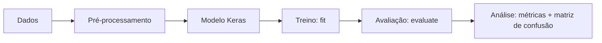

A seguir iremos apresentam o passo-a-passo para criar, treinar e avaliar uma rede neural usando **Keras** (API de alto nível do TensorFlow). O objetivo é mostrar o processo completo, desde a preparação dos dados até a análise de métricas, usando um exemplo prático de classificação de imagens (Fashion MNIST).




## Pré-requisitos

- Python 3.10+
- TensorFlow (que já inclui Keras)

Instalação (exemplo com `pip`):

```bash
pip install tensorflow
```

!!! note "GPU (opcional)"
    Para uso com GPU, a instalação pode variar conforme sistema operacional e drivers.


## Classificação multiclasse (Fashion MNIST)

O dataset **Fashion MNIST** contém imagens 28×28 em tons de cinza de 10 categorias (camiseta, calça, tênis etc.). 


### Carregar os dados de entrada

```python
import numpy as np
import tensorflow as tf

# x_*: imagens (N, 28, 28)
# y_*: rótulos inteiros (N,)
(x_train, y_train), (x_test, y_test) = tf.keras.datasets.fashion_mnist.load_data()

print(x_train.shape, y_train.shape)
print(x_test.shape, y_test.shape)
```

### Pré-processamento (dados de entrada)

Em redes neurais, é comum **normalizar** os valores de entrada para melhorar a estabilidade do treinamento.

```python
# Normalização: [0,255] -> [0,1]
x_train = x_train.astype("float32") / 255.0
x_test = x_test.astype("float32") / 255.0

# Criar um conjunto de validação
x_val = x_train[-10_000:]
y_val = y_train[-10_000:]

x_train = x_train[:-10_000]
y_train = y_train[:-10_000]

print("Treino:", x_train.shape, y_train.shape)
print("Validação:", x_val.shape, y_val.shape)
print("Teste:", x_test.shape, y_test.shape)
```

!!! note "Por que separar validação?"
    A validação permite acompanhar o desempenho do modelo em dados não vistos durante o treino, ajudando a detectar *overfitting*.


### Criar o modelo (camadas)

Aqui será usada uma rede simples do tipo **MLP** (*Multi-Layer Perceptron*):

- `Flatten`: transforma a imagem 28×28 em um vetor 784;
- `Dense`: camadas totalmente conectadas (com ReLU);
- `Dense` final com `softmax`: produz probabilidades para as 10 classes.

```python
model = tf.keras.Sequential([
    tf.keras.layers.Input(shape=(28, 28)),
    tf.keras.layers.Flatten(),

    tf.keras.layers.Dense(128, activation="relu"),
    tf.keras.layers.Dense(64, activation="relu"),

    tf.keras.layers.Dense(10, activation="softmax"),
])

model.summary()
```

!!! note "Hiperparâmetros"
    Neste exemplo, o número de neurônios (128, 64), o tipo de ativação (ReLU), a taxa de aprendizado, o número de épocas e o tamanho do *batch* são hiperparâmetros.


### Compilar (loss, otimizador e métricas)

Para classificação multiclasse com rótulos inteiros (0–9), uma escolha típica é:

- `SparseCategoricalCrossentropy` como função de perda;
- `Adam` como otimizador;
- `accuracy` como métrica inicial.

```python
model.compile(
    optimizer=tf.keras.optimizers.Adam(learning_rate=1e-3),
    loss=tf.keras.losses.SparseCategoricalCrossentropy(),
    metrics=[
        "accuracy",
        tf.keras.metrics.SparseTopKCategoricalAccuracy(k=3, name="top3_acc"),
    ],
)
```

### Treinar a rede

O método `fit` realiza o treinamento. Para manter o processo estável e “automático”, um *callback* comum é o `EarlyStopping`.

```python
callbacks = [
    tf.keras.callbacks.EarlyStopping(
        monitor="val_loss",
        patience=3,
        restore_best_weights=True,
    )
]

history = model.fit(
    x_train,
    y_train,
    validation_data=(x_val, y_val),
    epochs=20,
    batch_size=64,
    callbacks=callbacks,
    verbose=2,
)
```

O objeto `history` armazena a evolução das métricas ao longo das épocas.

```python
print(history.history.keys())
```

Um resumo simples (última época registrada) pode ser calculado assim:

```python
for k, v in history.history.items():
    print(f"{k}: {v[-1]:.4f}")
```

!!! note "Como interpretar (bem rápido)"
    - Se `accuracy` sobe no treino, mas `val_accuracy` estagna ou piora, pode haver **overfitting**.
    - Se treino e validação estão ambos baixos, pode haver **underfitting** (modelo simples demais ou treino insuficiente).
    - Métricas como `top3_acc` são úteis quando a aplicação aceita “acertar entre as 3 mais prováveis”.


### Testar (avaliar no conjunto de teste)

Depois do treinamento, a avaliação correta é feita em `x_test/y_test`.

```python
test_loss, test_acc = model.evaluate(x_test, y_test, verbose=0)
print("Loss (teste):", test_loss)
print("Acurácia (teste):", test_acc)
```


### Analisar métricas: probabilidades, classes e matriz de confusão

Além da acurácia, é útil analisar **onde** o modelo erra. Um caminho simples é:

1. obter probabilidades com `predict`;
2. converter para classe prevista com `argmax`;
3. construir uma **matriz de confusão**.

```python
# Probabilidades para cada classe (N, 10)
probs = model.predict(x_test, verbose=0)

# Classe prevista (N,)
y_pred = np.argmax(probs, axis=1)

# Matriz de confusão (10x10)
cm = tf.math.confusion_matrix(y_test, y_pred, num_classes=10).numpy()
print(cm)
```

Uma leitura comum da matriz:

- diagonal principal: acertos por classe;
- fora da diagonal: confusões entre classes.

Para calcular acurácia **por classe**:

```python
acertos_por_classe = np.diag(cm)
exemplos_por_classe = cm.sum(axis=1)
acc_por_classe = acertos_por_classe / np.maximum(exemplos_por_classe, 1)

for classe, acc in enumerate(acc_por_classe):
    print(f"Classe {classe}: {acc:.3f}")
```

!!! tip "Próximos passos (simples)"
    - trocar a MLP por uma CNN (`Conv2D`, `MaxPool2D`) para melhorar resultados em imagens;
    - experimentar *dropout* para reduzir *overfitting*;
    - ajustar hiperparâmetros: `learning_rate`, `batch_size`, número de camadas.


### Resumo

- Os dados entram como tensores (ex.: imagens `28×28`) e precisam de pré-processamento (normalização, divisão treino/val/teste).
- As camadas (`Dense`, `Flatten`, etc.) definem como a rede transforma as entradas.
- `compile` define como o modelo aprende (perda, otimizador, métricas).
- `fit` treina, `evaluate` testa, e a análise de métricas (ex.: matriz de confusão) ajuda a entender o desempenho.
