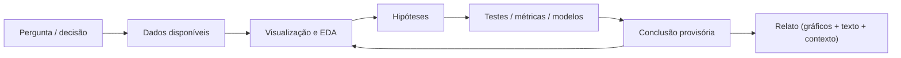
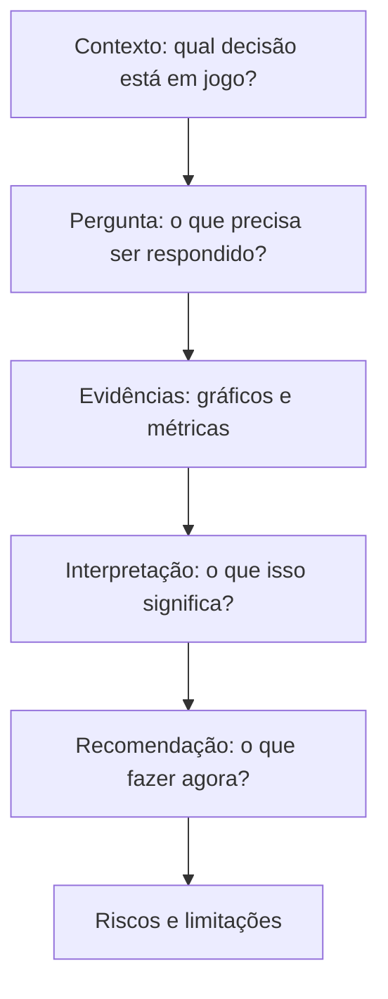

Visualização de dados é o conjunto de técnicas e princípios usados para **representar dados de forma gráfica** (ou visual) com o objetivo de **entender padrões**, **identificar problemas**, **comparar cenários** e **comunicar resultados** de maneira clara. Em vez de tratar gráficos como “enfeites”, a visualização é considerada parte central do raciocínio analítico: ela ajuda a transformar números e tabelas em evidências observáveis e discutíveis [@tufte2001visual; @cleveland1994elements].

É uma habilidade transversal em Ciência de Dados e IA: ela ajuda a formular hipóteses, validar a qualidade do conjunto de dados, diagnosticar modelos e comunicar resultados com clareza. Em domínios como o agronegócio, em que variabilidade e sazonalidade são centrais, visualizações (especialmente temporais e espaciais) são parte essencial do processo de decisão e do uso responsável de IA.

Em projetos reais, a visualização aparece em dois momentos complementares:

- **Exploração (EDA — análise exploratória)**: quando a equipe ainda está entendendo os dados, avaliando qualidade e levantando hipóteses.
- **Comunicação (explanatory)**: quando a equipe precisa explicar conclusões, riscos e recomendações para tomada de decisão (gestão, operação, clientes, órgãos públicos etc.) [@few2012show].

## Análise e visualização: uma relação de mão dupla

Em Ciência de Dados, “analisar” não significa apenas calcular métricas ou treinar modelos. Analisar significa **produzir entendimento**: identificar padrões, detectar exceções, propor explicações, comparar cenários e justificar decisões. Nesse sentido, visualização e análise caminham juntas.

Durante a exploração, a visualização costuma ser a forma mais rápida de descobrir inconsistências (valores faltantes, faixas impossíveis, mudanças bruscas), relações prováveis entre variáveis e recortes relevantes (por grupo, por período, por região). Durante a comunicação, a visualização passa a ter outro objetivo: **convencer com evidência**, reduzindo ambiguidade e tornando a conclusão auditável [@few2012show].

Como prática, é comum um ciclo iterativo no qual cada gráfico sugere uma hipótese, e cada hipótese sugere um novo gráfico. Esse ciclo pode ser resumido assim:

## Por que visualizar dados é útil

A visualização de dados é útil porque reduz a carga cognitiva de analisar grandes volumes de informação: relações que seriam difíceis de perceber em uma planilha (tendências, sazonalidade, outliers, agrupamentos) podem se tornar evidentes em um gráfico bem escolhido.

Alguns objetivos típicos:

1. **Entender o comportamento do fenômeno** (ex.: vendas por mês, produtividade por talhão).
2. **Detectar problemas de qualidade** (ex.: valores faltantes, medições impossíveis, duplicidades).
3. **Comparar grupos** (ex.: fazendas, cultivares, turnos, regiões).
4. **Monitorar processos** (ex.: indicadores operacionais, metas, alertas).
5. **Dar suporte à decisão** com evidências (ex.: priorizar ações de manejo, definir janelas de plantio/colheita).

## Tipos comuns de visualização (e o que eles respondem)

A escolha do gráfico deve seguir a pergunta analítica, não a preferência estética. Um resumo útil:

- **Distribuição**: histogramas e boxplots ajudam a responder “quais valores são comuns e quais são raros?”
- **Relação entre variáveis**: dispersão (scatter) ajuda a responder “quando $X$ aumenta, $Y$ tende a aumentar ou diminuir?”
- **Séries temporais**: linhas ajudam a responder “qual é a tendência ao longo do tempo?” e “há sazonalidade?”
- **Comparações**: barras ajudam a responder “qual categoria tem mais/menos?”
- **Dados espaciais**: mapas e heatmaps ajudam a responder “onde está acontecendo?” (ex.: talhões, municípios, regiões)

Em áreas como o agronegócio, a dimensão **temporal** (safra, clima, janelas de plantio) e a dimensão **espacial** (talhões, variabilidade intra-talhão) tornam séries temporais e visualizações georreferenciadas especialmente relevantes [@wolfert2017bigdata].

## Principais tipos de gráfico (com figuras)

Esta seção organiza os gráficos mais comuns por tipo de pergunta. Em atividades práticas, a ideia é que os estudantes consigam justificar a escolha do gráfico com base no objetivo analítico.

### Gráfico de barras (comparar categorias)

{ width="750" }

Gráficos de barras são apropriados quando a pergunta é “qual categoria tem mais/menos?” ou “como as categorias se comparam?”. Eles funcionam bem para contagens e agregações (média, soma) por grupo. Um cuidado recorrente é evitar escalas enganosas: em muitas situações de comparação direta, iniciar o eixo em zero torna as diferenças mais honestas.

### Gráfico de linhas (séries temporais)

{ width="750" }

Gráficos de linhas são adequados para acompanhar um indicador ao longo do tempo e responder perguntas como “há tendência?”, “há sazonalidade?” e “houve mudança de patamar?”. Em domínios com sazonalidade forte (como o agronegócio), é útil explicitar período (safra), frequência (diária, semanal, mensal) e eventuais lacunas de medição.

### Dispersão (relação entre variáveis)

{ width="750" }

Um gráfico de dispersão ajuda a avaliar associação entre duas variáveis numéricas e a perceber agrupamentos, relações não lineares e outliers. É um gráfico típico para iniciar discussões do tipo “quando $X$ aumenta, $Y$ tende a aumentar/diminuir?” — com o cuidado didático de lembrar que associação não implica causalidade.

### Histograma (distribuição)

{ width="750" }

Histogramas representam a distribuição de uma variável numérica e ajudam a responder “quais valores são comuns e quais são raros?”. A escolha do número de intervalos (bins) influencia bastante a leitura: poucos bins podem esconder estrutura, e bins demais podem criar ruído. É comum comparar histogramas por grupo (ex.: regiões, turnos, cultivares) para observar diferenças de perfil.

### Boxplot (resumo robusto da distribuição)

{ width="750" }

Boxplots resumem distribuição por grupo destacando mediana, quartis e possíveis outliers. São úteis quando os estudantes precisam comparar rapidamente muitos grupos e manter uma leitura robusta a valores extremos. Como contrapartida, boxplots escondem detalhes de formato (por exemplo, bimodalidade), então frequentemente são complementados por histogramas ou gráficos de violino.

### Heatmap (mapa de calor: matrizes e padrões)

{ width="750" }

Heatmaps são úteis quando existe uma matriz de valores e a cor comunica intensidade. Exemplos típicos incluem: matriz de correlação, presença/ausência de dados por dia e sensor, e “calendários” (dia x hora) para ver picos de atividade. Como boa prática, é importante escolher uma escala de cores que preserve contraste e não dependa apenas de tons problemáticos para daltonismo.

### Outros gráficos relevantes (quando fizer sentido)

Além dos tipos acima, aparecem com frequência: gráficos de área (acúmulo), barras empilhadas (composição), bolhas (3 variáveis), mapas coropléticos e mapas por pontos (dimensão espacial), e gráficos de rede (relações entre entidades). A regra didática permanece a mesma: a escolha deve ser guiada pela pergunta e pela forma do dado, e não pela estética [@tufte2001visual; @cleveland1994elements].

## Boas práticas (clareza, honestidade e acessibilidade)

A literatura clássica enfatiza que um bom gráfico deve favorecer a leitura correta dos dados e reduzir o risco de interpretações equivocadas [@tufte2001visual; @cleveland1994elements]. Na prática, algumas recomendações recorrentes são:

- **Definir a pergunta antes do gráfico**: o mesmo dado pode exigir gráficos diferentes dependendo do objetivo.
- **Usar escalas e eixos com cuidado**: em gráficos de barras, é comum iniciar o eixo em zero; em séries temporais, deve-se registrar quebras e mudanças de escala.
- **Evitar 3D e efeitos decorativos**: aumentam ruído sem melhorar o entendimento.
- **Rotular unidades e contexto**: título informativo, legenda, período analisado, fonte dos dados.
- **Pensar em acessibilidade**: evitar depender apenas de cor para diferenciar grupos; escolher paletas amigáveis para daltonismo e manter contraste adequado.

## Storytelling com dados (narrativa baseada em evidências)

Storytelling com dados é a prática de **organizar evidências** (gráficos, tabelas, números e contexto) em uma narrativa que facilita compreensão e tomada de decisão. A ênfase está menos em “contar uma história bonita” e mais em **reduzir ambiguidades**: explicitar qual é a mensagem central, por que ela importa e quais evidências a sustentam [@knaflic2015storytelling; @schwabish2021better].

Em um relatório técnico, uma estrutura simples (e recorrente) é:

Do ponto de vista didático, algumas técnicas comuns no storytelling com dados incluem: reduzir o número de gráficos ao essencial, usar títulos que expressem a mensagem (não apenas o tema), aplicar anotações e destaques para guiar a leitura e registrar limitações (viés de amostragem, mudanças de coleta, períodos incomparáveis). Essas escolhas também se relacionam à ética: uma narrativa bem feita não “esconde o que incomoda”; ela mostra com honestidade e contextualiza [@tufte2001visual].

## Relação com Inteligência Artificial

A visualização de dados se relaciona com Inteligência Artificial (IA) de forma direta porque a maior parte do trabalho com IA começa (e frequentemente termina) com **entendimento e comunicação** baseada em dados.

### Visualização “antes” do modelo

Antes de treinar um modelo, visualizações são usadas para:

- verificar distribuição de variáveis, outliers e valores faltantes;
- entender correlações e redundâncias (úteis para seleção/engenharia de atributos);
- inspecionar desbalanceamento de classes (ex.: poucas ocorrências de praga/doença);
- identificar vazamentos de informação (variáveis que “entregam” o alvo).

Isso aumenta a chance de o modelo ser treinado com dados consistentes e melhora a capacidade de diagnóstico quando os resultados não são bons.

### Visualização “durante e depois” do modelo

Após o treinamento, a visualização é essencial para **avaliar** e **explicar** resultados:

- curvas de aprendizado e métricas por época (especialmente em redes neurais);
- matriz de confusão, ROC/PR e métricas por grupo (para checar erros críticos);
- análise de erro (quais casos o modelo erra e por quê);
- explicabilidade e interpretação (quando a decisão exige justificativa) [@molnar2022interpretable].

Um ponto importante: nem toda explicação é “a verdade do modelo”; muitas técnicas produzem aproximações úteis para auditoria e comunicação. O foco didático é aprender a usar visualizações como ferramenta de **diagnóstico** e **governança** do sistema de IA.

### Um ciclo integrado (dados → visualização → IA → ação)

Em projetos aplicados, a visualização também aparece no produto final (painéis e relatórios) e no monitoramento contínuo (drift e mudanças sazonais). Um ciclo simplificado pode ser representado assim:

## Agronegócio: exemplos de visualização e por que importam

No agronegócio, decisões costumam ser tomadas sob **incerteza** (clima, pragas, mercado) e com **variabilidade espacial** (solo, relevo, manejo). Por isso, visualizações são amplamente usadas para apoiar o planejamento e a operação.

Exemplos frequentes:

- **Mapas de produtividade**: visualizar produtividade por talhão para localizar zonas de manejo e investigar causas.
- **Séries temporais climáticas**: chuva, temperatura e umidade ao longo de dias/semanas para apoiar manejo e janelas de aplicação.
- **Índices de vegetação e mapas (ex.: NDVI)**: visualizações a partir de sensoriamento remoto para monitorar vigor, estresse hídrico e evolução da cultura.
- **Dashboards de frota e operações**: telemetria de máquinas, consumo, rotas e tempo de operação.

Quando IA é aplicada (por exemplo, visão computacional para identificar doenças em folhas, ou modelos para prever produtividade), a visualização continua indispensável para validar dados e resultados e reduzir riscos de decisões erradas [@kamilaris2018deep]. Em cenários com drones e imagens aéreas, revisões sobre agricultura de precisão destacam o papel de mapas e imagens como base para análises e recomendações [@zhang2012uav].

\bibliography
