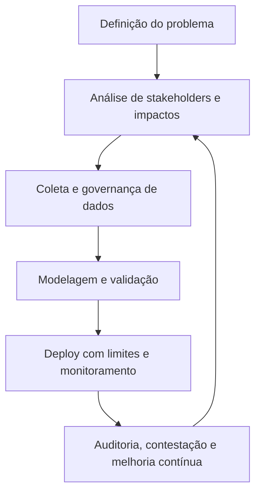

# Implicações éticas do uso da Inteligência Artificial

A Inteligência Artificial (IA) passou a mediar decisões e interações em escala: recomenda conteúdos, prioriza candidatos, orienta crédito, detecta fraude, automatiza atendimento e apoia diagnósticos. Nessa condição, a IA deixa de ser apenas “tecnologia” e se torna um componente sociotécnico: ela altera relações de poder, redistribui riscos e cria novas dependências. Por isso, discutir ética em IA não se resume a “evitar erros”, mas a explicitar valores, responsabilidades e limites de uso.

Este texto apresenta (i) conceitos modernos de ética e moral, (ii) riscos e impactos do uso inadequado de IA e (iii) formas de organizar a governança ética, com destaque ao framework **AI4People** [@floridi2018ai4people].

## Ética e moral: conceitos modernos

Em termos introdutórios, **moral** pode ser entendida como o conjunto de normas, hábitos e expectativas compartilhadas por um grupo (por exemplo, o que uma comunidade considera aceitável ou inaceitável). **Ética**, por sua vez, é a reflexão crítica sobre essas normas: investiga fundamentos, conflitos e justificativas do “certo” e do “errado”, especialmente quando há desacordo ou mudança social.

A discussão contemporânea tende a tratar ética como um campo plural, com diferentes tradições normativas que se complementam (e às vezes entram em tensão) quando aplicadas à tecnologia:

- **Consequencialismo**: avalia ações e políticas pelos seus resultados. Em IA, a pergunta típica é “quais danos e benefícios prováveis esta aplicação produz, para quem e em que prazo?”
- **Deontologia**: prioriza deveres, direitos e restrições (por exemplo, privacidade, não discriminação e devido processo). Em IA, aparece como limites que não deveriam ser ultrapassados mesmo com ganhos de eficiência.
- **Ética das virtudes**: desloca o foco do ato para o caráter e para a formação de práticas responsáveis (prudência, honestidade, temperança). No contexto tecnológico, enfatiza cultura organizacional, incentivos e competências morais de quem projeta e usa sistemas [@vallor2016technology].
- **Ética do cuidado e justiça social**: chama atenção para vulnerabilidades, assimetrias e impactos sobre grupos historicamente prejudicados. Em IA, ajuda a enxergar como modelos e dados podem reforçar desigualdades preexistentes [@benjamin2019race].

Em aplicações de IA, essa pluralidade é útil porque muitos dilemas não têm “uma única métrica”. Uma decisão pode maximizar desempenho médio (consequências), mas violar direitos individuais (deveres) e ainda erodir confiança social (virtudes e cuidado). A análise ética moderna procura tornar essas tensões explícitas e negociáveis.

## Por que o uso inadequado de IA é um problema ético (não apenas técnico)

Sistemas de IA falham de formas que impactam pessoas. Quando uma falha se traduz em restrição de acesso (crédito, emprego, saúde, liberdade), há um **fato moral**: alguém é beneficiado, prejudicado ou exposto a riscos sem consentimento adequado.

Além disso, IA costuma operar em contextos com três características que amplificam dilemas éticos:

1. **Escala e velocidade**: decisões automatizadas atingem milhares ou milhões de pessoas rapidamente.
2. **Opacidade parcial**: mesmo quando o código é acessível, o comportamento emergente (p. ex., de modelos de aprendizado profundo) pode ser difícil de explicar em termos úteis para auditoria e contestação [@mittelstadt2016ethics].
3. **Assimetria de poder e informação**: organizações controlam dados, modelos e canais, enquanto indivíduos têm pouca visibilidade e baixa capacidade de contestar resultados.

Esses fatores criam “lacunas” práticas de responsabilidade (quem responde pelo dano?) e demandam governança, não só “melhor acurácia”.

## Principais implicações do uso inadequado de IA

### Discriminação e injustiça algorítmica

Um uso inadequado comum ocorre quando modelos reproduzem vieses contidos em dados históricos (ou em escolhas de rotulagem, seleção e validação). Mesmo sem intenção explícita, o resultado pode ser a **discriminação indireta**: um sistema aparentemente neutro produz efeitos sistemáticos contra determinados grupos.

Em cenários de alto impacto (seleção de candidatos, concessão de crédito, policiamento preditivo), a inadequação ética não está apenas no erro estatístico, mas na forma como o erro é distribuído e em quem tem meios de contestá-lo. Obras críticas discutem como a automação pode “industrializar” injustiças sob aparência de neutralidade [@oneil2016weapons].

### Violação de privacidade, vigilância e erosão de autonomia

Sistemas de IA frequentemente dependem de coleta e correlação de dados comportamentais. Quando isso ocorre sem transparência, finalidade clara e limitação proporcional, a tecnologia pode sustentar práticas de **vigilância** e **manipulação**.

A autonomia humana é afetada quando:

- recomendações moldam escolhas de forma opaca;
- interfaces são otimizadas para maximizar engajamento, não bem-estar;
- decisões são tomadas sem consentimento informado e sem possibilidade real de recusa.

### Desinformação e manipulação em escala

Modelos generativos tornam mais barata a produção de textos, imagens e vídeos persuasivos, ampliando riscos de fraude, propaganda e assédio. A implicação ética central é a degradação do ambiente informacional: perde-se a confiabilidade de evidências e o custo social de verificação cresce.

### Riscos à segurança, confiabilidade e integridade

Uso inadequado inclui deploy sem testes robustos, sem monitoramento de deriva, sem planos de contingência e sem limites de operação. Em setores críticos, isso pode produzir danos físicos, financeiros e reputacionais.

Em IA, “segurança” também pode envolver resistência a abuso (por exemplo, manipulações intencionais de entradas, vazamento de dados e uso adversarial). Mesmo quando a falha é explorada por terceiros, a responsabilidade ética costuma recair sobre escolhas de projeto e governança que permitiram o risco.

### Impactos no trabalho, na dignidade e no meio ambiente

A automação pode deslocar tarefas e reconfigurar profissões. O uso inadequado aparece quando organizações tratam eficiência como único valor, ignorando dignidade, qualificação, condições de trabalho e redistribuição dos ganhos.

Adicionalmente, treinamento e operação de modelos podem ter custos ambientais. **A ética contemporânea tende a incluir sustentabilidade como parte da avaliação de impactos, especialmente quando benefícios são concentrados e custos são socializados.**

## O framework AI4People

O **AI4People** propõe um quadro ético para uma “boa sociedade” orientada por IA, articulando princípios e recomendações para alinhar tecnologia a valores humanos [@floridi2018ai4people]. O framework se destaca por conectar tradições éticas clássicas a exigências práticas de governança.

O AI4People formula cinco princípios centrais:

1. **Beneficência**: sistemas devem promover bem-estar humano e social, evitando “otimizações cegas” que gerem danos colaterais.
2. **Não maleficência**: deve-se reduzir riscos de dano, inclusive aqueles previsíveis por mau uso e por vulnerabilidades técnicas.
3. **Autonomia**: pessoas devem manter capacidade significativa de escolha e controle, com informação compreensível e possibilidade de contestação.
4. **Justiça**: benefícios e riscos devem ser distribuídos de maneira justa; discriminação e exclusão precisam ser prevenidas e corrigidas.
5. **Explicabilidade**: decisões devem ser compreensíveis e auditáveis no nível necessário para responsabilização e confiança.

Uma leitura importante do AI4People é que “explicabilidade” não é mero recurso técnico: ela sustenta **accountability**, devido processo e a possibilidade de reparação. Isso conecta ética a práticas concretas de documentação, auditoria e governança.

## Convergência com diretrizes e padrões contemporâneos

Nos últimos anos, várias iniciativas traduziram princípios éticos em requisitos e processos. Entre as mais influentes estão:

- Diretrizes para uma IA confiável (trustworthy AI) da Comissão Europeia, que relacionam princípios a requisitos como governança de dados, transparência, robustez técnica e accountability [@europeancommission2019trustworthy].
- A Recomendação da UNESCO sobre a Ética da IA, com foco em direitos humanos, inclusão, sustentabilidade e governança global [@unesco2021ethicsai].
- Os Princípios de IA da OCDE, amplamente adotados por países e orientados a crescimento inclusivo, transparência e robustez [@oecd2019aiprinciples].
- O NIST AI Risk Management Framework (AI RMF), que organiza a gestão de riscos ao longo do ciclo de vida por funções (Govern, Map, Measure, Manage) [@nist2023airmf].

Uma contribuição relevante para o debate é o mapeamento comparativo de diretrizes de ética em IA, mostrando padrões recorrentes (justiça, transparência, accountability) e também lacunas frequentes na operacionalização [@jobin2019aiguidelines].

## Da ética à prática: perguntas-guia e governança

Em contextos educacionais e profissionais, uma abordagem prática consiste em transformar princípios em perguntas verificáveis durante o ciclo de vida (definição do problema, dados, modelagem, validação, deploy e monitoramento). Exemplos de perguntas-guia:

- **Finalidade**: qual problema está sendo resolvido e por que a IA é apropriada?
- **Partes afetadas**: quem se beneficia, quem assume riscos e quem pode ser excluído?
- **Dados**: há consentimento, qualidade, representatividade e limitação de uso?
- **Explicabilidade e contestação**: existe documentação e caminho de recurso para pessoas afetadas?
- **Robustez e segurança**: há avaliação de falhas, abuso e planos de mitigação?
- **Monitoramento**: há métricas e processo para detectar deriva, vieses e incidentes?

O fluxo abaixo ilustra uma forma simples de incorporar checagens éticas no ciclo de vida.

## Considerações finais

A ética em IA é um campo aplicado que conecta filosofia moral, direitos, engenharia e políticas públicas. O uso inadequado de IA tende a produzir efeitos que ultrapassam a dimensão técnica: discriminação, vigilância, manipulação, riscos de segurança e impactos sociais. Frameworks como o **AI4People** ajudam a organizar princípios (beneficência, não maleficência, autonomia, justiça e explicabilidade) e transformá-los em governança verificável.

Ao tratar IA como sistema sociotécnico, estudantes e profissionais ganham instrumentos para projetar, avaliar e operar soluções de modo responsável, reduzindo danos e ampliando benefícios com transparência e accountability.
