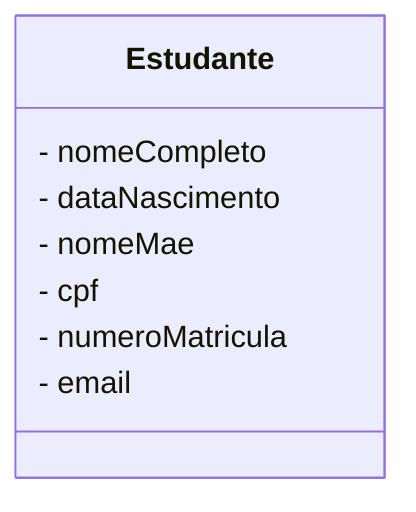
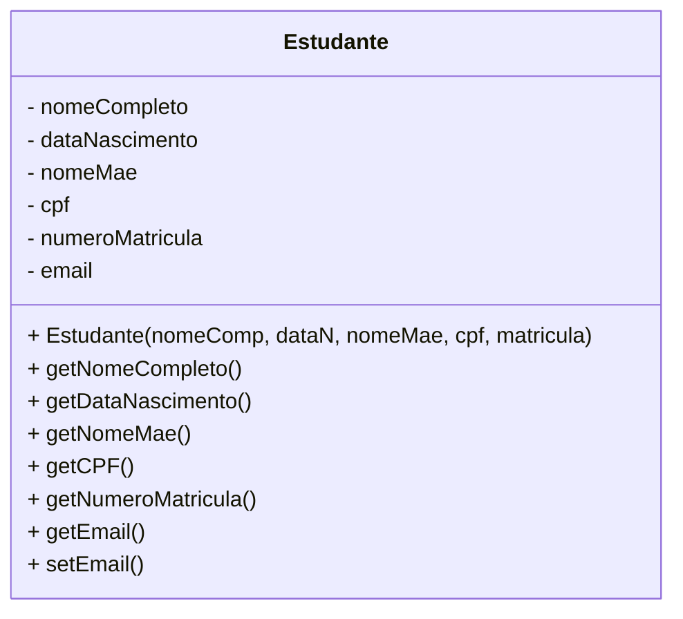
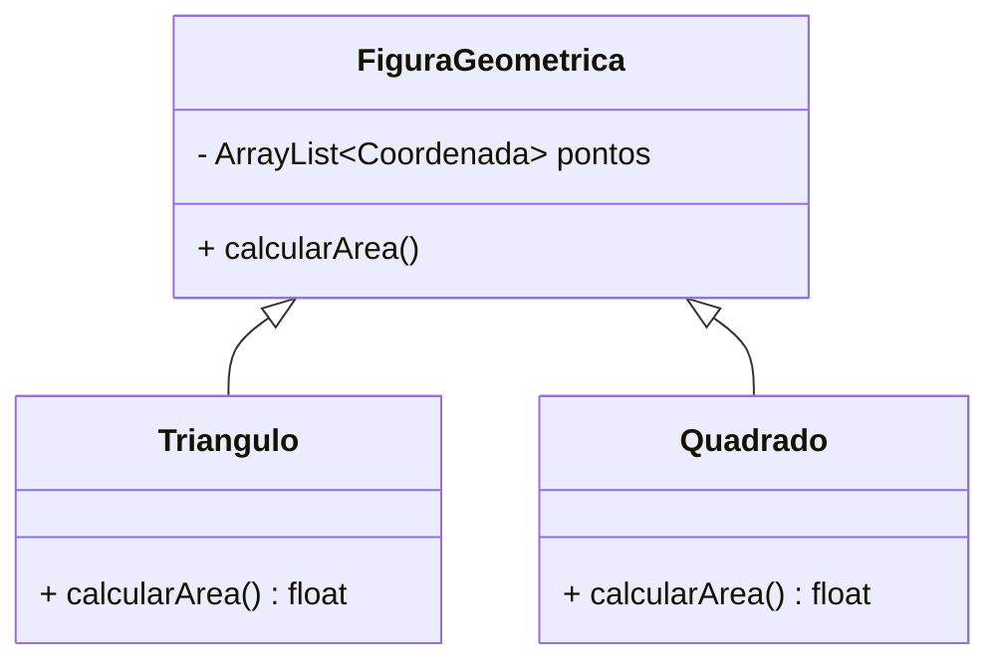

# Classes

Em um programa desenvolvido utilizando POO, o processamento se dá pela troca de mensagens entre os objetos criados. E, para criar tais objetos, precisamos de um modelo de construção, que chamamos de `classe`. A `classe` define, portanto, características comuns (atributos e comportamentos) de um tipo de objeto. 

Quando estamos projetando um software utilizando POO, a primeira atividade que temos na parte de projeto é especificar quais serão as classes que devemos construir, assim como seus relacionamentos. Essa fase de *design* é essencial, pois impacta diretamente na arquitetura do software. Perceba então que não falamos inicialmente de objetos, mas sim de classes, pois não há como criá-los sem definir sua estrutura previamente.


!!! info "Classes"
    As classes são **Tipos Abstratos de Dados** que o desenvolvedor define no código. A partir destes tipos criam-se variáveis que irão receber **instâncias da classe**, que conhecemos como **objetos**.


Existem diversas técnicas e recomendações voltadas ao projeto de classes. Neste momento isso não será levado em consideração, pois nosso foco será a codificação, ou seja, a expressão destes conceitos em código. Basta que entendamos por ora que as classes são obtidas a partir da análise do domínio do problema, buscando identificar as categorias de objetos que ocorrem.

!!! info "Dica"
    Você pode achar informações introdutórias sobre análise orientada a objetos [neste endereço](http://www.sjp.pr.gov.br/wp-content/uploads/servicos/csci/3826.pdf) ou no curso oferecido pela [Fundação Bradesco](https://www.ev.org.br/cursos/linguagem-de-modelagem-unificada-uml).

Imagine, por exemplo, que estamos trabalhando em sistema de gestão acadêmica para uma universidade. Através da análise do domínio, elencamos que minimamente precisaremos considerar *estudantes*, *professores*, *cursos*, *disciplinas* e *avaliações* em nossa modelagem.  Estas são nossas categorias, e, portanto, candidatas a se tornarem classes. Feito isso, precisamos identificar os atributos de interesse, comportamentos e as relações entre as classes para termos os insumos necessários à codificação.

Vamos começar pela categoria *estudante*. Quais `atributos` de dados os estudantes em nosso sistema deverão ter? A resposta é: *dependerá dos requisitos que identificamos junto ao nosso cliente*. Como não temos em mãos tais requisitos, iremos pressupor que os atributos são:

+ nome completo
+ data de nascimento
+ nome da mãe
+ cpf
+ número de matrícula
+ email

!!! info "Atributos"
    **Atributos** são propriedades associadas à objetos que desejamos registrar valor.

Deste modo, a categoria (grupo) *estudante* será representada por uma *classe*. E como podemos representar este entendimento para fins de modelagem? Bem, podemos utilizar o **Diagrama de Classes** da [UML](https://www.uml.org/)! Veja como ficaria:



Na primeira seção temos o nome da classe, que escolhemos ser **Estudante**. A segunda seção trata dos atributos que identificamos. Falta apenas elencarmos os comportamentos, ou seja, as ações que objetos de **Estudante** podem expor. De início, vamos imaginar a possibilidade do estudante expor ações que permitam ler e alterar seus atributos de dados. Em linguagem que expressam POO, utilizamos `métodos` para implementar ações que um objeto pode realizar. Assim, concluímos nossa representação da classe **Estudante** incluindo alguns métodos (que explicaremos mais a frente).




!!! info "Métodos"
    São rotinas associadas ao objeto que manipulam seu estado (conjunto de valores de atributos) e que expõem ao mundo exterior uma interface de comunicação. Representam a implementação do conceito de comportamento em linguagens com suporte a POO.

Na sequência apresentamos implementações muito básicas para a classe **Estudante** utilizando três linguagens *mainstream* para que possamos discutir e analisar alguns elementos importantes. O primeiro deles é a forma que utilizamos para definir a classe, que nas três linguagens se dá pelo uso da palavra reservada `class`. Atributos são declarados como `variáveis de instância`, ou seja, variáveis terão valores específicos para cada objeto criado (instanciado). Já os comportamentos são implementados a partir de `métodos`, cuja estrutura é praticamente igual à funções/procedimentos. A grande diferença é que tais funções operam no escopo do objeto, especificamente manipulando suas variáveis de instância.

=== "C++"
    ```c++  linenums="1" hl_lines="7 12 13"
    #include <string>
    #include <ctime>

    using namespace std;

    class Estudante {
            private:
            string nomeCompleto, nomeMae, email, cpf;
            unsigned long numeroMatricula;
            tm dataNascimento;

            public:
                Estudante (string nomeCompleto, string nomeMae, string email, string cpf,
                    unsigned long numeroMatricula, tm dataNascimento)
            {
                this->cpf = cpf;
                this->nomeCompleto = nomeCompleto;
                this->nomeMae = nomeMae;
                this->email = email;
                this->numeroMatricula = numeroMatricula;
                this->dataNascimento = dataNascimento;

            }
            string getNomeCompleto ()
            {
                return this->nomeCompleto;
            }
            tm getDataNascimento ()
            {
                return this->dataNascimento;
            }
            string getNomeMae ()
            {
                return this->nomeMae;
            }
            string getCPF ()
            {
                return this->cpf;
            }
            unsigned long getNumeroMatricula ()
            {
                return this->numeroMatricula;
            }
            string getEmail ()
            {
                return this->email;
            }
            void setEmail (string email)
            {
                this->email = email;
            }
            };
    ```
=== "Java"
    ```java  linenums="1" hl_lines="9"
    import java.time.LocalDate;

    class Estudante {

        private String nomeCompleto, nomeMae, email, cpf;
        private long numeroMatricula;
        private LocalDate dataNascimento;

        public Estudante(String nomeCompleto, String nomeMae, String email, String cpf, long numeroMatricula,
                LocalDate dataNascimento) {
            this.cpf = cpf;
            this.dataNascimento = dataNascimento;
            this.nomeCompleto = nomeCompleto;
            this.nomeMae = nomeMae;
            this.email = email;
            this.numeroMatricula = numeroMatricula;
        }

        String getNomeCompleto() {
            return this.nomeCompleto;
        }

        LocalDate getDataNascimento() {
            return this.dataNascimento;
        }

        String getNomeMae() {
            return this.nomeMae;
        }

        String getCPF() {
            return this.cpf;
        }

        long getNumeroMatricula(){
            return this.numeroMatricula;
        }

        String getEmail() {
            return this.email;
        }

        void setEmail(String email) {
            this.email = email;
        }

    }
    ```
=== "Python"
    ```python  linenums="1" hl_lines="2"
    class Estudante:
        def __init__(self, nome_completo, data_nascimento, nome_mae, cpf, matricula, email):
            self.__nome_completo = nome_completo
            self.__data_nascimento = data_nascimento
            self.__nome_mae = nome_mae
            self.__cpf = cpf
            self.__email = email
            self.__numero_matricula = matricula
        
        def set_email(self, email):
            self.__email = email		
        def get_email(self):
            return self.__email
        def get_numero_matricula(self):
            return self.__numero_matricula
        def get_cpf(self):
            return self.__cpf
        def get_nome_mae(self):
            return self.__nome_mae
        def get_data_nascimento(self):
            return self.__data_nascimento
        def get_nome_completo(self):
            return self.__nome_completo

    ```

O primeiro ponto de atenção são o uso de `this` e `self` (por convenção) no código. Embora a sintaxe mude de linguagem para linguagem, o objetivo de ambos é o mesmo: **referenciar uma variável de instância ou método de instância**. Ainda confuso? Então vamos explicar com mais detalhes.


Quando o desenvolvedor codifica a classe, sua intenção é operacionalizar as ações para cada possível objeto que venha a ser `instanciado`. Por instanciação devemos entender o processo de reserva de espaço de memória para o objeto residir, bem como sua inicialização a partir do `construtor`. Nesta área de memória em que o objeto reside há espaço para armazenar os valores de seus atributos. Disso é que surge o conceito de *variáveis de instância*, ou seja, variáveis cujo valor é particular a cada instância (objeto) criada.

Já os métodos não têm seu código "carregado" junto a cada instância, pois eles não mudam sua implementação a cada novo objeto. Desconsiderando casos excepcionais, todos os objetos compartilham da mesma implementação definida na classe e é neste ponto que o uso de *this/self* tornam-se especialmente útil. Eles representam a instância que recebeu a mensagem (objeto do contexto), o que permite codificar o comportamento para todo e qualquer objeto da classe a partir de um código genérico.

Analise o código a seguir. Ele apresenta dois objetos, *estudante01* e *estudante02*, devidamente inicializados com os valores informados no construtor. Nos comandos de *print*, o valor apresentado para *cpf* será àquele informado para o respectivo objeto. Isso é possível porque, quando o objeto *estudante01* recebe a mensagem `get_cpf`, ao rodar a implementação do método, o valor da referência *self* está apontando para *estudante01*. O mesmo raciocínio vale para *estudante02* e qualquer outro objeto que venha a ser instanciado.


```python
estudante01 = Estudante("Fulano A. B.", "12/05/2003", "Ciclana A. B. ", "12365478963", "1236584")
estudante02 = Estudante("Beltrano F. G.", "30/01/2002", "Ciclana F. G. ", "85789632541", "2365841")
print(estudante01.get_cpf())
print(estudante02.get_cpf())

```


Em nossa explicação anterior falamos de `método construtor` mas não o descrevemos e para isso, vamos tomar como estudo de caso nossa implementação em Python, linha \(2\). Bem, sabemos que o estado de um objeto é constituído pelo valor de seus atributos em um determinado instante. A questão é: qual será o estado inicial do objeto, obtido assim que ele for instanciado? Quem determina isso é o `método construtor`.

O nome do tipo de método já deixa a dica: `construtor`, ou seja, aquele que constrói o estado inicial. Trata-se, portanto, de um método especial executado no ato da instanciação, cuja finalidade é entregar o objeto em um estado válido, consistente. Seus parâmetros constituem as dependência que o objeto precisa receber do mundo exterior. Cada linguagem especifica como criá-los: enquanto que Java e C++ expressam os construtores a partir de um método de mesmo nome da classe e sem tipo de retorno, no Python ele  obrigatoriamente deve se chamar `__init__`. E, para ficar registrado, podemos ter vários construtores em uma mesma classe.


## Visibilidade

A programação orientada a objetos é especialmente útil porque oferece um mecanismo de programação que une atributos à comportamentos em uma única unidade. E, ao permitir tal recurso, possibilita também a proteção contra alterações indevidas, desde que o programador utilize os princípios e boas práticas na codificação. 

A visibilidade de atributos é um fator muito importante. Por visibilidade devemos entender quem terá acesso direto a um atributo do objeto e de antemão devemos saber que **é, no mínimo, indesejado permitir acesso direto**. 

A técnica que utilizamos para esconder os atributos (*data members*) de um objeto chama-se `data hiding`. O objetivo é impedir o acesso direto aos atributos e assim garantir a consistência de estado por meio dos métodos que o objeto expõe ao mundo exterior [@javatpointdatahiding21]. Em nossa implementação da classe **Estudante** aplicamos a técnica por meio dos modificadores de visibilidade do Java e C++, enquanto que no Python, utilizamos a convenção.

O que declaramos como `private` (Java e C++) fica restrito ao escopo interno. Isso vale para atributos e para métodos. Logo, acesso direto externo ao atributo *email*, por exemplo, não é possível. Se for preciso ao mundo exterior ler o valor de *email*, então criamos um método `accessor`, cuja finalidade é permitir a leitura de um atributo, jamais sua alteração. Por sua vez, se há necessidade de alterar o valor de um atributo, então criamos um método `mutator` para este fim. Este é o caso dos métodos *get_email* e *set_email* que implementamos.


## Encapsulamento

`Encapsulamento` é um dos pilares da POO. Quando associamos atributos à métodos que os manipulam dentre de uma unidade chamada objeto, e determinamos o que será público e o que fica restrito, estamos falando de encapsulamento. 

Utilizando `data hiding` impedimos que objetos sofram alterações de estado sem controle. E, ao escondermos a implementação dos métodos ou mesmo restringirmos a exposição de alguns métodos, estamos garantindo o encapsulamento e gerando uma abstração de dados que expõe apenas o que necessário para o mundo exterior.

Perceba que a `abstração` nos acompanha em todas as etapas, pois ela é o mecanismo que nós, humanos, utilizamos para simplificar a realidade. Mantemos nossa atenção naquilo que nos importa sobre a realidade, desconsiderando os demais aspectos. Importante perceber também que cada indivíduo abstrai àquilo que lhe convém, a partir de seu ponto de vista da realidade. Contudo, essas diferenças precisam ser minimizadas no projeto de software orientado a objetos através da observação atenta das regras e características do domínio do problema, que irão se materializar nos objetos [@carlerick2009].

## Métodos

Os comportamentos de um objeto são codificados em `métodos`. Em sua construção, métodos assemelham-se a rotinas, inclusive na sintaxe. A grande diferença está no papel desempenhado. Enquanto rotinas são executadas para transformar dados recebidos por parâmetro ou disponíveis no escopo, sendo invocadas quando necessário, os `métodos` são responsáveis por atender à mensagens recebidas de outro objeto. Quando um método executa, ele está respondendo a uma `mensagem` e sua execução irá considerar o estado do objeto, seus demais comportamentos e os dados eventualmente recebidos como argumento.

Os `métodos` que o objeto torna disponível ao mundo externo compõem sua `interface` de comunicação e somente por meio deles outros objetos podem interagir enviando mensagens. Neste sentido, o objeto reage ao estímulo, executando a ação associada àquela mensagem específica. É a partir desta troca de mensagens entre objetos que se alcança as funcionalidades do sistema.


No código abaixo você irá perceber que o objeto `e1` está recebendo uma mensagem para alterar o valor de e-mail armazenado. Como argumento está sendo enviado o novo endereço. 


```python
#...
e1 = Estudante("Fulano A. B.", "12/05/2003", "Ciclana A. B. ", "12365478963", "1236584")
e1.set_email("estudante01@instituicao.edu")
#...

```

## Sobrecarga


`Sobrecarga` é o recurso que algumas linguagens de programação oferecem para criarmos múltiplas implementações de um mesmo método, preservando seu nome mas variando tipos e/ou quantidades de parâmetros formais em sua assinatura. É um recurso típico de `linguagens estaticamente tipadas`, ou seja, àquelas em que definimos a priori o tipo das variáveis e isso é utilizado como critério de validação semântica no momento da `compilação`. 

Ao se deparar com o nome de um método (ou função) sobrecarregado, o compilador irá utilizar o tipo/quantidade dos argumentos para encontrar a "versão" mais adequada (*best match*). No caso de linguagens dinâmicas, a sobrecarga não é recurso nativo (nem necessário), ficando a cargo de bibliotecas externas habilitar tal possibilidade no código.

Na sequência apresentamos exemplos em três linguagens: C++, Java e Python. Duas delas passam por processo de compilação (C++ e Java), logo a sobrecarga é recurso nativo. Já para o Python, há a necessidade de importar um módulo específico, que, embora funcione corretamente no código em questão, mostra ser pouco coerente, haja vista que podemos obter o mesmo resultado de forma mais simples (e correta). Logo, considere a implementação em Python como uma representação forçada para demonstrar o recurso, mas não como prática recomendada de codificação nesta linguagem.

=== "C++"
    ```c++  linenums="1" hl_lines="30 35"

    #include <ctime>
    #include <string>

    using namespace std;

    enum class Conceito
    {
        A,
        B,
        C,
        D,
        E
    };

    class Avaliacao
    {
    private:
        tm data;
        string descricao;
        int pesoInteiro;
        Conceito pesoConceito;

    public:
        Avaliacao(tm data, string descricao)
        {
            this->data = data;
            this->descricao = descricao;
        }

        void setPeso(Conceito c)
        {
            this->pesoConceito = c;
        }

        void setPeso(int peso)
        {
            this->pesoInteiro = peso;
        }
    };
    ```
=== "Java"
    ```java  linenums="1" hl_lines="18 22"

    import java.time.LocalDate;
    public enum Conceito {
        A,B, C,D,E;        
    }

    public class Avaliacao {
        private LocalDate data;
        private String descricao;
        private int pesoInteiro;
        private Conceito pesoConceito;

        public Avaliacao(LocalDate data, String descricao) {
            this.data = data;
            this.descricao = descricao;

        }

        public void setPeso(Conceito c) {
            this.pesoConceito = c;
        }

        public void setPeso(int peso) {
            this.pesoInteiro = peso;
        }
    }

    ```
=== "Python"
    ```python linenums="1" hl_lines="20 24"

    from multipledispatch import dispatch
    from enum import Enum

    class Conceito(Enum):
        A=1
        B=2
        C=3
        D=4
        E=5


    class Avaliacao():
        def __init__(self, data, descricao):
            self.data=data;
            self.descricao= descricao;
            self.peso_inteiro=0;
            self.peso_conceito=None;

        @dispatch(Conceito)
        def set_peso(self, c):
            self.peso_conceito = c

        @dispatch(int)
        def set_peso (self, peso):
            self.peso_inteiro=peso

    ```


## Método abstrato

Por vezes é interessante que uma classe defina um ou mais métodos sem implementação. Estes métodos, ditos `abstratos`, são utilizados para especificar a presença de um comportamento na hierarquia de classes, garantindo que classes derivadas definam sua própria implementação. Logo, a presença de método abstrato corresponde a formalmente delegar responsabilidade de sobrescrita às classes derivadas (desde que sejam concretas).

Importante ressaltar que a presença de um ou mais métodos abstratos torna a classe abstrata. `Classes abstratas` não podem produzir instâncias e servem prioritariamente como superclasse de outras. Contudo, nem toda classe abstrata contém métodos abstratos. Portanto, o inverso não é verdade!


Prover classes abstratas é útil quando desejamos oferecer um conjunto básico de funcionalidades. Tal recurso é comum em arquiteturas que utilizam *frameworks*, pois nelas a aplicação, para acessar os recursos da API do *framework* precisa estender classes específicas.

Para ilustrar o conceito de método e classe abstrata iremos considerar a existência de uma classe chamada **FiguraGeométrica**, abstrata, contendo o método abstrato **calcularArea()**. A partir dela, duas classes derivam, **Triangulo** e **Quadrado**, cada qual comprometendo-se em sobrescrever o método abstrato recebido da superclasse.

Perceba que a justificativa para o uso do método abstrato **calcularArea()** é simples: qualquer figura geométrica possui área. Mas cada figura requer um cálculo específico de área, o que demanda a implementação do cálculo pela classe especializada. 




=== "Java"
    ```java  linenums="1"
    import java.util.ArrayList;

    class Coordenada{
        private int pontoX;
        private int pontoY;

        public Coordenada(int x, int y){
            this.pontoX=x;
            this.pontoY=y
        }
        public int getPontoX(){
            return this.pontoX;        
        }

        public int getPontoY(){
            return this.pontoY;
        }

    }


    abstract class FiguraGeometrica {
        private ArrayList<Coordenada> pontos;

        public FiguraGeometrica(ArrayList<Coordenada> pontos){
            this.pontos = pontos;
        }
        public abstract float calcularArea();

    }


    public Triangulo extends FiguraGeometrica{
        
        public Triangulo(Coordenada p1, Coordenada p2, Coordenada p3){
            ArrayList<Coordenada> pontos = new ArrayList<>();
            pontos.add(p1);
            pontos.add(p2);
            pontos.add(p3);
            super(pontos);
        }
        @Override
        public float calcularArea(){
            //calculo da área do tringulo
        }
    }


    public Quadrado extends FiguraGeometrica{
        
        public Triangulo(Coordenada p1, Coordenada p2){
            ArrayList<Coordenada> pontos = new ArrayList<>();
            pontos.add(p1);
            pontos.add(p2);        
            super(pontos);
        }
        @Override
        public float calcularArea(){
            //calculo da área do tringulo
        }
    }
    ```
=== "Python"
    ```python  linenums="1" hl_lines="30 35"
        #em breve
    ```
=== "C++"
    ```c++  linenums="1" hl_lines="30 35"
        //em breve
    ```

continua...

\bibliography