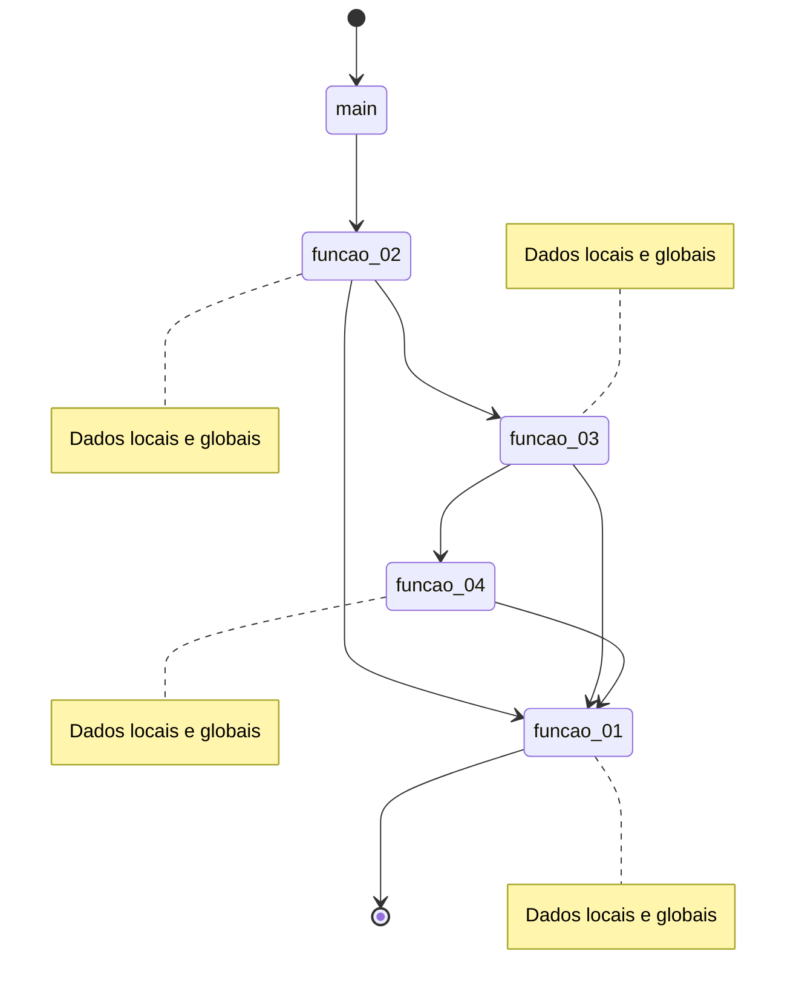
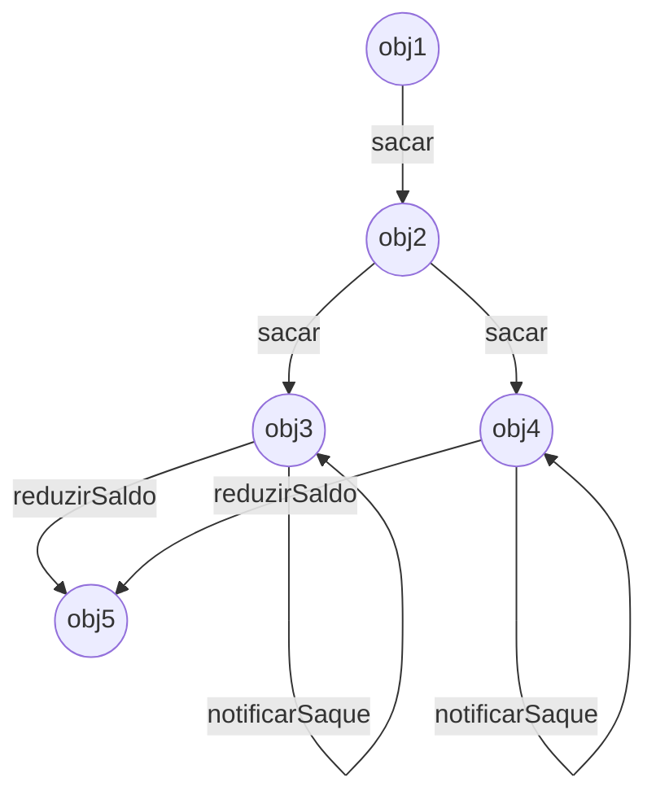
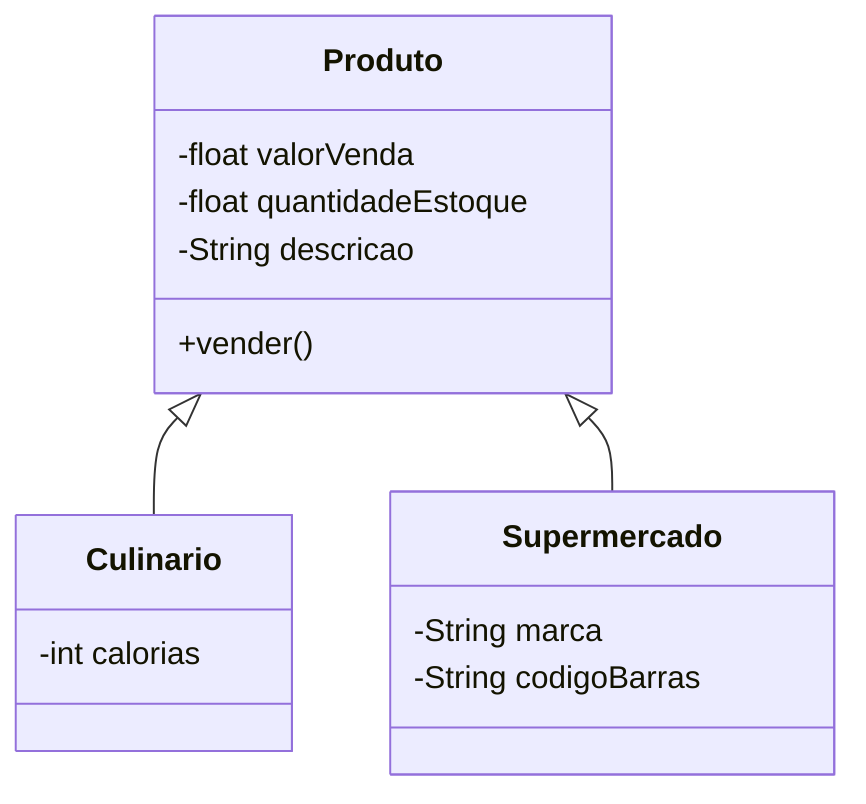

O paradigma da programação orientada a objetos (POO) é relativamente antigo, remontando à década de 1960. Contudo, se tornou popular tempos após, por meio de linguagens de programação populares no mercado de software da época[@sintespoo21dias].

Basicamente podemos resumir a programação orientada a objetos como qualquer estilo de programação que se baseia no conceito de `objeto`, que é uma estrutura que agrega `atributos` e `comportamentos` de forma encapsulada. Veja, este é o grande trunfo do paradigma: **relacionar dados e comportamentos em uma única estrutura**.

Se analisarmos a evolução das linguagens de programação, iremos perceber um esforço comum em distanciar a forma de expressar algoritmos da linguagem binária. O objetivo foi e ainda é elevar o nível de abstração das linguagens de programação para a forma que nós, humanos, observamos, interpretamos e entendemos o mundo.

Certamente um passo importante neste contexto foi a possibilidade de se utilizar `procedimentos` (rotinas) na codificação. Tal recurso trouxe aos desenvolvedores maior capacidade de reutilizar código, segmentar e reduzir complexidade, tornando a codificação uma atividade mais eficiente e, em termos gerais, menos propensa a bugs (com muitas ressalvas).

Através do uso de rotinas, um software é segmentado em diversas pequenas unidades de propósito específico, que, ao serem executadas na ordem correta, geram ao final as funcionalidades esperadas. Já os dados necessários ao programa são processados através de variáveis locais ou globais, comumente sendo enviados de procedimento em procedimento como um *pipeline* de operações. Não há relação formal entre as rotinas e os dados por elas processados, pois são estruturas dissociadas na codificação. O resultado é algo semelhante ao diagrama abaixo.



Embora tenha sido um inegável avanço, a reutilização de código via procedimentos ainda era limitado e o caminho de execução do programa por vezes se tornava tão confuso como um prato de espaguete, tornando a manutenção difícil. Mas, o maior dos problemas origina-se da separação entre dados e procedimentos. Isso porque todo procedimento precisa conhecer detalhadamente a estrutura dos dados que está manipulando e, quando esta estrutura muda, torna-se necessário realizar alterações em diversos pontos do código, o que é péssimo em termos de engenharia[@sintespoo21dias].

Vamos tentar ilustrar essa separação entre procedimentos e dados por meio de um código escrito em C++. O programa define duas estruturas, `ITEM_VENDA` e `VENDA`, as quais representam os dados que o programa deve manipular. Já as funções `registrarVenda`, `venderItem` e `calcularImpostos` são responsáveis por ações específicas sobre os dados e por tal necessidade, devem ter conhecimento sobre a estrutura dos mesmos. 

=== "C++"
```c++  linenums="1"

#include <iostream>
#include <ctime>
using namespace std;

struct ITEM_VENDA {
    float valorVendaProduto=0;
    float quantidadeVenda=0;
    float desconto=0;
};

struct VENDA {
    string cliente;
    time_t dataHora;
    ITEM_VENDA itens[10];
};

VENDA registrarVenda(){
    //realiza a abertura da venda
}

ITEM_VENDA venderItem(){
    //realiza o registro de um item vendido
}

float calcularImpostos(VENDA v){
    //calcula os impostos da venda recebida como argumento
}

int main (){
    VENDA v1 = registrarVenda();
    v1.itens[0]=venderItem();
    v1.itens[1]=venderItem();
    v1.itens[2]=venderItem();
    v1.itens[3]=venderItem();
    float tributos = calcularImpostos(v1);
}

```

Perceba que a função `main` de nosso programa realiza chamada às demais funções em uma sequência específica, passando a variável que contém os dados de uma para a outra. Logo, gradativamente, a estrutura de dados em memória representada pela variável será transformada/alimentada até obtermos o resultado esperado. 

Os problemas dessa abordagem concentram-se em dois pontos. O primeiro deles é a exposição direta da estrutura de dados às funções, o que permite alterações sem qualquer controle. Por exemplo, nada impede que a quantidade vendida de um produto esteja negativa, o que é incorreto. O segundo ponto é a dependência da implementação das funções para com a estrutura de dados, que gera **alto acoplamento** entre os componentes. O efeito direto do alto acoplamento é a propagação de pontos de manutenção a mínima mudança que ocorrer na estrutura de dados, por exemplo. Todos estes problemas seriam melhor endereçados se pudessemos encapsular dados e comportamentos em um único componente.


Uma solução parcial ao problema da falta de encapsulamento veio com as linguagens de programação que permitiam implementar o conceito de módulo, um componente que contém dados e procedimentos que os manipulam, cujo acesso externo se dá por meio de uma interface. Embora isso resolva a questão da alteração do estado, temos a impossibilidade de derivar um módulo a partir de outro, o que limita o reuso de código[@sintespoo21dias].

!!! info "Estado"
    **Estado**  refere-se à "fotografia" do conjunto de valores mantidos pelo componente em um determinado instante.


Chegamos então à POO, uma estratégia de programação que modela o problema a partir de objetos e os faz interagir entre si para obter os resultados. Deixamos de lado a chamada de inúmeros procedimentos para orientar o fluxo do programa e passamos a ter objetos trocando mensagens, tal qual uma simulação viva da solução almejada. Além de uma forma diferente de codificar, a POO impõe uma mudança significativa na maneira de elaborar o algoritmo. Observe o exemplo:




Mas antes de pensarmos nos detalhes de implementação, precisamos conhecer os quatro pilares do paradigma da orientação a objetos, pois são eles que orientam a concepção e implementação de softwares por meio desta estratégia. Vamos a eles então.

## Abstração
A `abstração` é um processo que permite identificar de um contexto somente o que é de interesse, ignorando os demais detalhes. Logo, na POO, a abstração nos permite pensar objetos que contenham apenas atributos e comportamentos necessários à resolução do problema [@gfgabstraction2021][@hamzaahmed2021]. O processo de abstração pode ser entendido, portanto, como uma estratégia em que mantemos o foco em ideias, qualidades e propriedades de um assunto, deixando as minuciais de lado. É olhar para o grande cenário, mas ver apenas elementos de interesse.

Podemos entender também a abstração como a estratégia de esconder detalhes de implementação dos usuários. Isso significa que a manipulação dos objetos não requer e nem deve precisar do conhecimento de operação interno. Somente a funcionalidade é exposta (**o que** o objeto faz), nunca a sua implementação (**como faz**) [@gfgabstraction2021][@hamzaahmed2021].


## Encapsulamento

A POO permite associar em um único componente dados e comportamentos que manipulam estes dados, de sorte a oferecer meios de evitar a alteração indevida de estado a partir de agentes externos. Tal recurso chama-se `encapsulamento`, uma "membrana" que isola os detalhes internos do objeto do mundo exterior.

Podemos entender, portanto, que encapsular, na perspectiva da POO, compreende proteger um objeto do acesso direto às suas propriedades, sem passar por um `método`. Comumente as variáveis de instância têm sua manipulação restrita aos métodos, de sorte que qualquer mudança de estado do objeto só ocorre por meio deles.

## Herança

Muitos elementos do mundo real podem ser organizados em uma taxionomia. Isso porque diferentes indivíduos (objetos), mesmo sendo diferentes, compartilham de características comuns em alguns contextos. Vamos imaginar um site de *delivery* que oferece *fast food*, culinária oriental, culinária tropical e itens de supermercado. Então, pelo *app*, você pode comprar sabão e um *hot dog* da mesma forma. Já no mundo real, são coisas completamente diferentes. O que pode haver de comum entre eles?

A resposta é que ambos são produtos, e, na perspectiva de produto, compartilham de atributos como *valor de venda*, *quantidade em estoque*, *descrição*, *imagens*, entre outros. Além disso, ambos podem ser vendidos, o que representa uma ação. E, de forma específica, cada item pode conter atributos e métodos específicos. 

A relação de `herança` é o recurso da POO que permite a objetos herdar atributos e comportamentos de outro de natureza mais genérica. Em nosso exemplo, podemos pensar em três classes: `Produto`, `Culinario` e `Supermercado`. A classe `Produto` é a genérica e serve de **superclasse** à `Culinario` e `Supermercado`.




## Polimorfismo

`Polimorfismo` versa sobre a possibilidade de uma mesma ação ser realizada de formas diferentes em objetos que compartilham de uma mesma interface. Tal recurso reduz significativamente a necessidade de escrita de código e favorece a criação de componentes com baixo acoplamento. É como se enviássemos a mensagem `correr` para um velocista e um ciclista. Cada qual executaria a ação associada a mensagem de forma diferente, mas ambos tem capacidade de compreender e execução a mesma ação de alto nível.


\bibliography