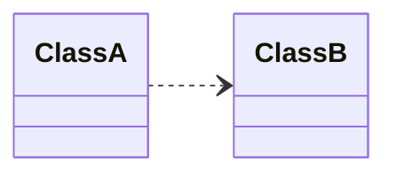
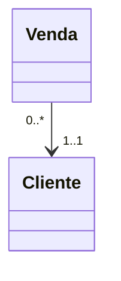
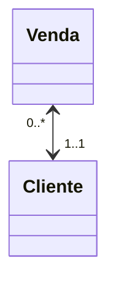
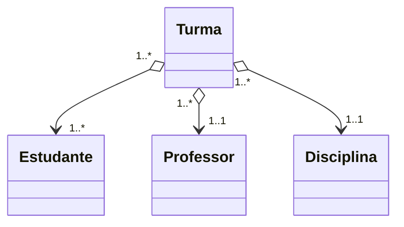
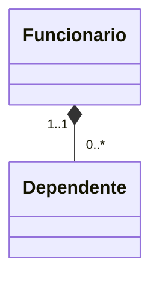
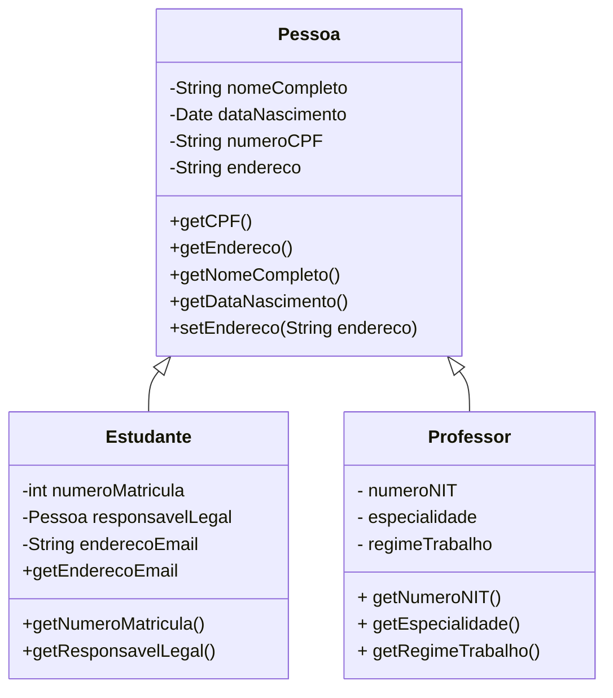
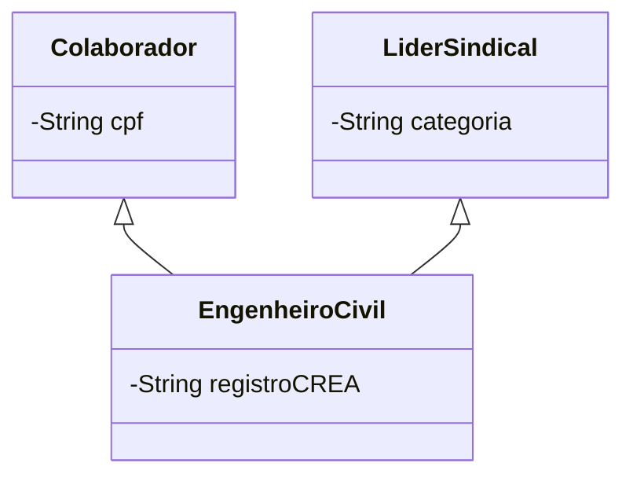

Um dos principais benefícios oriundos da abstração provida pela orientação a objetos foi ampliar a possibilidade de reutilizar código. Isso não é importante somente pela redução do tempo de codificação do software, mas também é pelo melhor controle das responsabilidades (cada componente é responsável por uma única tarefa), ampliação da cobertura de teste e redução da incidência de *bugs* no código.


Na definição de uma classe, é comum precisarmos estabelecer relacionamentos com outras classes. Logo, a estrutura de componentes de um software construído na perspectiva da orientação a objetos contempla componentes e relações entre componentes. A estas relações chamamos genericamente de *dependências*.

## Dependência

A dependência entre duas classes ocorre quando uma classe \(A\) utiliza recursos da classe \(B\), de modo que alterações na classe \(B\) podem afetar a classe \(A\).



Dependências são extremamente comuns e se estabelecem quando utilizamos na classe \(A\) a classe \(B\) para definir  tipo de atributos, tipo de retorno de método, tipo de parâmetros, tipo de variáveis ou simplesmente fazemos uso de um método estático de provido por \(B\). 

Pela grande ocorrência de dependências entre classes, precisamos ser mais seletivos quando a observamos, mantendo atenção àquelas em que existem restrições/especificidades maiores que o trivial uso. Neste caso, pensamos em termos de associações e especializações/generalizações.

## Associação

A associação é um relacionamento de dependência que indica a existência de comunicação entre duas classes. Pode ser `unidirecional` ou `bidirecional` e também comporta informação de multiplicidade.

A associação implica no uso de um tipo em outro. A direção da associação dá o caminho possível para navegação. Em nosso exemplo, temos a classe `Venda` fazendo uso de um objeto de `Cliente`. Toda venda terá \(1\) cliente e, na perspectiva do cliente, poderá haver diversas vendas associadas a ele. Contudo, podemos navegar apenas de `Venda` para  `Cliente`, ou seja, é `unidirecional`.



Se quiséssemos uma associação `bidirecional`, expressaríamos a relação da seguinte forma:




### Agregação

Na agregação, duas classes relacionam-se por meio de um vínculo do tipo `todo-parte` ou `tem um`. Neste tipo de **associação**, temos um classe que `está contida` ou é `uma parte de` de outra classe.

A agregação ocorre quando o objeto `todo` requer  objetos `parte` para complementá-lo, para ter sentido completo. É uma relação fraca entre os componentes, de modo que se o objeto *todo* for destruído, os *objetos parte* podem permanecer existindo.

É o que ocorre com o conceito de turma para determinada disciplina. A turma terá vários estudantes,  \(1\) professor e \(1\) disciplina vinculada. A turma depende destes componentes para ser completa. Contudo, ao removermos a turma, os demais objetos que são *parte* continuam existindo. Observe que a representação da agregação se dá por meio de um losango ao lado do objeto `todo`.



### Composição

A composição, por sua vez, é uma associação forte entre classes, também caracterizada pelo conceito `todo-parte`. Mas, diferente da agregação, o ciclo de vida dos objetos `parte` é gerenciado pelo objeto `todo`, pois a existência da `parte` sem o `todo` não faz sentido. Perceba que o losango está preenchido no diagrama, diferentemente do que ocorre na agregação.



## Herança


A *herança*, um dos pilares da POO, está intimamente associada com o reuso de software. Se podemos pensar componentes do software como sendo dispostos em uma taxionomia, em que irão existir componentes mais genéricos e outros mais específicos que deles derivam, então estamos pensando em uma relação de herança.

Herança é um relacionamento forte entre classes, que implica em alto acoplamento e que permite a uma classe herdar membros de outra. Dizemos, portanto, que é um relacionamento do tipo `é um` em que a superclasse mantém sua integridade e a especialização é feita na classe dela derivada.


Importante ressaltar que, mesmo sendo um dos pilares da POO, optar por herança é uma decisão que requer reflexão, pois o acoplamento entre os componentes se intensifica, o que geralmente é ruim em termos de arquitetura de software.


!!! info "Dica"
    Membro de classe é a designação genérica que utilizamos para método ou atributo.

Vamos entender melhor como o relacionamento de herança se estabelece e quais são as implicações técnicas do seu uso. Nosso exemplo irá apresentar uma situação simples de um modelo de negócio envolvendo professores e estudantes. Nele vamos ter a superclasse `Pessoa` e duas classes derivadas: `Estudante` e `Professor`.


!!! info "Dica"
        `Classe derivada` ou `subclasse` é toda aquela que especializa uma ou mais `superclasses` ou `classes base`. Em nosso exemplo, `Pessoa` é a superclasse, representando o tipo mais genérico da taxionomia. Já `Professor` e `Estudante` são subclasses, ou seja, tipos mais específicos que aprimoram `Pessoa` novos membros. Precisamos considerar também que uma classe pode ter superclasses e/ou subclasses `indiretas`, no caso em que a taxionomia possui diversos níveis.

A relação entre as nossas classes de exemplo permite afirmar que `Professor` é uma `Pessoa` e que `Estudante` é uma pessoa. Já o inverso não é possível: `Pessoa` não é `Professor`, nem `Estudante`. Ainda, podemos observar que a herança é `simples`, haja vista que as classes derivadas herdam de apenas uma única superclasse.

Agora vamos propor um caso de `herança múltipla`. Em nosso diagrama temos as classes `Colaborador`, `LiderSindical` e `Engenheiro Civil`, sendo esta última derivada das anteriores. Para simplificar o diagrama, omitimos boa parte dos atributos e métodos.




Embora a herança múltipla seja possível, nem todas as linguagens oferecem suporte. No Java, por exemplo, temos somente herança `simples`, enquanto que C++ e Python temos a possibilidade de herdar de múltiplas classes. 

De qualquer forma, seja simples ou múltipla, o relacionamento de herança permite às classes derivadas acesso a membros da superclasse. Contudo, algumas linguagens definem modificadores de visibilidade ou estratégias que impedem acesso direto à membros em classes derivadas. No caso da linguagem Java, membros definidos como `private` ficam inacessíveis nas classes derivadas, o que é especialmente conveniente para se preservar o encapsulamento e a integridade da superclasse.

Já os construtores não são automaticamente herdados pelas classes derivadas. Toda classe precisa definir os seus e, quando há herança envolvida, construtores das classes derivadas devem chamar obrigatoriamente algum dos construtores disponíveis na superclasse (e se for herança múltipla, precisamos considerar cada uma das superclasses). Logo, as chamadas se propagam até a classe mais genérica da hierarquia, sendo seu construtor o primeiro a executar. É o que demonstramos na ilustração a seguir, de forma simplificada, considerando as classes de nosso exemplo anterior.


A cadeia de chamada aos construtores é necessária para que o objeto seja inicializado de forma consistente, segundo as regras implementadas em cada classe. Cada construtor irá tratar, portanto, de uma parte do objeto da subclasse, partindo do tipo mais genérico até o mais especializado.

### Implementando Herança

Cada linguagem de programação estabelece a sintaxe e palavras reservadas utilizadas na construção do relacionamento herança. Em nossos exemplos, apresentaremos códigos escritos em C++, Python e Java.

Na linguagem Java, a herança ocorre por meio de extensão. A classe derivada, em sua declaração utiliza a palavra reservada `extends` para indicar a superclasse. Já no Python, as superclasses são informadas entre parenteses na declaração da subclasse.

No código a seguir evidenciamos linhas em que há declaração de construtores e/ou chamada a construtores da superclasse. Perceba que a palavra reservada `super` está sendo utilizada para fazer referência à membros da superclasse, inclusive construtores.

=== "Java"
    ```java linenums="1" hl_lines="3 8 66 70 71"
      import java.time.LocalDate;

      class Pessoa {
          private String nomeCompleto, endereco, cpf, email;
          private LocalDate dataNascimento;

         
          public Pessoa(String cpf, LocalDate dataNascimento, String nomeCompleto, String endereco) throws Exception {
              this(cpf, dataNascimento);
              this.nomeCompleto = nomeCompleto;
              this.endereco = endereco;
          }

         
          public Pessoa(String cpf, LocalDate dataNascimento) throws Exception {
              this.setCPF(cpf);
              this.dataNascimento = dataNascimento;
          }

          private void setCPF(String cpf) throws Exception {
              if (cpf.length() != 11)
                  throw new Exception("CPF deve ter 11 caracteres");
              else
                  this.cpf = cpf;
          }

          public void setNomeCompleto(String nome) {
              this.nomeCompleto = nome;

          }

          public LocalDate getDataNascimento() {
              return this.dataNascimento;
          }

          public String getCpf() {
              return this.cpf;
          }

          public String getNomeCompleto() {
              return this.nomeCompleto.toUpperCase();
          }

          public void setEndereco(String endereco) {
              this.endereco = endereco;
          }

          public String getEndereco() {
              return this.endereco;
          }

          public void setEmail(String email) {
              this.email = email;
          }

          public String getEmail() {
              return this.email;
          }

          @Override
          public String toString() {        
              return String.format("Pessoa: %s %s %s", this.cpf, this.nomeCompleto, this.dataNascimento);
          }
      }     

      class Estudante extends Pessoa {
        private String numeroMatricula;

      
        public Estudante(String numeroMatricula, String cpf, LocalDate dataNascimento) throws Exception{
            super(cpf,dataNascimento);
            this.numeroMatricula = numeroMatricula;      
        }

        public String getMatricula(){
            return this.numeroMatricula;
        }

        @Override
        public String toString() {
            return String.format("Estudante: %s %s %s %s", this.numeroMatricula,this.getCpf(), this.getNomeCompleto(), this.getDataNascimento());
        }
      }
    ```
=== "Python"
    ```python linenums="1" hl_lines="1 2 44 45 46"

      class Pessoa:
        def __init__(self, cpf, data_nascimento):
            self.__cpf = cpf
            self.__data_nascimento = data_nascimento
            self.__nome_completo=""
            self.__endereco = ""
            self.__email = ""

        @property
        def email(self):
            return self.__email

        @email.setter
        def email(self, email):
            self.__email = email

        @property
        def endereco(self):
            return self.__endereco

        @endereco.setter
        def endereco (self, endereco):
            self.__endereco = endereco

        @property
        def data_nascimento(self):
            return self.__data_nascimento

        @property
        def cpf(self):
            return self.__cpf

        @property
        def nome_completo(self):
            return self.__nome_completo
            
        @nome_completo.setter
        def nome_completo(self, nome_completo):
            self.__nome_completo = nome_completo
        
        def __str__(self) -> str:
        return f'Pessoa {self.cpf} -  {self.nome_completo}'

      class Estudante(Pessoa):   
        def __init__(self, cpf, data_nascimento, nr_matricula):
            super.__init_(self, cpf, data_nascimento)        
            self.__numero_matricula = nr_matricula

        @property
        def matricula(self):
            return self.__numero_matricula

        def __str__(self) -> str:
            return f'Estudante {self.matricula} - {self.nome_completo}'
    
    ```
=== "C++"
    ```c++ linenums="1"
      /* em breve */
    ```

### Sobrescrita

Por vezes, a classe derivada precisa `redefinir` um método recebido de uma superclasse direta ou indireta. Isso ocorre porque a implementação recebida não atende o comportamento necessário na subclasse. Neste caso, sobrescrevemos o método.

`Sobrescrever` significa preservar a assinatura do método tal qual está na superclasse, mas alterar seu corpo (implementação). Com isso, preservamos a interface de comunicação com os objetos, mas teremos comportamentos distintos a depender do tipo de objeto que estamos considerando (se da superclasse ou da subclasse).

É o caso do método `toString()` presente na implementação das classes `Pessoa` e `Estudante` em Java. Em ambas as classes temos sobrescrita do mesmo, visto que ele é definido na classe `Object`, a superclasse direta ou indireta de qualquer classe na linguagem Java. Dado que sua implementação original não nos serve, atribuímos nova codificação, sem fazer qualquer alteração na implementação original do método de Object (preservação da integridade da classe). O mesmo ocorre com o método especial __str__ (*dundle str*) da implementação em Python.

Ao redefinir o método, precisamos tomar cuidado para não alterar sua assinatura, pois se isso ocorrer estaremos realizando uma `sobrecarga`. No Java, a anotação `@Override` nos dá esta segurança, delegando ao compilador a responsabilidade por validar a existência de um método de superclasse com a assinatura informada. Não havendo tal método, um erro de compilação é lançado.