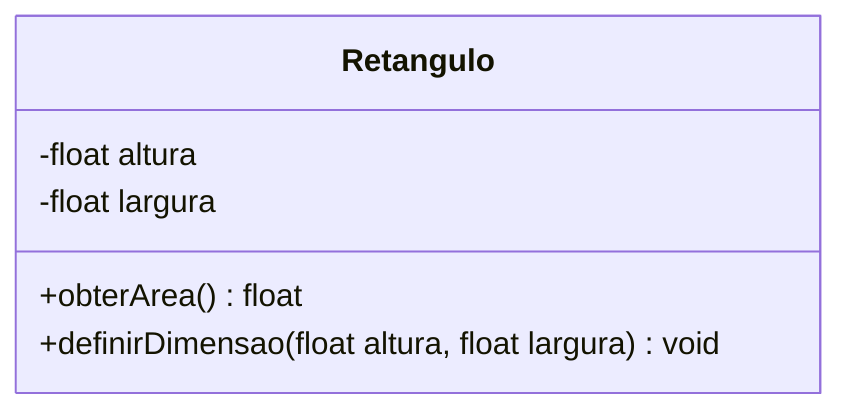

Quando desenvolvemos software, precisamos representar fatos do mundo por meio de uma linguagem formal. Neste processo criativo, de abstração, aplicamos estratégias, caminhos, formas específicas de expressar, de codificar. A isso chamados paradigma de programação.

As inúmeras linguagens de programação que podem ser utilizadas na codificação facilitam o uso de um ou mais paradigmas em detrimento de outros. Contudo, não podemos imaginar que a linguagem seja a concretização do paradigma, haja vista que é algo abstrato. O que ocorre é que, pela facilidade em expressarmos o paradigma \(Y\) por meio de um linguagem \(X\), a classificamos como sendo do tipo \(Y\). Por exemplo, sabemos que a linguagem Java facilita a codificação utilizando o paradigma da Orientação a Objetos, então costumamos dizer que Java é uma linguagem orientada a objetos.

Na sequência iremos abordar os principais paradigmas de programação. Importante ressaltar que uma única linguagem de programação pode expressar vários paradigmas, embora um deles seja, por vezes, mais evidente no código do que outros.

## Imperativo
...continua

## Declarativo
...continua

## Estruturado
...continua

## Procedural
...continua

## Funcional
...continua

## Orientado a Objetos

Neste paradigma, a programação é realizada por meio da definição de objetos que trocam mensagens entre si. Estes objetos têm estado e comportamento encapsulados, ocultando do mundo exterior seus detalhes internos de operação. Para criar objetos, podemos fazer uso de `classes` ou `protótipos`, a depender do que a linguagem de programação proporciona.

O comportamento do software é gerado pela interação entre os objetos que o compõem, através da troca de mensagens em que um objeto emissor dispara no receptor a execução de uma operação específica, a qual chamamos de `método`. 

Estes objetos têm `atributos` e `comportamentos` definidos a partir de suas `classes` ou `protótipos`. Entendemos por `atributos` as propriedades do objeto sobre as quais armazenamos dados. Já os `comportamentos` referem-se às ações que o objeto realizada. Todas as alterações de `estado` (fotografia dos valores de atributo em um dado momento) são feitas exclusivamente pelos métodos, a partir da recepção de mensagens.

Vamos imaginar, por exemplo, a representação de um simples retângulo através do paradigma da orientação a objetos. Iremos considerar utilizar orientação a objetos baseada em `classes` neste momento. Observe o diagrama:




Chamamos nossa classe de *Retangulo*, visto que ela irá representar qualquer retângulo em nossa codificação. Os atributos estabelecidos foram `altura` e `largura`, ou seja, são as propriedades que desejamos armazenar valor. Considerando uma linguagem de programação fortemente tipada, estabelecemos que ambos os atributos são do tipo `float` (real de precisão simples). Já os comportamentos são dois, representados pelos métodos `obterArea` e `definirDimensao`. Percebeu os símbolos de \(+\) e \(-\) em frente aos atributos e métodos? Bem, eles estabelecem a visibilidade e, de momento, basta saber que \(+\) indica `acesso público` e \(-\), `acesso privado`.


=== "C++"
    ```c++  linenums="1"
    class Retangulo
    {
        private:
            float largura, altura;

        public:
            float obterArea()
            {
                return this->altura * this->altura;
            }
            void definirDimensao(float altura, float largura)
            {
                this->altura = altura;
                this->largura = largura;
            }
    };
    ```

=== "Java"

    ```java  linenums="1"
    class Retangulo {
        private float largura, altura;

        public float obterArea() {
            return this.altura * this.altura;
        }

        public void definirDimensao(float altura, float largura) {
            this.altura = altura;
            this.largura = largura;
        }
    };
    ```

=== "Python"
    ```python  linenums="1"
   
    class Retangulo:
        def __init__(self):
            self.__largura=0
            self.__altura=0

        def obterArea(self):
            return self.__altura * self.__altura

        def definirDimensao(self, altura, largura):
            self.__altura = altura
            self.__largura = largura
    ```

Perceba que as implementações da classe *Retangulo*, embora feitas em três linguagens de programação diferentes, apresentam semelhança na forma de codificar. Atributos são definidos tal qual o são variáveis comuns e métodos como sendo funções. A diferença é que as definições ficam restritas ao `escopo da classe` e funcionam como um molde para a criação dos objetos.

A definição da classe implica na disponibilidade de um novo `tipo abstrato de dados` (TAD) no código. Com este novo tipo podemos criar variáveis e nelas, instanciar objetos. Veremos isso com mais detalhes quando tratarmos dos aspectos específicos de implementação. Esses objetos criados trocam mensagens entre si durante a execução do software, produzindo o resultado almejado pelo desenvolvedor.

Saiba mais sobre este paradigma na seção de [Programação Orientada a Objetos](oop/introducao.md).


## Orientado a Eventos
...continua

## Lógico

...continua

## Orientado a Aspectos
...continua


