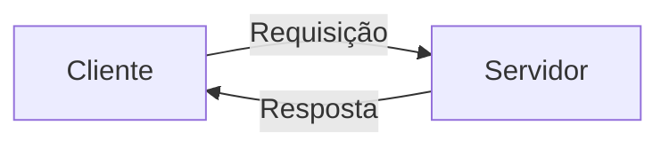
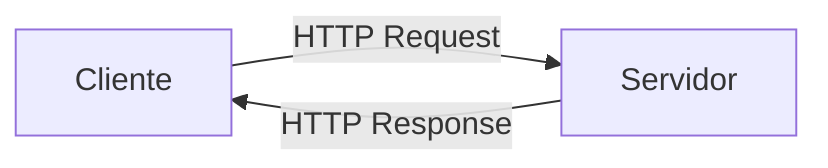
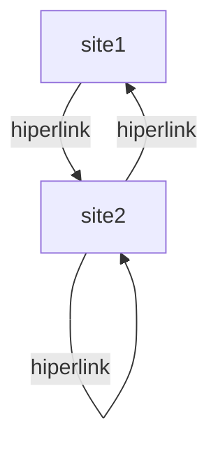

{ align=left width=25%}

`Hypertext Markup Language`, ou simplesmente HTML, é uma linguagem de marcação utilizada para representar informação na Web. Nasceu junto com o conceito da Web e hoje, conjuntamente às linguagens `JavaScript` e `CSS`, compõe as bases para o desenvolvimento de soluções *frontend* neste ecossistema.

Desde seu desenvolvimento, em 1989, a linguagem HTML foi passando por diversas revisões, que culminaram com o lançamento de novas versões da linguagem. Atualmente está em uso a versão 5, motivo pelo qual é comum encontrar citações à linguagem como HTML5. Caso tenha interesse na integra da linha do tempo das versões da linguagem, podes começar pela [Wikipédia](https://en.wikipedia.org/wiki/HTML#HTML_versions_timeline).

Antes de propriamente iniciarmos nosso estudo na linguagem HTML5, precisamos entender os atores principais da Web e como eles se comunicam. Obviamente faremos uma simplificação da arquitetura, enfatizando o papel do *web browser* e do *web server*. 

Observe o diagrama a seguir. Nele representamos um *cliente* estabelecendo comunicação com um *servidor*. O cliente envia uma requisição - uma solicitação de recurso - que é recepcionada pelo *servidor* e devolvida ao *cliente* por meio de uma resposta. Esse modelo de arquitetura distribuída é chamada `client/server` e define em alto nível como ocorre a comunicação entre *web browsers* (clientes) e *web servers* (servidores).

Nesta troca de mensagens está sendo utilizado o protocolo HTTP (Hypertext Transfer Protocol), que por sua vez transporta documentos HTML quando recursos são retornados ao cliente. Logo, grande parte da informação que trafega na Web é representada em HTML.

O HTML é um dos pilares da Web, junto ao protocolo HTTP e o conceito de URI. Define-se como uma linguagem de marcação, ou seja, uma representação de documento em que adicionamos marcas de significado(semântica) e de estrutura à informação. 

O conceito de `hipertexto` é essencial à compreensão do HTML. De forma simples, entendemos como `hipertexto` um conjunto de nós (palavras, imagens, vídeos, áudios, documentos) que possuem ligações entre si.

A linguagem HTML tornou-se um padrão de referência a partir de 1997, graças ao trabalho da W3C. Isso garantiu à tecnologia interoperabilidade em diferentes plataformas e meios de acesso. A especificação corrente da linguagem está disponível no [portal da W3C](https://html.spec.whatwg.org/multipage/) de forma pública.

